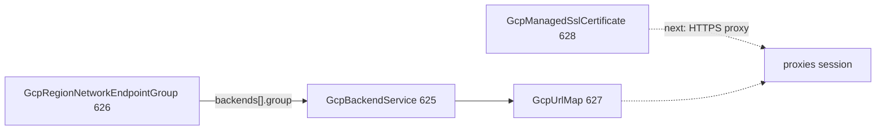

# GCP LB Routing Trio — Serverless NEG, URL Map, Managed SSL Certificate

**Date**: July 3, 2026
**Type**: Feature
**Components**: API Definitions, GCP Provider, IaC Modules, E2E Framework, Testing Framework

## Summary

Adds three load-balancing kinds that unlock the routing layer above `GcpBackendService`: `GcpRegionNetworkEndpointGroup` (626, all five endpoint types), `GcpUrlMap` (627, the full released GA routing tree), and `GcpManagedSslCertificate` (628, Google-managed TLS). The shared E2E runner now resolves `valueFrom` refs inside nested and repeated spec fields and honors explicit `valueFrom.kind`. `GcpBackendService` gains a live serverless-NEG backend scenario and registers the NEG as a prerequisite. All three kinds and the composed scenarios pass live dual-engine E2E on `planton-e2e`.

## Problem Statement / Motivation

Session 007 forged the backend-service hub but recorded a coverage boundary: no live `backends[].group` because no NEG kind existed. URL maps and managed SSL certificates — the routing brain and the TLS handle the HTTPS proxy will consume — were missing entirely, blocking the proxy/forwarding-rule endgame.

### Pain Points

- Backend services could not compose to serverless workloads (Cloud Run, Functions, App Engine) through a first-class NEG.
- URL maps had nowhere to live in the catalog despite being the central routing primitive for global L7 load balancers.
- Managed SSL certificates — the standard TLS path for external HTTPS load balancers — were unmodeled.

## Solution / What's New

### GcpRegionNetworkEndpointGroup (626)

- Full released GA surface for regional NEGs: SERVERLESS (Cloud Run / Functions / App Engine blocks), PSC, INTERNET_IP_PORT, INTERNET_FQDN_PORT, GCE_VM_IP_PORTMAP.
- CEL enforces endpoint-type ↔ block coherence; FK refs for project, VPC, subnetwork, and Cloud Run service name.
- Outputs export plain `spec.region` (not the provider's region self-link attribute — required for E2E/API callers).

### GcpUrlMap (627)

- Full released GA routing tree: default target exclusivity, host rules, path matchers, path rules, route rules with all match types (incl. `path_template_match`), weighted backends, rewrites (incl. route-rules-only `path_template_rewrite`), redirects, header actions, CORS, fault injection, retry/timeout/mirror, custom error response policies, and test blocks.
- **Deliberately unmodeled:** route-action `cache_policy` (present on provider clone main and Pulumi SDK but absent from released TF 6.50.0 — released floor governs both engines).
- `default_service` and path/route `service` refs are un-defaulted multi-target (`GcpBackendService` or `GcpBackendBucket` via explicit `valueFrom.kind`).

### GcpManagedSslCertificate (628)

- Exact released GA surface: name, description, `managed.domains` (1–100). Fully immutable; async provisioning documented. Self-managed PEM certs deferred to the proxy session.

### E2E framework extension

- `refresolve.go` recurses into nested messages and repeated elements; resolves by explicit `valueFrom.kind` + `fieldPath`, falling back to field `default_kind`. Enables `backends[0].group` and un-defaulted `default_service` composition live.

### Backend service follow-ups

- `backends[].group` gains `default_kind = GcpRegionNetworkEndpointGroup`.
- Registry `prerequisites` adds the NEG alongside the health check.
- New `neg-backend` scenario: live serverless NEG in `backends[]`, no health check, **no balancing_mode** (GCP rejects capacity dials for serverless NEGs).

## Benefits

- The LB family composes end-to-end through URL maps; HTTPS proxy session can attach certs + URL map + backend service + NEG in one chain.
- Serverless workloads can sit behind a load balancer without hardcoded self-links in manifests.
- E2E composition patterns (nested refs, explicit kind) are reusable for every future multi-target field.

## Validation

- Offline: spec tests green for all three kinds; `make protos`; release-equivalent Pulumi builds; `tofu validate`; `secret-coverage --check`; `validate-refs --check`; `validate-outputs` + three new `pkg/outputs` conformance cases; presets/hack/prerequisite manifests through `planton validate`; `make build-go`; `make reset-gazelle`.
- Live (project `planton-e2e`, dual-engine): 8 test functions / 10 scenario-runs green — backend service (minimal + neg-backend), region NEG, URL map (composed chain), managed SSL cert — Pulumi and Terraform. Zero orphans after sweep.
- Audits: all three kinds **Fully Complete — PARITY ✅**, zero PARITY-EXCEPTIONs.

## Workflow Uplift

- `e2e/README.md`: documents nested/repeated `valueFrom` resolution.
- `forge-planton-component.mdc`: regional outputs must emit plain spec region names, not provider self-links.

---

**Status**: ✅ Production Ready
