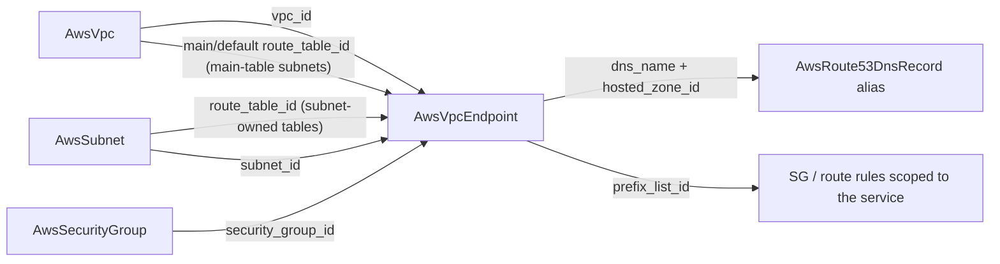

# AWS VPC Endpoint: A First-Class Node for Private Service Access

**Date**: July 3, 2026
**Type**: Feature
**Components**: API Definitions, AWS Provider, IAC Modules, E2E Framework, Infra Charts

## Summary

`AwsVpcEndpoint` (enum 242, id_prefix `vpce`) joins the AWS catalog as the
first-class node for private service access: S3/DynamoDB gateway endpoints
attached to referenced route tables, ENI-based interface endpoints for every
other AWS service and third-party PrivateLink services, and the VPC Lattice
endpoint types. Both engines ship at full parity with live dual-engine E2E
green (4/4), and the microservices-backend chart gains a free S3 gateway
endpoint node on by default.

## Problem Statement / Motivation

Private service access is the backbone of locked-down AWS architectures, and
until now it was unrepresentable:

- **No private path to AWS services.** Workloads in private subnets reached
  S3, ECR, STS, and CloudWatch through a NAT gateway -- paying per-GB data
  processing for traffic AWS would carry free through a gateway endpoint,
  and leaving no S3 path at all in no-NAT topologies.
- **No PrivateLink consumption.** Third-party SaaS PrivateLink offerings
  (databases, observability platforms) could not be attached to a VPC.
- **The composition was already waiting.** `AwsVpc` exports its main/default
  route-table ids and `AwsSubnet` exports its owned route table -- gateway
  endpoints are exactly what those outputs exist to compose with.

## Solution / What's New

### The Kind

The full `aws_vpc_endpoint` surface, modeled with type-honest gating:

- **Five endpoint types** (`Gateway`, `Interface`, `GatewayLoadBalancer`,
  `Resource`, `ServiceNetwork`), with CEL enforcing which attachments each
  type takes: route tables are Gateway-only; subnets/security groups/private
  DNS/static ENI addresses/cross-region targets belong to the ENI-based
  types; security groups and private DNS are Interface-only.
- **Exactly-one service target** (`serviceName` /
  `resourceConfigurationArn` / `serviceNetworkArn`), CEL-coupled to the
  endpoint type.
- **DNS depth**: private DNS with the VPC DNS-support/hostnames requirement
  documented, `dnsOptions` including the S3 dual-stack
  inbound-resolver-only pattern and the Lattice domain-preference/domains
  coupling (required exactly when the preference says specified domains).
- **Endpoint policies** as a first-class field -- an S3 gateway endpoint
  scoped to the organization's buckets is a data-exfiltration control.
- **Composition by reference everywhere**: VPC, route tables (subnet-owned
  or the VPC main/default tables), subnets, and security groups; outputs
  (`vpc_endpoint_id`, `arn`, `state`, `prefix_list_id`, `dns_name` +
  `hosted_zone_id`, `network_interface_ids`) feed security-group rules,
  Route53 aliases, and flow-log composition downstream.

### Composition Flow

### Chart Composition

`charts/aws/microservices-backend` gains an S3 gateway endpoint node
(`s3EndpointEnabled`, default true): private-subnet S3 traffic bypasses NAT
data-processing charges, and with `nat_mode: none` the endpoint is the ONLY
S3 path private subnets have. The node attaches to the private subnets'
owned route tables when NAT gives them one, and to the VPC main route table
in the no-NAT arm -- both arms rendered and CLI-validated.

### Honesty Fix Alongside

The `AwsSubnet` `route_table_id` output comment claimed a fallback to the
VPC main route table; both modules actually (and rightly) export empty in
that case -- silently handing back a main-table id a user never configured
would be a surprise. The comment now states the real contract and points
composers at the `AwsVpc` outputs for main-table attachment.

## Implementation Details

- **Spec**: 16 fields + 2 nested messages, 9 message-level CEL rules on the
  spec + 3 on `dnsOptions`, every rule with an empathetic user-facing
  message. `policy` needs no sensitive exemption (heuristic-suppressed).
- **Engines**: both modules richly commented at full parity; empty
  lists/strings/false booleans are pruned identically on both sides so AWS
  defaults (e.g. the VPC default security group) apply uniformly. The
  Terraform contract is generator-owned under `TestVariablesTFDrift` from
  day one; the provider floor is `>= 6.28.0` (where
  `dns_options.private_dns_preference` / `private_dns_specified_domains`
  landed) -- resolved to v6.53 at init.
- **E2E**: an ID-keyed `DescribeVpcEndpoints` verifier treating the
  lingering `deleting`/`deleted` states as absent alongside the typed
  `InvalidVpcEndpointId.NotFound` (the NAT-gateway lifecycle class;
  case-insensitive because the EC2 API reports lowercase states while the
  SDK enum capitalizes). Two scenarios: an S3 **gateway** endpoint attached
  to the VPC prerequisite's `default_route_table_id` output (the subnet
  fixture deliberately owns no route table), and an STS **interface**
  endpoint on the two-AZ subnet pair with private DNS on (the VPC fixture
  already enables DNS support + hostnames).
- **Registry**: enum 242 with `prerequisites: [AwsVpc, AwsSubnet]` driving
  composed E2E resolution; kind map + gazelle regenerated.
- **Deferred with recorded reasons** (component docs): the PrivateLink
  provider side (`aws_vpc_endpoint_service` + its four satellites) is a
  separate product surface; the standalone policy and association resources
  are folded into the spec.

## Validation

Offline gate all green: spec/CEL tests (10 happy + 18 error paths), outputs
conformance (guarding the repeated-string `network_interface_ids`
flattening), drift guard, `validate-refs`, `secret-coverage`,
`validate-outputs` dry-runs 7/7 fields on both engines, `tofu
init+validate` (aws v6.53), release-equivalent Pulumi build +
`Pulumi.yaml` check, `make build-go`, 3 presets + hack manifest + 2 E2E
scenarios + both rendered chart arms CLI-validated, site catalog
regenerated (`vpc-endpoint`), scaffolding-leakage grep clean.

**Live dual-engine E2E: 4/4 green** -- gateway 1m52s/2m18s and interface
3m52s/5m43s (Pulumi/Terraform), each riding the VPC + two-AZ subnet
prerequisite chain, ephemeral create → SDK verify → destroy → verify-clean.
Post-run account sweep: zero endpoints, zero non-default VPCs, zero tagged
subnets.

## Impact

- Locked-down and cost-optimized topologies are now expressible: private
  subnets reach AWS services with no internet path, and S3-heavy workloads
  stop paying NAT data charges.
- Third-party PrivateLink services become one composable node with a
  dedicated preset.
- The microservices-backend chart's default deployment gets the free S3
  optimization out of the box.

## Related Work

- Builds on the networking decomposition (thin VPC, subnet-owned route
  tables) whose outputs this kind composes with.
- Completes the Tier-1 networking surface; VPC peering and the PrivateLink
  provider side remain demand-gated.

---

**Status**: ✅ Production Ready
