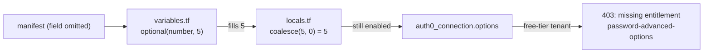
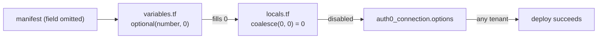

# Auth0Connection: Advanced Password Options Opt-In (Free-Tier 403 Fix + Engine Parity)

**Date**: July 3, 2026
**Type**: Bug Fix
**Components**: API Definitions, Terraform, Documentation

## Summary

The `Auth0Connection` Terraform module deployed with three "advanced password options" (`password_history_size`, `password_no_personal_info`, `password_dictionary`) enabled by default. Those features require Auth0's paid `password-advanced-options` entitlement, so on a free/lower-tier tenant Auth0 rejected the deploy with a `403 Forbidden: Subscription missing entitlement: password-advanced-options`. This broke the `e2e-auth0` pipeline (`TestAuth0Connection_Terraform/minimal`). The Pulumi module never applied these defaults, so the two engines also diverged. This change flips those three defaults to disabled in Terraform, bringing it to parity with Pulumi and letting the component deploy on any Auth0 plan.

## Problem Statement / Motivation

The Terraform variable schema filled in defaults for the advanced password options via `optional(...)`. When a manifest omitted `database_options` (or these specific fields), Terraform substituted enabled values *before* the `locals.tf` `coalesce` ran, so the module always sent them to Auth0.

### Pain Points

- **Free-tier tenants 403** - a minimal manifest (no advanced options set) still tried to enable them, and Auth0 rejected the whole `auth0_connection` deploy.
- **Silent CI breakage** - `e2e-auth0`'s `TestAuth0Connection_Terraform/minimal` failed on any tenant lacking the paid entitlement.
- **Terraform/Pulumi divergence** - the Pulumi module passed the raw spec (proto zero-values), so it left the options off; only Terraform force-enabled them. The same manifest produced different Auth0 configuration depending on the engine.
- **Misleading docs** - the catalog page, READMEs, and "Sensible Defaults" section advertised `5`/`true`/`true` as safe defaults with no mention of the paid entitlement.

## Root Cause

The real default lived in `variables.tf`'s `optional(...)`, not `locals.tf`. Because `optional()` fills the value before `coalesce` sees it, only changing `locals.tf` would not have fixed the `403` - `variables.tf` had to change too.

## Solution / What's New

Default the three advanced password options to **disabled** in Terraform, matching the Pulumi module's behavior, and document them as opt-in features that require the paid entitlement.

| Field | Old default | New default |
|-------|-------------|-------------|
| `password_history_size` | `5` | `0` (disabled) |
| `password_no_personal_info` | `true` | `false` |
| `password_dictionary` | `true` | `false` |

Users who *do* have the entitlement can still opt in by setting the fields explicitly in their manifest.

## Implementation Details

- **`apis/dev/planton/provider/auth0/auth0connection/v1/iac/tf/variables.tf`** (primary fix): `password_history_size` -> `optional(number, 0)`, `password_no_personal_info` -> `optional(bool, false)`, `password_dictionary` -> `optional(bool, false)`, each with a comment noting the paid entitlement.
- **`.../iac/tf/locals.tf`**: `coalesce` fallbacks set to `0`/`false`/`false` (defensive/consistent with `variables.tf`).
- **`.../spec.proto`**: doc comments updated to state the fields default to disabled and require the paid `password-advanced-options` entitlement.
- **Pulumi module**: no change - `iac/pulumi/module/locals.go` passes the raw spec (proto zero-values), so the options were already off; this change simply brings Terraform to parity.
- **Documentation**: `catalog-page.md` default column + entitlement note, `docs/README.md` "Sensible Defaults"/"Password History" caveats, `README.md` and `iac/tf/README.md` example annotations, and a comment in `iac/hack/manifest.yaml`.

## Benefits

- `Auth0Connection` deploys on any Auth0 plan out of the box - no more free-tier `403`.
- `e2e-auth0` `TestAuth0Connection_Terraform/minimal` passes on the entitlement-less test tenant.
- Terraform and Pulumi now produce identical Auth0 configuration for the same manifest.
- Docs accurately describe which options are opt-in and why.

## Impact

- **Behavioral (Terraform only)**: manifests that relied on the implicit `5`/`true`/`true` defaults will now deploy with these options disabled. Anyone who wants them must set the fields explicitly (and hold the paid entitlement). This matches the Pulumi behavior that was already in effect.
- **No proto wire change**: field numbers and types are unchanged; only defaults and docs changed.

## Related Work

- Follows the CI toolchain image migration ([2026-07-03-143246-common-ci-toolchain-image.md](../2026-07/2026-07-03-143246-common-ci-toolchain-image.md)) whose migrated `e2e-auth0` workflow surfaced this failure.

---

**Status**: ✅ Production Ready
