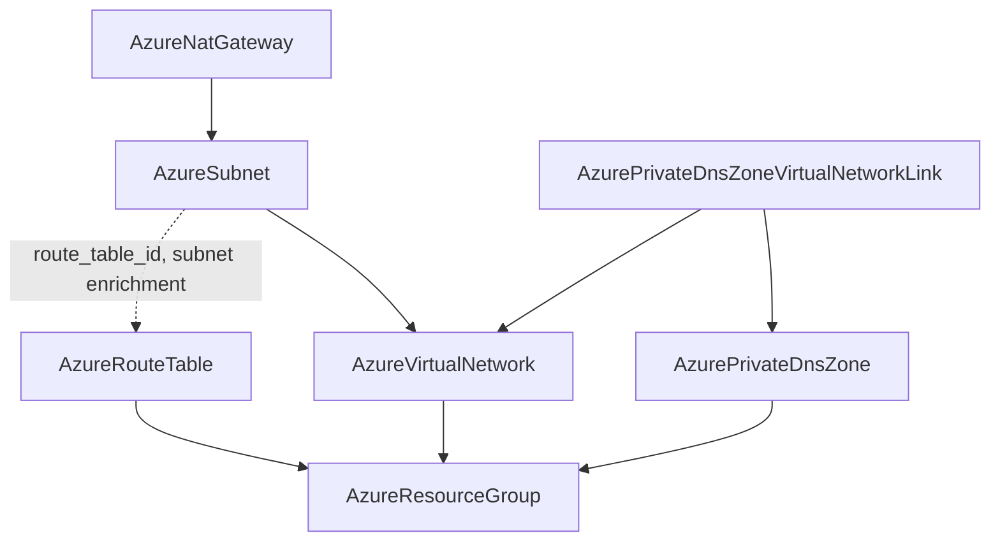

# Azure Networking Wave: General-Purpose Virtual Network, Route Tables, and Private DNS Zone Links

**Date**: July 3, 2026
**Type**: Feature + Breaking Change
**Components**: Azure Provider, API Definitions, IAC Modules, Infra Charts, E2E Framework

## Summary

The Azure networking foundation is rebuilt around honest, composable primitives. The
AKS-shaped `AzureVpc` kind is now `AzureVirtualNetwork` -- Azure's own name for the
resource -- modeling the full `azurerm_virtual_network` surface instead of a
single-CIDR wrapper that silently created subnets, NAT gateways, and DNS links.
Two new Tier-0 kinds join the catalog: `AzureRouteTable` (418, user-defined routing)
and `AzurePrivateDnsZoneVirtualNetworkLink` (419, the zone-to-network attachment),
and `AzurePrivateDnsZone` is reworked to zone-only with its bundled one-link
limitation removed. All four components ship both engines at 100% behavioral parity
on the shared keyless-capable provider builder, with live dual-engine E2E proof.

## Problem Statement / Motivation

The old `AzureVpc` was a 7-field spec designed entirely around one consumer:

- A single `address_space_cidr` where Azure supports many (and dual-stack)
- A hard-wired `nodes_subnet_cidr` baking an AKS worldview into the network kind
- An `is_nat_gateway_enabled` toggle that created a NAT gateway and public IP inside
  the network module -- another kind's job (`AzureNatGateway` already existed)
- Plain-string `dns_private_zone_links` that half-modeled a resource with its own
  lifecycle
- None of the real network surface: DNS servers, BGP community, DDoS protection,
  encryption, flow timeouts, IPAM delegation

The name itself was the deepest problem: "VPC" is another cloud's vocabulary. An
Azure user looks for a Virtual Network -- in the portal, in ARM, in `azurerm` --
and the catalog should speak Azure's language.

On the private DNS side, the zone bundled exactly one virtual network link and
self-documented the limitation ("for hub-spoke topologies... deploy separate
instances or use a future dedicated VNet link resource"). Links are many-per-zone
with independent lifecycles -- the textbook case for a first-class kind.

## Solution / What's New

### AzureVirtualNetwork (rework of AzureVpc, enum 406, id_prefix `azvnet`)

The network is deliberately just the network. The spec models the full
`azurerm_virtual_network` v4 surface:

- `address_spaces` (multi-CIDR, dual-stack) XOR `ip_address_pools` (Azure Network
  Manager IPAM delegation, max 2), enforced by message-level CEL mirroring
  azurerm's ExactlyOneOf
- `dns_servers`, `bgp_community` (range-precise validation), `ddos_protection_plan`
  (id + enable, preserving ARM's attach/activate distinction), `encryption`
  enforcement enum, `flow_timeout_in_minutes` (4-30),
  `private_endpoint_vnet_policies` enum, `edge_zone`, and user `tags`
- Outputs: `virtual_network_id`, `virtual_network_name`, `guid`, and
  `address_spaces` echoing the ACTUAL ranges (the only place IPAM-provisioned
  ranges are visible)

Everything the old kind smuggled in now composes by reference: `AzureSubnet`
partitions the space, `AzureNatGateway` attaches subnet-side, and the new link
kind handles private DNS resolution.

### AzureRouteTable (new, enum 418, id_prefix `azrt`)

User-defined routes for forced tunneling, firewall egress, and black-holing:

- Repeated `routes` (name, CIDR-or-service-tag prefix, five-value next-hop enum,
  appliance IP) with the VirtualAppliance/IP pairing enforced at validation time
- `bgp_route_propagation_enabled` (Azure default true; disabling is the
  forced-tunneling hardening)
- Routes fold inside the table (no independent lifecycle); subnet attachment is
  expressed from the subnet side, matching Azure's model -- the table exports
  `route_table_id` for the `AzureSubnet` enrichment to consume

### AzurePrivateDnsZoneVirtualNetworkLink (new, enum 419, id_prefix `azpdnslink`)

The attachment that makes a zone resolvable from a network:

- **One parent reference, no redundant resource group**: the spec takes
  `private_dns_zone_id`, and both modules derive the zone name and resource group
  from the ARM ID -- they can never contradict the referenced zone. (azurerm's own
  source marks its name+RG contract as the legacy shape it intends to replace.)
- `registration_enabled` (VM auto-registration; one enabled link per network) and
  `resolution_policy` (Default / NxDomainRedirect public fallback)

### AzurePrivateDnsZone (rework: zone-only)

- The bundled `vnet_id` + `registration_enabled` are removed; links are the
  standalone kind, one per zone-network pair
- Completed to the azurerm floor: `soa_record` customization and user `tags` added
- Outputs gain `resource_group_name` for tooling that joins on name+RG
- Both modules rewritten on the canonical variable shape and the shared provider
  builder (the Terraform module previously used a pre-standard metadata contract)

### Composition graph

## Implementation Details

- **Rename executed end to end**: enum value (number 406 kept), component
  directory, all four protos, both modules, docs, presets, and every
  cross-reference in other components' docs and the six FK/chart seams. Final
  `git grep -i azurevpc` sweep: zero tracked hits outside historical records.
- **FK graph corrected**: `azuresubnet.vnet_id` and `azureprivatednszone` now
  reference `AzureVirtualNetwork`; `azureakscluster.vnet_subnet_id` and
  `azurevirtualmachine.subnet_id` -- which defaulted to the VNet's removed
  `nodes_subnet_id` output -- now default to `AzureSubnet.status.outputs.subnet_id`
  (the honest join). `planton validate-refs --check` green.
- **Registry prerequisites** declared for the E2E dependency graph:
  `AzureVirtualNetwork`/`AzureRouteTable`/`AzurePrivateDnsZone` →
  `[AzureResourceGroup]`; the link → `[AzurePrivateDnsZone, AzureVirtualNetwork]`
  (the first two-parent chain in the Azure suite).
- **Shared-builder migration continues**: the network and zone modules moved off
  inline `azure.NewProvider` (which silently breaks keyless auth) onto
  `pulumiazureprovider.Get`; both new kinds start there. 8 of ~41 Azure Pulumi
  modules are now keyless-capable.
- **Charts kept green, contract preserved**: four `charts/azure/*` updated. The
  AKS chart's load-bearing nodes subnet became an explicit `AzureSubnet` (the
  cluster repointed to it) and its NAT toggle became a conditional
  `AzureNatGateway` resource; the other three charts' unused "default subnet"
  values were dropped; the database-stack's zones gained explicit link resources.
- **E2E**: four new verifiers on the generic ARM GetByID pattern (typed-404
  absence, per-RP pinned API versions -- no new Go SDK dependencies), fixture
  profiles for the network and zone, scenarios for all four kinds, and eight new
  test entrypoints.

## Validation (what ran and passed)

- Offline: `make protos`; 84 spec test cases across the four kinds (31/21/16/16),
  all passing; targeted + release-equivalent Pulumi builds; `make build-go`;
  kind-map + gazelle regen; `planton secret-coverage --check` (Azure slice stays
  100%; none of the four kinds carries secret material);
  `planton validate-refs --check`; `pkg/outputs` conformance cases added for all
  four kinds; `tofu init/validate/fmt` + full `planton tofu plan` on all four hack
  manifests; audits 98% Fully Complete with PARITY ✅ and COVERAGE ✅ for each;
  site catalog regenerated (old `vpc-virtual-network` slug self-cleaned).
- Chart proof: all 19 manifests rendered from the four charts' default values
  validate; the only two failures (`AzureAksCluster.system_node_pool` required;
  empty default `administratorPassword`) are pre-existing chart gaps in untouched
  fields, owned by the charts wave.
- Live (test subscription, ambient CLI credentials): all eight scenarios green --
  `TestAzureVirtualNetwork_{Pulumi,Terraform}`,
  `TestAzureRouteTable_{Pulumi,Terraform}`,
  `TestAzurePrivateDnsZone_{Pulumi,Terraform}`, and
  `TestAzurePrivateDnsZoneVirtualNetworkLink_{Pulumi,Terraform}` (the link's
  two-parent composed chain: fixture RG → fixture zone + fixture network → link).
  All 8 phases per run; suite total 31m; `az group list` empty afterwards -- zero
  orphans (Azure's auto-created NetworkWatcherRG platform artifact removed too).

## Impact

- **Breaking (pre-adoption)**: `AzureVpc` manifests must become
  `AzureVirtualNetwork` with `addressSpaces` (list) + explicit `name`; consumers
  of the removed `nodes_subnet_id` output reference an `AzureSubnet` instead;
  `AzurePrivateDnsZone.vnet_id` becomes an
  `AzurePrivateDnsZoneVirtualNetworkLink`. Nobody uses the system yet -- no
  migration path is shipped, by design.
- Azure networking topologies (hub-and-spoke DNS, firewall egress, forced
  tunneling, dual-stack, IPAM) are now expressible as composed first-class
  resources.

## Related Work

- Builds on the Azure live E2E harness and the identity/RBAC wave (role
  assignment, role definition, federated identity credential, identity rework)
- The `AzureSubnet` enrichment (route-table attach seam, delegation depth) and
  `AzureVnetPeering` are the networking wave's next components

---

**Status**: ✅ Production Ready
