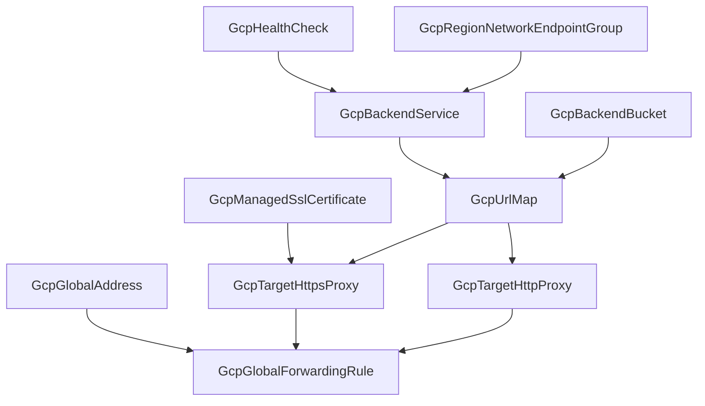

# GCP Load Balancer Frontend: Target Proxies, Global Forwarding Rule, and the Cloud CDN Retirement

**Date**: July 3, 2026
**Type**: Feature
**Components**: GCP Provider, API Definitions, IAC Stack Runner, Testing Framework

## Summary

The GCP L7 load balancing family is now complete end to end as first-class composable kinds: `GcpTargetHttpProxy` (629) and `GcpTargetHttpsProxy` (601) bind forwarding rules to URL maps and own TLS termination, and `GcpGlobalForwardingRule` (710) is the VIP node where traffic enters — doubling as the Private Service Connect entry point. The monolithic `GcpCloudCdn` kind is retired: everything it bundled as a black box (URL map, HTTPS proxy, SSL certificate, health check, backends, CDN policy) now exists as individually ownable, referenceable resources. `GcpGlobalAddress` was conformed to the modern module contract, and the shared E2E ref resolver gained repeated-`StringValueOrRef` resolution.

## Problem Statement / Motivation

The catalog carried the middle and back of GCP's global load balancer (health check, backend service, backend bucket, NEG, URL map, managed certificate) but no frontend: no target proxies and no forwarding rule meant no way to compose an actual serving VIP from first-class kinds. The only path to a complete load balancer was `GcpCloudCdn` — a monolith that embedded its own URL map, HTTPS proxy, and certificates, none of them referenceable, none of them independently rotatable or swappable.

### Pain Points

- No composable path from "backend service exists" to "traffic serves on an IP" — the family dead-ended at the URL map.
- `GcpCloudCdn` duplicated five resources the catalog now models properly, with a fraction of their depth and zero referenceability.
- `GcpGlobalAddress` (the VIP reservation the frontend binds) carried four stale defect classes: `object({value})` tfvars typing, a `Pulumi.yaml` binary option that breaks source-mode runs, the only `~> 5.0` provider pin left in the tree, and no ambient-project fallback.
- The shared E2E ref resolver crashed on repeated `StringValueOrRef` fields (a proxy's `ssl_certificates`), blocking composed TLS scenarios.

## Solution / What's New

### The complete frontend, decomposed the way GCP decomposes it

- **`GcpTargetHttpProxy` (629, `gcpthp`)** — the thin plaintext adapter. `url_map` is the resource's only mutable field (GCP's `setUrlMap` swaps routing tables on a live frontend with zero downtime); keep-alive and Traffic Director `proxy_bind` modeled. Its standard production role — serving the http→https redirect on port 80 — is taught by the presets.
- **`GcpTargetHttpsProxy` (601, `gcpthsp`)** — the TLS-termination node. All three certificate mechanisms at the released 6.50.0 floor: the classic `ssl_certificates` list (refs → `GcpManagedSslCertificate`, max 15), `certificate_manager_certificates` (refs → `GcpCertManagerCert`, cross-region internal ALB), and the SNI-scale `certificate_map` — with a CEL rule enforcing the exactly-one choice GCP requires. Plus `ssl_policy` and `server_tls_policy` (the mTLS lever) as un-defaulted refs, `quic_override`, and all four TLS 1.3 `tls_early_data` modes.
- **`GcpGlobalForwardingRule` (710, `gcpgfr`)** — the VIP node. `target` (mutable in place — the zero-downtime frontend swap) with `default_kind` → the HTTPS proxy; `ip_address` ref → `GcpGlobalAddress`; scheme modeling includes the `NONE` sentinel that maps to the API's empty scheme — the Private Service Connect form (`all-apis`/`vpc-sc` bundles, service attachments, Service Directory registration, DNS-zone opt-out), so PSC and "unset → EXTERNAL" can never be confused. Five CEL coherence rules fence scheme-dependent fields pre-deploy. The EXTERNAL→EXTERNAL_MANAGED backend-bucket migration canary is modeled.
- **`GcpCloudCdn` retired** — the kind directory, enum 601 (reassigned), the generated kind map, and its catalog cross-links are gone. CDN capability lives where GCP puts it: `cdn_policy` on backend services and backend buckets.
- **`GcpGlobalAddress` conformed** — modern converter contract (metadata variable + plain-string ref typing), `~> 6.0` float, ambient-project fallback in both engines, `Pulumi.yaml` binary option dropped, Compute API enablement, and TF-side `planton-ai_*` label parity with the Pulumi module.

### E2E framework: repeated ref resolution

The shared resolver ([refresolve.go](../../e2e/framework/runner/refresolve.go)) treated every `StringValueOrRef` field as singular; a repeated ref field (the HTTPS proxy's `ssl_certificates`) hit `Value.Message()` on a list and panicked. It now resolves each element of a repeated ref field in place, unit-tested, with singular and nested-message behavior unchanged.

## Implementation Details

- Specs verified against the **released** provider line (v6.50.0), not the clone's main: every modeled field exists at the released floor; `allow_psc_global_access` (beta-only) and `source_ip_ranges` (API-documented as regional-only despite appearing in the global schema) are recorded skips. All three TF modules run on plain `google ~> 6.0`.
- Registry prerequisites drive composed E2E transitively: `GcpTargetHttpProxy → [GcpUrlMap]`, `GcpTargetHttpsProxy → [GcpUrlMap, GcpManagedSslCertificate]`, `GcpGlobalForwardingRule → [GcpTargetHttpsProxy, GcpGlobalAddress]`. New install profiles (`e2e/prerequisite.yaml`) for the URL map, managed certificate (with a `${E2E_RUN_ID}` domain), HTTPS proxy, and global address; four new verifiers assert real wiring (URL-map attachment, TLS input presence, VIP + target binding) via `compute.googleapis.com`.
- The 710–719 enum block opens the networking/load-balancer overflow family (623–629 is fully allocated).

## Benefits

- **A complete external HTTPS load balancer now composes from ten first-class kinds** — every piece independently ownable, referenceable, rotatable, and swappable (certificate rotation, routing-table repoints, and frontend proxy swaps are all zero-downtime in-place updates, and the spec comments say which edits are safe on a live frontend).
- **Private Service Connect for Google APIs ships in the same kind** — private API access for locked-down VPCs with no extra modeling.
- **One less black box**: the retired monolith can no longer teach users an uncomposable pattern.

## Validation

- Spec tests: 21 + 22 + 30 cases green (plus the conformed global address suite).
- Offline: release-equivalent Pulumi builds; `tofu validate` + `planton tofu plan` through the real tfvars converter for all four kinds; `secret-coverage --check`; `validate-refs --check`; `validate-outputs` dry-runs fully populated on BOTH module dirs per kind; `pkg/outputs` conformance cases added for all three new kinds; every preset/hack/scenario/prerequisite manifest through `planton validate`.
- Live dual-engine E2E on the test project: target HTTP proxy 3m50s/4m20s (4-prerequisite chain), target HTTPS proxy 4m45s/4m35s (5-prerequisite chain incl. a PROVISIONING managed certificate — attachment-before-activation proven live), global forwarding rule 6m12s/6m18s (the deepest chain in the harness: 7 transitive prerequisites assembling and destroying a complete load balancer). Zero orphans after teardown, verified by per-type gcloud sweeps.
- Audits: all three kinds **Fully Complete — PARITY ✅**, zero PARITY-EXCEPTIONs.

## Impact

GCP users can now self-serve the entire global external Application Load Balancer — VIP to backend — from referenceable kinds, including the http→https redirect pair pattern on a shared static IP, SNI-scale SaaS certificate maps, mTLS frontends, Traffic Director meshes, and PSC private API access.

## Related Work

- Builds on the GCP backend service hub and the routing trio (NEG, URL map, managed SSL certificate).
- The regional LB family (regional forwarding rule / proxies / backend service) remains a deliberate future wave — the provider's regional resources are structurally divergent.
- `GcpSslPolicy` and the self-managed `GcpSslCertificate` are natural TLS-leaf follow-ups; the HTTPS proxy's `ssl_policy` ref accepts them with a one-line `default_kind` addition.

---

**Status**: ✅ Production Ready
