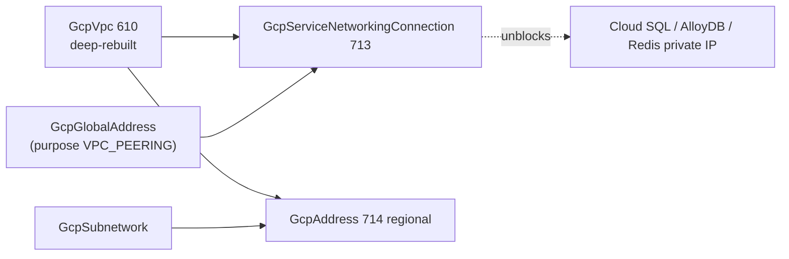

# GCP Networking-Depth Wave: Service Networking Connection, Regional Address, and the VPC Deep-Rebuild

**Date**: July 3, 2026
**Type**: Feature
**Components**: API Definitions, GCP Provider, IAC Stack Runner, Testing Framework, Provider Framework

## Summary

Opened the networking-depth wave with two new kinds — `GcpServiceNetworkingConnection` (713) and regional `GcpAddress` (714) — and a deep-rebuild of `GcpVpc` that removes the bundled private-services-access black box in favor of the composed shape GCP itself models. The E2E framework gained consumer-scoped prerequisite overrides, and the `serverless-api-backend` chart was reworked onto the explicit PSA nodes. All three kinds passed live dual-engine E2E on `planton-e2e` with zero orphans.

## Problem Statement / Motivation

Private services access — the VPC peering that lets Cloud SQL, AlloyDB, Memorystore, and Filestore hand out private IPs — was hidden inside `GcpVpc` as a `privateServicesAccess: enabled` toggle that silently created a global address and a service networking connection with no independent lifecycle, no FK-referenceable outputs, and no way to grow reserved ranges. The provider models the connection as its own resource; it is THE prerequisite for the entire data wave.

Regional `google_compute_address` was absent from the catalog entirely while its global sibling existed — no reservation node for Cloud NAT IPs, internal LB VIPs, or GCE endpoints.

### Pain Points

- PSA capacity could not be grown (the hidden range was fixed at creation); GCP's own growth path is appending ranges to the connection.
- The hidden resources were invisible to the resource graph — no ordering relationships, no cross-chart ownership.
- `GcpRouterNat.nat_ip_names` named regional addresses that had no kind to reference.
- The VPC's Terraform module exported only 3 of 5 declared stack outputs (`network_name` and `network_id` missing) — FK targets of `GcpCloudRun` and `GcpCloudSql` silently resolved empty on Terraform deployments.
- The VPC spec was thin: 4 real knobs vs the provider's ~12 (no MTU, ULA IPv6, firewall-policy order, network profile, BGP best-path block, or default-route suppression).

## Solution / What's New

### `GcpServiceNetworkingConnection` (713, `gcpsnc`)

The private-services-access peering as a first-class node: `network` ref → GcpVpc (required, ForceNew), `service` (default `servicenetworking.googleapis.com`), `reserved_peering_ranges` as repeated refs → GcpGlobalAddress **by name** (min 1, mutable — growth is additive and safe), and the `update_on_creation_fail` recovery lever for adopting pre-existing connections. Outputs: `peering`, `network`. One connection per (network, service) pair — the API's cardinality — documented prominently, as is the teardown ordering rule (destroy producers before the connection). Registry prerequisites: `[GcpVpc, GcpGlobalAddress]`. Recorded skips: `deletion_policy` (catalog-wide), `peered_dns_domain` + `vpc_service_controls` sibling resources (Tier-2).

### `GcpAddress` (714, `gcpaddr`, regional)

The regional reservation node, split from the global kind per the addresses split-when-divergent precedent (regional carries `subnetwork`, `network_tier`, `ipv6_endpoint_type` the global kind cannot): `region` (required), `address`, `address_type`, `purpose` (GCE_ENDPOINT / SHARED_LOADBALANCER_VIP / VPC_PEERING / IPSEC_INTERCONNECT / DNS_RESOLVER — PRIVATE_SERVICE_CONNECT is global-only per the provider schema), `network` ref, `subnetwork` ref, `prefix_length`, `ip_version`, `ipv6_endpoint_type`, labels. Outputs: `address`, `self_link`, `name`, `region`. Message-level CEL enforces the purpose/type/network/subnetwork coherence arms pre-deploy. Recorded skip: `ip_collection` (BYOIP PDP — matches the subnetwork BYOIP skip). `GcpRouterNat.nat_ip_names` gained `default_kind = GcpAddress`, closing the family's last un-defaulted ref (the NAT module's deeper rework — it creates rather than references addresses — is recorded for the RouterNat depth session).

### `GcpVpc` deep-rebuild (610)

- **Removed** `private_services_access` (message + field) and the two PSA outputs; both modules dropped the hidden global-address + connection resources. All 18 inbound `default_kind = GcpVpc` refs resolve through name-keyed output paths untouched by the removal (`validate-refs` green).
- **Fixed the TF output parity defect**: `network_name` and `network_id` now exported by Terraform (previously Pulumi-only — their FK consumers silently resolved empty on TF deployments).
- **Added the provider floor**: `description`, `mtu` (1300–8896), `enable_ula_internal_ipv6` + `internal_ipv6_range`, `network_firewall_policy_enforcement_order`, `network_profile`, BGP best-path block (`mode` / `always_compare_med` / `inter_region_cost`), `delete_default_routes_on_create`. Outputs gained `gateway_ipv4` and `internal_ipv6_range`. All fields verified GA on released 6.50.0; provider pin moved `6.19.0` → `~> 6.0`.
- **Anatomy conformance**: hack manifest created at the canonical `iac/hack/manifest.yaml` (legacy `hack/` copy and a stale `stack-input.yaml` deleted); spec test rebuilt (17 cases); presets/docs/catalog-page rewritten to the composed-PSA world.
- **Terraform enum contract fixed en route**: the tfvars converter emits proto enum NAMES as strings (`"REGIONAL"`), but the old `variables.tf` typed `routing_mode` as a number — set-explicitly manifests failed at plan time. Now typed as a validated string.

### GcpGlobalAddress extensions

- `name` output added (extend-only, both engines) — the composition key `reserved_peering_ranges` resolves through.
- **CEL reference-safety fix**: `internal_requires_network` used `this.network.value != ''`, which silently rejected valid `valueFrom` manifests (the reference branch has no `value`). Rewritten to the `has(value) || has(value_from)` pattern; the same trap was avoided in the new GcpAddress CEL, and the forge rule (`002-spec-validate`) now documents the reference-safe presence-check pattern.

### E2E framework: consumer-scoped prerequisite overrides

The connection chain needs a GcpGlobalAddress prerequisite in INTERNAL/VPC_PEERING shape, but the address kind's published `prerequisite.yaml` is an EXTERNAL VIP (for the forwarding-rule chain). The dependency resolver now prefers `<consumer>/v1/e2e/prerequisites/<dep>.yaml` over the dependency's published profile, letting each consumer pin the install shape it needs without forking the registry. Unit-tested (`dependencies_test.go`) and documented in `e2e/README.md`. Used twice this session: the SNC chain's peering-range address and the GcpAddress internal chain's slim subnetwork.

### Chart rework: `serverless-api-backend`

`network.yaml`'s `privateServicesAccess: enabled` toggle became two explicit chart nodes — a `GcpGlobalAddress` VPC_PEERING /16 range and a `GcpServiceNetworkingConnection` — behavior-preserving (the chart enabled PSA unconditionally; the nodes stay unconditional). The Cloud SQL node gained a `depends_on` relationship on the connection: its private IP genuinely requires the peering to exist first. The Redis node is unaffected (BASIC tier direct peering does not use PSA). Chart re-rendered against default values; every document validates.

## Validation

Offline, all green: `make protos` ×2 + kind-map regen + `make reset-gazelle`; spec tests (15 SNC + 21 address + 17 VPC); release-equivalent Pulumi builds ×3; `tofu validate` ×3 + offline `planton tofu plan` ×3 through the real tfvars converter; `secret-coverage --check`; `validate-refs --check`; `validate-outputs` dry-runs fully populated on BOTH module dirs for all three kinds + GcpGlobalAddress; four new `pkg/outputs` conformance cases; every preset / hack / scenario / prerequisite manifest through `planton validate`; chart rendered + all documents validated; `make build-go`; framework tests (outputs / runner) green.

Parity audits: all three kinds audited **Fully Complete — PARITY ✅** (reports in each kind's `docs/audit/2026-07-03-*.md`). The GcpAddress audit caught one real divergence in-session (Pulumi's API-enablement resource lacked `DisableOnDestroy: false` while TF sets it) — fixed there, then swept across the session's other Pulumi modules (SNC ×2 API resources, GcpGlobalAddress) which carried the same class.

Live (project `planton-e2e`, dual-engine, zero orphans on per-type gcloud sweeps):

| Scenario | Pulumi | Terraform |
|---|---|---|
| `gcpservicenetworkingconnection/minimal` (VPC + peering-range chain) | 241s | 227s |
| `gcpaddress/minimal` + `gcpaddress/internal-subnetwork` | 343s | 315s |
| `gcpvpc/minimal` (first-ever VPC leaf scenario) | 74s | 67s |

The known teardown risk (service-networking connection deletes flaking when producers hold subnets) did not materialize — the chain creates no producers; the TF destroy completed in 35s.

New verifiers: `serviceNetworkingConnectionVerifier` asserts the `servicenetworking-googleapis-com` peering exists (state ACTIVE) on the network object — no new Go SDK dependency; `addressVerifier` probes regional `addresses.get`; the VPC verifier gained self-link and MTU posture assertions.

## Impact

- The data wave (Cloud SQL / AlloyDB / Redis private IP) now has its prerequisite modeled honestly: reserve ranges as first-class addresses, connect them explicitly, grow capacity by appending ranges.
- Terraform users of the VPC kind get the two outputs their FK refs were silently missing.
- Regional address reservation unlocks static Cloud NAT IPs, internal LB VIPs, and GCE endpoint IPs as catalog nodes.
- Breaking change for any manifest using `GcpVpc.spec.privateServicesAccess` — migrate to the composed pair (the serverless-api-backend chart shows the pattern).

## Related Work

- Session 010 (`2026-07-03-204844-gcp-ssl-policy-and-self-managed-ssl-certificate-kinds.md`) — the TLS-leaf pair that completed the LB family and opened the 710–719 block this session continues.
- Session 005 subnetwork depth rebuild — the depth-at-the-provider-floor precedent the VPC rebuild follows.

---

**Status**: ✅ Production Ready
