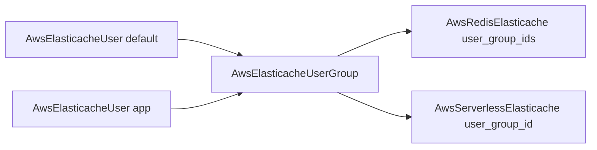

# AWS ElastiCache Family: RBAC Kinds Forged, Three Cache Kinds Rebuilt

**Date**: July 3, 2026
**Type**: Feature
**Components**: API Definitions, AWS Provider, IAC Modules, E2E Framework

## Summary

The ElastiCache family reaches the 90/10 bar as one coherent unit: two new
first-class RBAC kinds — `AwsElasticacheUser` (enum 243, id_prefix `ecuser`)
and `AwsElasticacheUserGroup` (enum 244, id_prefix `ecug`) — and full rebuilds
of `AwsRedisElasticache`, `AwsMemcachedElasticache`, and
`AwsServerlessElasticache` to the complete provider surface. All five kinds
carry generator-owned Terraform contracts under the drift guard, and the
family's first-ever live E2E ran 10/10 lanes green on both engines with a
zero-orphan account sweep.

## Problem Statement / Motivation

- **The modern auth path was unrepresentable as a graph.** RBAC (per-user ACL
  access strings grouped into user groups) is AWS's recommended production
  authentication for Redis/Valkey, yet the replication group's
  `user_group_ids` and the serverless cache's `user_group_id` were plain
  strings — the exact pre-`AwsIamPolicy` shape. Nothing in the catalog could
  *create* a user or group, so composing a cache with credentials meant
  hand-provisioning outside the graph.
- **All three cache specs were mid-depth.** The replication group was missing
  the cluster-mode migration path, global datastore membership, dual-stack
  networking, snapshot restore sources, Valkey durability modes, per-shard
  placement, AUTH-token rotation strategy, and preferred-AZ placement.
  Memcached lacked dual-stack fields and dishonestly required
  `engine_version`. Serverless lacked `network_type` and restore-from-S3.
- **All three modules carried the legacy `variable "spec" { type = any }`
  contract** — the never-actually-deployable class the RDS session
  eliminated — plus provider pins frozen at `= 5.82.0`, below the version
  where `durability` and `node_group_configuration` exist.
- **Zero E2E coverage** for the whole family: no verifiers, no scenarios, no
  `aws-sdk-go-v2/service/elasticache` dependency.

## Solution / What's New

### The RBAC pair (forged)

- **`AwsElasticacheUser`** — identity (user id = `metadata.name`, create-time
  immutable), engine (redis/valkey), Redis ACL `access_string` with dense
  syntax comments, and the **modern nested `authentication_mode` only**
  (password with up-to-2 sensitive passwords for zero-downtime rotation /
  iam / no-password-required, each coupling CEL-enforced). The provider's
  legacy flat `passwords`/`no_password_required` arms and the TF write-only
  `passwords_wo` pair are skipped with recorded reasons — one honest shape
  per capability.
- **`AwsElasticacheUserGroup`** — engine + `user_ids` as
  `repeated StringValueOrRef` → `AwsElasticacheUser`. AWS's mandatory
  "default"-named member is documented in the spec and proven live: the kind's
  registry entry declares `prerequisites: [AwsElasticacheUser]` and its E2E
  scenario composes the group from a deployed locked-down `default` user plus
  a password app user. The `aws_elasticache_user_group_association` glue
  resource folds into `user_ids` (the IAM-attachments precedent).

### The cache rebuilds

- **`AwsRedisElasticache`** (~42 fields): `cluster_mode` (online
  non-clustered→clustered migration), `global_replication_group_id` with the
  full required-or-derived CEL set (engine/version/node_type/topology/
  encryption/parameter-group/restore all inherited from the global primary),
  `durability` (Valkey 9.0+ clustered write-acknowledgement),
  `node_group_configurations` (per-shard AZ/replica/slot pinning),
  `preferred_cache_cluster_azs`, `network_type`/`ip_discovery` (dual-stack),
  `snapshot_arns`/`snapshot_name` restore sources,
  `auth_token_update_strategy` (ROTATE/SET/DELETE), `auth_token` as a
  sensitive `StringValueOrRef`, `user_group_ids` as refs, and the
  `subnet_group_name`/`parameter_group_name` bring-your-own arms (XOR the
  folded lists — the RDS shape). Naming basis moved to `metadata.name`.
- **`AwsMemcachedElasticache`**: `engine_version` relaxed required→optional
  (empty = AWS default; versionless manifests never go stale),
  `network_type`/`ip_discovery`, both external group arms.
- **`AwsServerlessElasticache`**: `network_type`, `snapshot_arns_to_restore`,
  `user_group_id` as `StringValueOrRef` → `AwsElasticacheUserGroup` (its
  engine guard moved to the `has()` form a message-typed field requires).

### Generator-owned contracts

All five kinds enrolled in `TestVariablesTFDrift`; `variables.tf` regenerated
from the protos (null-aware tri-states, `StringValueOrRef` lowered to plain
strings). The three legacy `type = any` contracts are gone. Hand-written
locals were swept for `.value` dereferences against the flattened contract,
and the `= 5.82.0` pins lifted to the `>= 6.0.0` family floor (durability and
per-shard placement do not exist below v6).

## E2E (first for the family)

`aws-sdk-go-v2/service/elasticache` added; five state-aware verifiers on one
client (DescribeReplicationGroups / CacheClusters / ServerlessCaches / Users /
UserGroups; deleting/deleted = absent — the NAT-gateway lifecycle class).

| Lane | Pulumi | Terraform |
|---|---|---|
| AwsElasticacheUser (locked-down default) | 3m37s | 1m53s |
| AwsElasticacheUserGroup (composed 2-user membership) | 6m51s | 6m05s |
| AwsServerlessElasticache (min limits) | 8m0s | 6m53s |
| AwsMemcachedElasticache (t4g.micro) | 9m42s | 9m12s |
| AwsRedisElasticache (single-node t4g.micro) | 14m43s | 13m41s |

10/10 green, serial lanes with private TMPDIR/PULUMI_HOME and `-count=1`;
post-run sweep confirmed zero orphans (only AWS's built-in `default` user
remains; no groups, caches, subnet/parameter groups, or tagged VPCs/subnets).

The one live-run catch: the serverless and memcached Pulumi modules predated
the module anatomy and had **no `Pulumi.yaml`** — every offline gate passes
without it, and the failure surfaces only as `pulumi stack init`'s misleading
"pass the fully qualified name" error. The entrypoint-completeness gate is now
folded into the update rule's IaC scenario.

## Validation

- Spec/CEL tests ×5 (happy + every error path) — green.
- `pkg/outputs` conformance ×5 new cases — green.
- `TestVariablesTFDrift` ×5 — green (generator-owned).
- `planton validate-refs --check` — all foreign keys resolve.
- `planton secret-coverage --check` — green (`auth_token_update_strategy`
  exempted with reason: rotation-policy enum, not credential material).
- `tofu init + validate` ×5 — green on the v6 provider line.
- Release-equivalent Go builds of all five Pulumi programs + `make build-cli`;
  Bazel build of all touched targets after `bazel-mod-tidy` + gazelle.
- All presets, hack manifests, and E2E scenarios CLI-validated.
- Site catalog regenerated (420 components, incl. the two new kind pages).

## Impact

- **RBAC becomes composable**: user → group → cache is now a pure
  resource-graph path, with credential rotation scoped to one application's
  user instead of a shared AUTH token.
- **Breaking (no users)**: `user_group_ids`/`user_group_id` changed from plain
  strings to `StringValueOrRef`; redis/memcached naming basis moved from
  `metadata.id` to `metadata.name`; memcached `engine_version` no longer
  required.
- Chart impact: none — the only chart composing these kinds
  (`charts/aws/microservices-backend/templates/cache.yaml`) sets fields whose
  names and shapes are unchanged (verified; charts untouched per the
  charts-wave directive).

## Related Work

- The RDS pair rebuild (2026-07-03) — the data-wave pattern this session
  applies: external group arms, managed-secret posture, generator-owned
  contracts, state-aware verifiers.
- The IAM leaf (2026-07-02) — the attachments-as-refs precedent the user
  group's membership follows.

---

**Status**: ✅ Production Ready
