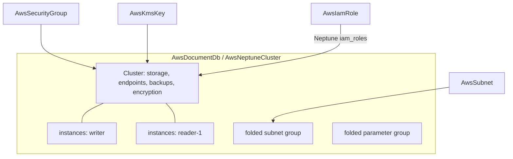

# AWS DocumentDB and Neptune: Full-Surface Rebuilds with Folded Instances

**Date**: July 4, 2026
**Type**: Feature
**Components**: API Definitions, AWS Provider, IAC Modules, E2E Framework

## Summary

`AwsDocumentDb` and `AwsNeptuneCluster` — the two Aurora-shaped cluster
kinds — are rebuilt to the complete provider surface with the settled
data-family pattern: folded per-name `instances` blocks, embedded security
groups retired in favor of first-class references, an AWS-managed master
password as the recommended DocumentDB default, and serverless v2 scaling on
both. Both Terraform contracts are now generator-owned under the drift
guard, both kinds are enrolled in outputs conformance, and their first-ever
live E2E ran 4/4 dual-engine lanes green with a zero-orphan account sweep.

## Problem Statement / Motivation

- **Both specs were mid-depth with flat compute.** Each kind modeled its
  instances as `instance_count` + one `instance_class` — so per-instance
  controls (promotion tiers, AZ pins, Performance Insights, CA certs,
  maintenance windows) were unrepresentable, and scaling readers rewrote
  anonymous count-indexed resources instead of adding a named entry.
- **DocumentDB required a plaintext `master_password`** and had no
  `manage_master_user_password` path, no serverless v2 scaling, no
  `network_type`/`storage_type`, no snapshot or point-in-time restore, and
  no global-cluster join. Its `connection_string` output embedded a
  `<password>` placeholder. Its port validation allowed 1–65535 while AWS
  rejects anything below 1150.
- **Neptune was missing its restore/replication shapes**
  (`snapshot_identifier`, `replication_source_identifier`,
  `global_cluster_identifier`), the major-version-upgrade companion field,
  and had serverless bounds wider than the service accepts (the real NCU
  range is 1–128 on both ends). **Its Terraform module had no `outputs.tf`
  at all** — a live cross-engine parity bug in which Terraform deploys
  emitted zero stack outputs while Pulumi exported everything.
- **Both kinds embedded a shadow security group** built from
  `allowed_cidrs` + a `vpc` field that existed only to feed it, carried
  hand-written legacy `variables.tf` contracts, exact `= 5.82.0` provider
  pins, stale hardcoded defaults (`engine_version: "5.0.0"` /
  `"1.3.0.0"`, `master_username: "docdbadmin"`), and had zero E2E coverage.

## Solution / What's New

### The shared cluster anatomy

Each `instances` entry materializes as its own provider resource keyed
`<cluster>-<name>` in both engines, so adding or removing a reader is an
in-place update. The instances list may only be empty for headless shapes
(restores, replicas, global-cluster members), CEL-enforced.

### AwsDocumentDb

- **Credentials**: `manage_master_user_password` (recommended; the secret
  ARN surfaces as `master_user_secret_arn`, never in state) XOR a sensitive
  optional `master_password`; `master_username` required-or-derived
  (derived when restoring from a snapshot, restoring to a point in time, or
  joining a global cluster — mirrors the provider's create branching).
- **New surface**: `network_type` (IPV4/DUAL), `storage_type`
  (standard/iopt1), `availability_zones`, serverless v2 scaling (0.5–256
  NCU with `db.serverless` coherence CEL), `snapshot_identifier`,
  `restore_to_point_in_time` (source + time XOR latest;
  copy-on-write/full-copy), `global_cluster_identifier`,
  `allow_major_version_upgrade`, per-instance promotion tiers /
  Performance Insights / CA certs / maintenance windows. Port range
  corrected to the provider's real 1150–65535.
- **Outputs modernized**: endpoint pair, id/arn/resource-id, port,
  hosted_zone_id, resolved engine version, `master_user_secret_arn`,
  subnet/parameter-group names, per-instance endpoints;
  `connection_string` and `security_group_id` dropped.

### AwsNeptuneCluster

- **IAM-auth model kept** — provider-honest: Neptune has no master
  credential field anywhere; access is network reachability +
  `iam_database_authentication_enabled` (SigV4), with engine `iam_roles`
  refs for the S3 bulk loader and Neptune ML.
- **New surface**: `snapshot_identifier`, `replication_source_identifier`,
  `global_cluster_identifier`, `neptune_instance_parameter_group_name`
  (CEL-required alongside `allow_major_version_upgrade` so a major upgrade
  can never fail halfway), `availability_zones`, `storage_type` iopt1,
  serverless bounds corrected to 1–128 NCU with max ≥ min.
- **The missing Terraform `outputs.tf` created** — the module now emits the
  full output set at parity with Pulumi, and the gap class is guarded by
  the new outputs-conformance case.

### Both kinds

- Embedded SG retired (breaking, zero users): `allowed_cidrs`/`vpc` gone;
  one repeated `security_group_ids` ref remains — ingress rules live on
  referenced `AwsSecurityGroup` nodes.
- Field names normalized to the data-family vocabulary (`subnet_ids`,
  `db_subnet_group_name`, `security_group_ids`, `kms_key_id`); hardcoded
  engine-version/username defaults dropped (empty = AWS current default,
  never stale); naming basis `metadata.name`.
- Generator-owned `variables.tf` under `TestVariablesTFDrift`; provider
  floors on the v6 line (DocumentDB `>= 6.23.0` — managed passwords and
  serverless land there; Neptune `>= 6.0.0`); registry
  `prerequisites: [AwsSubnet]`; zero PARITY-EXCEPTIONs (pulumi-aws v7.35.0
  carries the complete surface for both kinds).

## E2E (first for both kinds)

`aws-sdk-go-v2/service/docdb` + `aws-sdk-go-v2/service/neptune` added; two
state-aware verifiers (DescribeDBClusters keyed on the identifier output;
deleting/deleted = absent).

| Lane | Pulumi | Terraform |
|---|---|---|
| AwsDocumentDb (db.t4g.medium, managed master password) | 16m12s | 17m11s |
| AwsNeptuneCluster (Serverless 1–2 NCU, db.serverless) | 27m05s | 28m25s |

4/4 green, serial lanes with private TMPDIR/PULUMI_HOME and `-count=1`;
post-run sweep confirmed zero orphans (no clusters, instances,
subnet/parameter groups, managed secrets, or tagged VPCs/subnets remain).

The live-run catch: Terraform evaluates ALL locals eagerly, so a
parameter-group family derivation (`slice(split(".", engine_version), 0,
2)`) hard-failed the whole plan on unpinned manifests even though its
consuming resource had `count = 0` — invisible to `tofu validate`, which
never evaluates real inputs. Both modules now bound the slice with
`min()`, and the guidance is folded into the Terraform-module authoring
rule.

## Impact

- **The document-database and graph-database shapes are now composable
  graph citizens**: subnets, security groups, KMS keys, and IAM roles
  attach by reference; readers scale by appending named instance entries;
  DocumentDB credentials can live entirely in AWS Secrets Manager.
- **Breaking (no users)**: embedded-SG fields removed, field names
  normalized, `master_password` no longer required (DocDB),
  `connection_string`/`security_group_id` outputs dropped, flat
  `instance_count`/`instance_class` replaced by `instances`.
- Chart impact: none — no chart composes either kind.

## Related Work

- The RDS cluster/instance rebuild (2026-07-03) — the pattern this session
  applies verbatim: folded instances, managed passwords, embedded-SG
  retirement, generator-owned contracts, state-aware verifiers.
- The ElastiCache family (2026-07-03) — the external subnet/parameter-group
  arms and versionless-manifest conventions both kinds now share.

---

**Status**: ✅ Production Ready
