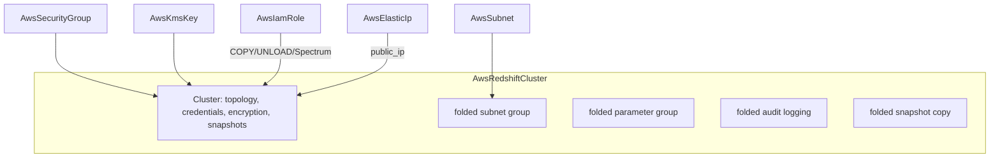

# AWS Redshift Cluster: Full-Surface Rebuild with Composed Security and Folded DR

**Date**: July 4, 2026
**Type**: Feature
**Components**: API Definitions, AWS Provider, IAC Modules, E2E Framework

## Summary

`AwsRedshiftCluster` is rebuilt to the complete `aws_redshift_cluster` v6
surface with the settled data-family pattern: the embedded security group
retired in favor of first-class `AwsSecurityGroup` references, snapshot
restore shapes (by name and by ARN, including cross-account), availability-
zone relocation and Multi-AZ modeled as the mutually exclusive recovery
strategies they are, a static `AwsElasticIp` reference for public clusters,
and cross-region snapshot copy folded in alongside audit logging. The
Terraform contract is generator-owned under the drift guard, the kind is
enrolled in outputs conformance, and its first-ever live E2E ran dual-engine
lanes green with a zero-orphan account sweep.

## Problem Statement / Motivation

- **The two engines disagreed on the cluster's identity.** The Terraform
  module named the cluster from `metadata.name` while the Pulumi module used
  `metadata.id` — the same manifest deployed differently-identified
  warehouses depending on the engine.
- **The spec embedded a shadow security group** built from
  `allowed_cidr_blocks` + `associate_security_group_ids` + a `vpc_id` field
  that existed only to feed it. Warehouse ingress rules belong on referenced
  `AwsSecurityGroup` nodes.
- **No restore shapes.** A warehouse could not be created from a snapshot —
  no `snapshot_identifier`/`snapshot_arn`/`owner_account`, so migration and
  recovery paths were unrepresentable.
- **No AZ relocation, no Elastic IP, no manual snapshot retention, no
  cross-region snapshot copy** — and the `>= 5.0` provider floor predated
  the v6 line where audit logging and snapshot copy became standalone
  resources and `encrypted`/`publicly_accessible` defaults changed.
- **Stale hardcoded defaults** (`master_username: "admin"`,
  `database_name: "dev"`) and a `maintenance_track_name` allowlist that
  rejected the named tracks AWS accepts.
- **Hand-written `variables.tf`** outside the drift guard, no outputs
  conformance case, and zero E2E coverage.

## Solution / What's New

### Composed security and honest recovery semantics

- **Security composes by reference**: one repeated `security_group_ids` ref
  (the attach semantics — `vpc_security_group_ids`); the managed SG and its
  rules are gone from both engines.
- **Recovery is a modeled choice**: `availability_zone_relocation_enabled`
  (move the single cluster) XOR `multi_az` (fail over to a standby),
  CEL-enforced with the provider's own constraint.
- **Restore shapes**: `snapshot_identifier` XOR `snapshot_arn`, with
  `snapshot_cluster_identifier` name disambiguation and `owner_account`
  cross-account restores — each gated by CEL to its meaningful contexts,
  and `master_username` required-or-derived (restores inherit credentials).
- **Folded satellites**: audit logging and cross-region snapshot copy are
  cluster settings keyed by the cluster identifier (the provider gives both
  replace-on-change `cluster_identifier` semantics), so they fold as
  sub-messages rather than standalone kinds.
- **Parameter groups**: inline `parameters` XOR an existing group name, with
  `parameter_group_family` selecting `redshift-2.0` when the managed group
  should track the new generation (`redshift-1.0` remains the accepted
  default everywhere).
- **Elastic IP by reference**: `elastic_ip` points at
  `AwsElasticIp.status.outputs.public_ip` — Redshift takes the IP address
  itself, not an allocation ID.

### Both engines on one contract

Naming basis converged on `metadata.name`; generator-owned `variables.tf`
under `TestVariablesTFDrift`; provider floor lifted to `>= 6.0.0`; the
Pulumi module completed its entrypoint anatomy (`Makefile`,
`stack-input.yaml`); zero PARITY-EXCEPTIONs (pulumi-aws v7.35.0 carries the
full surface). Outputs modernized: the managed-SG output dropped; endpoint,
DNS name, namespace ARN, and the managed admin-password secret ARN exported
identically by both engines.

### First-ever E2E

A state-aware verifier on the Redshift SDK (`DescribeClusters`;
`ClusterNotFound` and deleting/deleted states = absent), a managed-password
single-node ra3.large scenario on two-AZ subnet prerequisites, and
`TestAwsRedshiftCluster_Pulumi`/`_Terraform` entrypoints.

| Lane | Result | Duration |
|------|--------|----------|
| Pulumi (ra3.large, managed password) | PASS | 8m27s |
| Terraform (ra3.large, managed password) | PASS | 7m51s |

Zero-orphan sweep clean: no clusters, subnet/parameter groups, managed
secrets, or e2e-tagged networking remain.

## Implementation Details

- `spec.proto`: 40 fields, 13 spec-level CEL rules plus nested
  logging/snapshot-copy rules; fields renumbered contiguously; genuine
  skips recorded in `docs/README.md` (`master_password_wo`,
  `aqua_configuration_status`, per-kind tags).
- Live-run catches fixed and folded into the workflow rules:
  - A Pulumi `ApplyT` applier typed `*string` against a `StringOutput`
    compiles cleanly and panics only at deploy — guidance to prefer direct
    exports and to `go doc` the SDK type first now lives in the Pulumi
    module authoring rule.
  - A service's first-ever use in an account can fail on its service-linked
    role (`Unable to assume the SLR on the customer account`) while the
    auto-created role propagates — recorded as a retryable first-use
    transient in the forge rule's E2E guidance.
- Registry: `prerequisites: [AwsSubnet]`; docs/catalog/presets rewritten to
  the current shape (RA3-first — the dc2 family is no longer creatable for
  new clusters); site catalog regenerated.
- Redshift Serverless (namespaces + workgroups) deliberately not modeled —
  a separate product surface; candidate kinds of their own on demand.

## Impact

Redshift joins RDS, ElastiCache, DocumentDB, and Neptune on the settled
data-family shape: composed security, managed credentials by default,
honest create-time semantics, generator-owned contracts, and live
dual-engine proof. Breaking spec changes ship with zero users and zero
chart/foreign-key consumers.

---

**Status**: ✅ Production Ready
