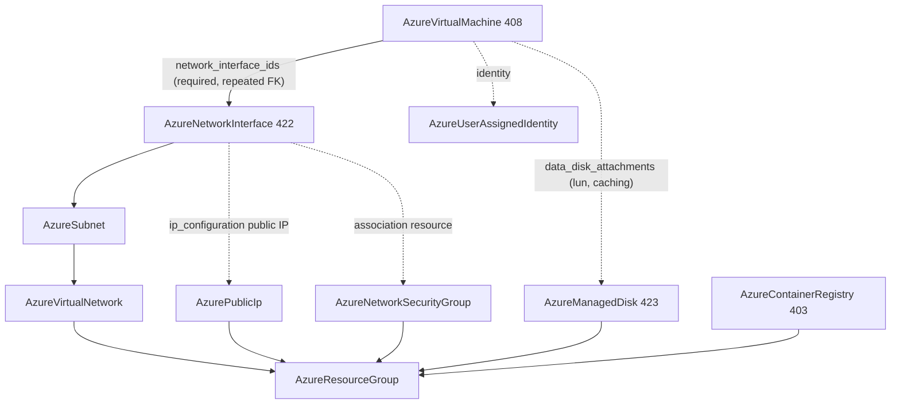

# Azure Compute Wave: Container Registry and Virtual Machine Reworks, Network Interface and Managed Disk Kinds

**Date**: July 4, 2026
**Type**: Feature / Breaking Change
**Components**: Azure Provider, API Definitions, Provider Framework, IAC Stack Runner

## Summary

Reworked `AzureContainerRegistry` and `AzureVirtualMachine` to the full azurerm
v4.80 surface and forged two new kinds — `AzureNetworkInterface` (422) and
`AzureManagedDisk` (423) — so the virtual machine decomposes into honest,
composable first-class nodes instead of a bundled black box. Both engines sit
at 100% behavioral parity on the shared Pulumi provider builder, all four kinds
audit at 100% with PARITY ✅ and COVERAGE ✅, and live dual-engine E2E is green
for all four (8 runs, zero orphans). This session also retires the catalog's
LAST provider-auth outliers: no Azure Terraform module pins `azurerm ~> 3.0`
anymore, and no module injects `client_secret` into its provider block.

## Problem Statement / Motivation

### Pain Points

- **The VM was a bundled black box.** Its modules silently created a public
  IP, a hidden single-ip-configuration network interface, an NSG association,
  and managed data disks alongside the VM — while Azure's own model treats the
  NIC as a first-class resource the VM *references* (a required list; a VM can
  carry several). Worse, the two engines disagreed: the Pulumi module created
  no data disks and no NSG association — a real parity break shipping in the
  catalog.
- **The worst keyless-auth blocker lived here.** The VM's Terraform provider
  block injected `var.provider_config.client_secret` directly — hardcoding the
  static secret and breaking the OIDC web-identity path.
- **ACR was a 6-field spec against a ~23-field provider surface** — no network
  isolation, no CMK encryption, no zone redundancy, no policies, no identity,
  and both engines hardcoded `network_rule_bypass_option`.
- **No standalone NIC or disk kinds existed**, so load-balancer pool membership
  (expressed NIC-side in Azure) and the shared/restorable data-disk story had
  no home.

## Solution / What's New

### Composition: the VM is deliberately just the machine

### `AzureContainerRegistry` (403, rework)

- **Spec**: 19 fields at the v4.80 floor — SKU with every Premium gate
  mirrored as spec-level CEL (geo-replication, zone redundancy, data endpoint,
  quarantine, retention days, trust policy, network rules, CMK, export-disable
  pairing with public-access-off), `network_rule_set` (default action + IP
  allowlist), CMK `encryption` (identity client id + Key Vault key id),
  managed `identity` with `AzureUserAssignedIdentity` FKs, per-replica
  `georeplications` (zone redundancy, regional endpoint, tags),
  `network_rule_bypass_option` promoted from a hardcoded engine literal to a
  field, and user `tags`.
- **Outputs**: renamed to the kind-authentic grain (`container_registry_id`,
  `container_registry_name`, `login_server`) + admin credentials, the
  system-assigned principal id, and `data_endpoint_host_names`. The single FK
  consumer (`AzureAksCluster.container_registry_id`) repointed in the same
  change.
- **Engines**: Terraform `azurerm ~> 3.0` → `~> 4.0`; Pulumi migrated from the
  native ARM SDK to classic v6 via the shared `pulumiazureprovider.Get`.

### `AzureNetworkInterface` (422, `aznic`, new)

Repeated `ip_configurations` (subnet FK, private IP allocation/version/static
address, public IP FK, primary, gateway-LB frontend), `dns_servers`,
`internal_dns_name_label`, accelerated networking, IP forwarding, auxiliary
mode/SKU (paired CEL), edge zone, tags. The NSG attach is realized as the
association resource on both engines (the subnet-hub precedent); ASG ids ride
as plain ARM ids (no ASG kind — recorded). LB pool membership deliberately
waits for the LB depth wave, which will export per-pool ids.

### `AzureManagedDisk` (423, `azdisk`, new)

The full ~35-field surface: all 7 create options (Empty/Copy/Import/
ImportSecure/FromImage/Restore/Upload) with their source-field pairings as
CELs, all 7 SKUs including UltraSSD/PremiumV2 with independently dialed
IOPS/MBPS and logical sector size, shared-disk `max_shares`, bursting, tier,
trusted launch and confidential-VM encryption, network access policy +
disk-access pairing, zones. 16 message-level CEL rules mirror ARM's
conditional-validation matrix. One deliberate skip with a recorded reason:
legacy in-guest `encryption_settings` (Azure Disk Encryption) — server-side
encryption via disk encryption sets is the modern grain.

### `AzureVirtualMachine` (408, rework — breaking)

- **The machine, not the network**: required repeated `network_interface_ids`
  FK → `AzureNetworkInterface`; the bundled public IP, hidden NIC, NSG
  association, and inline data-disk creation are REMOVED.
- **Explicit OS choice**: `os_profile` carries exactly one of `linux`
  (SSH-first, `disable_password_authentication`, Linux patch vocabulary) or
  `windows` (password + WinRM, unattend content, timezone, automatic updates,
  hotpatching, Windows patch vocabulary) — replacing the fragile
  "has-an-SSH-key-means-Linux" inference.
- **Full v4.80 depth**: os_disk with ephemeral diff-disk and confidential-VM
  security encryption plus boot-from-existing-disk (`os_managed_disk_id`),
  `data_disk_attachments` (disk FK + lun/caching/write-accelerator) realized
  as attachment resources on both engines, identity with
  `AzureUserAssignedIdentity` FKs, spot (priority/eviction/max bid),
  availability (zone, availability set, proximity placement, dedicated host,
  capacity reservation, VMSS attach), security profile (secure boot, vTPM,
  encryption-at-host), patch orchestration (per-OS modes, assessment, reboot
  setting, safety-check bypass), gallery applications, OS-image/termination
  notifications, marketplace plan, license types, `user_data` + `custom_data`
  (sensitive), boot diagnostics, tags.
- **Misleading FK defaults removed**: `admin_password` no longer defaults to
  the Key Vault `vault_uri` output (a vault URI is not a password) and the
  disk-encryption-set reference no longer points at the vault's id (a disk
  encryption set is `Microsoft.Compute/diskEncryptionSets`, its own resource
  type).
- **Provider-auth outlier retired**: the Terraform provider block is the
  canonical empty `provider "azurerm" { features {} }` — the `client_secret`
  injection is gone. Pulumi moved to classic v6
  (`linuxvirtualmachine`/`windowsvirtualmachine`) via the shared builder.

## Audit-Driven Hardening (found and fixed in-session)

The `--parity` audit caught one misdeploy-class Terraform defect the green
live E2E could not see: three `locals.tf` ternary chains compared patch-mode
enums against prefix-less strings (`"AUTOMATIC_BY_PLATFORM"`) while the tfvars
wire format carries the full proto value names (`LINUX_AUTOMATIC_BY_PLATFORM`,
`WINDOWS_AUTOMATIC_BY_PLATFORM`, `ASSESSMENT_*`) — so platform patch
orchestration silently dropped on Terraform while deploying on Pulumi. Fixed;
the hack manifest now exercises the patch seam, and a full `planton tofu plan`
proves the mapping (`patch_mode = "AutomaticByPlatform"` in the plan). The VM
re-audits at 100%, PARITY ✅.

## Validation

- Spec tests ×4 PASS; `make build-go` PASS; release-equivalent Pulumi builds
  ×4 PASS; `tofu validate` + full `planton tofu plan` on all four hack
  manifests PASS.
- `validate-refs --check` PASS (all FKs resolve, including the ACR output
  rename repoint); `secret-coverage --check` PASS (Azure stays 100%; VM admin
  passwords, `custom_data`, and unattend content annotated sensitive).
- `pkg/outputs` conformance ×4 PASS; `validate-outputs` full population, zero
  unmapped, on all four.
- Audits ×4: **100% Fully Complete, PARITY ✅, COVERAGE ✅** each (the
  family-wide tag-shape divergence remains a documented `PARITY-EXCEPTION` in
  both modules of every tag-bearing kind).
- **Live dual-engine E2E — all 8 runs green** (test subscription, fresh
  fixtures, zero orphans; `az group list` empty afterward):
  - `TestAzureManagedDisk` Pulumi 128s / Terraform 153s
  - `TestAzureNetworkInterface` Pulumi 320s / Terraform 323s (composed chain:
    RG → VNet → Subnet → NSG → NIC with the NSG association proven live)
  - `TestAzureVirtualMachine` Pulumi 419s / Terraform 551s (composed chain
    through the NIC + a managed-disk attachment via the scenario-declared
    extra-fixture mechanism — both new seams proven live)
  - `TestAzureContainerRegistry` Pulumi 156s / Terraform 182s

## Impact

- The Azure compute story is now honest composition: NIC, disk, VM, and
  registry are independent, referenceable nodes, and the NIC seam unblocks
  the LB depth wave's pool-membership story.
- **Provider-auth standardization is COMPLETE**: zero `azurerm ~> 3.0` pins
  and zero credential-injecting provider blocks remain in the Azure catalog.
  Shared Pulumi-builder migration reaches 14 of ~42 modules.
- Breaking spec rework on `AzureVirtualMachine` with zero downstream FK
  impact (no kind references the VM; chart drift accumulates for the
  end-of-phase charts pass, as planned).

## Related Work

- Builds on the AKS cluster/node-pool rework (2026-07-04) that opened the
  compute wave and the networking-wave subnet attach hub (2026-07-04) whose
  association-resource pattern the NIC reuses.
- Workflow uplift: the Terraform-module forge rule now warns that enum values
  arrive as FULL proto value names (prefix included) and must be matched
  verbatim in `locals.tf` maps; the hack-manifest rule now requires
  conditionally-mapped enum seams to be exercised by the plan validation.

---

**Status**: ✅ Production Ready
