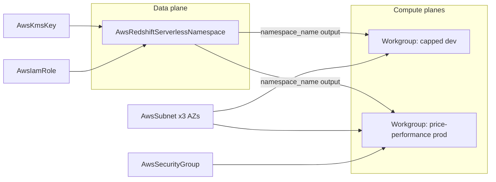

# AWS Redshift Serverless: Namespace + Workgroup Pair

**Date**: July 4, 2026
**Type**: Feature
**Components**: API Definitions, AWS Provider, Pulumi CLI Integration, IAC Stack Runner, Testing Framework

## Summary

Two new AWS kinds bring Redshift Serverless to the catalog as first-class composable nodes: `AwsRedshiftServerlessNamespace` (the data plane) and `AwsRedshiftServerlessWorkgroup` (the compute plane). The split mirrors AWS's own serverless resource model — many workgroups can serve one namespace, each with an independent lifecycle — making "a capped dev compute plane and an autoscaling production compute plane over the same data" a two-manifest story. Both kinds ship with full dual-engine parity, complete E2E coverage, and live dual-engine validation (4/4 lanes green).

## Problem Statement / Motivation

The catalog modeled Redshift only as a provisioned cluster (`AwsRedshiftCluster`), which bills per hour whether or not queries run. Redshift Serverless — where RPU-hours accrue only while queries execute — is the entry point most new analytics adopters start on, and it was unrepresentable.

### Pain Points

- No serverless warehouse in the AWS catalog; the provisioned cluster was the only Redshift shape.
- Serverless is a different product surface (namespaces + workgroups, no cluster concept) — it could not be bolted onto the existing kind without misrepresenting both.

## Solution / What's New

### AwsRedshiftServerlessNamespace (enum 245, id_prefix `rsns`)

The data plane: first database (`db_name`, create-time), admin credentials — Secrets-Manager-managed by default (`manage_admin_password`, secret ARN exported) XOR a sensitive-annotated direct password — KMS data encryption by reference, engine IAM roles (`iam_roles` + `default_iam_role_arn`) by reference, and CloudWatch audit `log_exports`. A namespace does not hard-require admin credentials at all (IAM identities use temporary credentials), which the spec models honestly.

### AwsRedshiftServerlessWorkgroup (enum 246, id_prefix `rswg`)

The compute plane: the capacity contract — a fixed RPU `base_capacity` XOR an enabled `price_performance_target` (AWS owns the baseline against a 1–100 cost/speed dial), with `max_capacity` as the spend cap in either posture — plus three-AZ VPC placement by subnet references, security groups by reference, the serverless-only port ranges (5431-5455 / 8191-8215) as CEL, direct `config_parameters` (serverless has no parameter groups; the API's closed 17-key set is mirrored exactly), and the release `track_name`.

### Composition mechanics

- The namespace exports `namespace_name` as a stack output because it is the join key: references resolve against stack outputs, never metadata.
- The workgroup's registry entry declares `prerequisites: [AwsRedshiftServerlessNamespace, AwsSubnet]`, driving its composed E2E chain.
- The shared AwsSubnet E2E fixture grew a third availability-zone document — Redshift Serverless requires a workgroup's subnets to span three AZs; existing consumers select fixture instances by name, so the addition is transparent to them.

## Implementation Details

- Full four-proto anatomy for both kinds, with dense field comments and empathetic CEL messages; spec tests cover every rule's happy and error paths on both kinds.
- Both engines at behavioral parity with zero PARITY-EXCEPTIONs: generator-owned `variables.tf` under the drift guard from day one, `metadata.name` as the naming basis, identity tags key-for-key, `hashicorp/aws >= 6.0.0` floor, complete Pulumi entrypoint anatomy.
- The workgroup's connection endpoint exports without an ApplyT applier: `Endpoints.Index(0).Address().Elem()` resolves to zero values when unknown, giving a stable, panic-free export shape (guidance folded into the Pulumi module authoring rule).
- Config parameters use the Redshift family's `{name, value}` message shape rather than the provider's `parameter_key`/`parameter_value` verbosity.
- E2E: `redshiftserverless` SDK verifiers for both kinds (GetNamespace / GetWorkgroup; DELETING treated as absent alongside the typed ResourceNotFoundException), a namespace prerequisite install profile, scenarios, and dual-engine entrypoints.

## Validation

Offline gate all green: spec tests ×2, outputs conformance ×2, TF drift guard ×2, refcheck suite, `validate-refs`, `secret-coverage`, `tofu init`+`validate` ×2 (resolving aws v6.53), release-equivalent Pulumi builds ×2, `make build-go`, Bazel build of all touched targets, every preset/hack-manifest/scenario/fixture CLI-validated, mechanical field-parity sweep clean on both kinds × both engines, site catalog regenerated.

Live dual-engine E2E — 4/4 lanes green, serial, with a zero-orphan account sweep (no namespaces, workgroups, `redshift` secrets, or e2e-tagged VPCs/subnets remain):

| Lane | Result | Duration |
|------|--------|----------|
| Namespace (managed password) — Pulumi | PASS | 25s |
| Namespace (managed password) — Terraform | PASS | 42s |
| Workgroup (8 RPU, VPC → 3 subnets → namespace chain) — Pulumi | PASS | 5m31s |
| Workgroup (8 RPU, VPC → 3 subnets → namespace chain) — Terraform | PASS | 6m05s |

## Impact

- Serverless analytics becomes a first-class, composable AWS story: namespace + workgroup + the existing VPC/subnet/SG/KMS/IAM graph.
- The idle-costs-nothing billing model means a deployed dev warehouse carries no standing compute charge — a materially lower barrier than the provisioned cluster for teams starting out.

## Related Work

- Complements the provisioned `AwsRedshiftCluster` rebuild (see `2026-07-04-091249-aws-redshift-cluster-rebuild.md`); the two products share the Redshift family's credential and parameter vocabulary while modeling their genuinely different resource shapes.

---

**Status**: ✅ Production Ready
