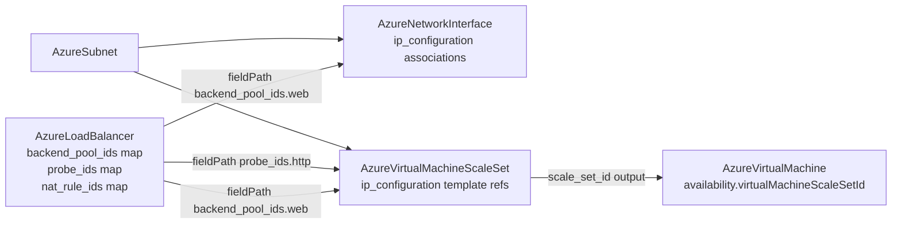

# Azure Load-Balanced Compute: Virtual Machine Scale Set Kind, Load Balancer Depth Rework, and NIC-Side Pool Membership

**Date**: July 4, 2026
**Type**: Feature | Breaking Change
**Components**: Azure Provider, API Definitions, Pulumi CLI Integration, IAC Stack Runner, Testing Framework

## Summary

The Azure catalog gains its fleet-compute primitive and closes the load-balancer composition story. `AzureVirtualMachineScaleSet` (enum 424) is forged as ONE kind spanning both orchestration modes — FLEXIBLE (the default, Azure's recommendation) and UNIFORM — with an explicit `os_profile.linux` XOR `windows` discriminator and ~30 mode- and pairing-gated CEL rules mirroring ARM's real contracts. `AzureLoadBalancer` is reworked from its 80/20 shape to the full azurerm v4.80 surface — repeated frontends, SKU/tier, deepened pools, probe depth, rule depth, and the previously-missing inbound NAT rule and outbound rule families — and now exports name-keyed map outputs (`backend_pool_ids`, `probe_ids`, `nat_rule_ids`, `frontend_ip_configuration_ids`) that make its sub-resources referenceable. `AzureNetworkInterface` consumes those maps: each IP configuration can now join backend pools and complete NAT rules through association resources, closing the member-side seam recorded when the NIC was forged. All three kinds passed live dual-engine E2E (10 scenarios, both engines, zero orphans).

## Problem Statement / Motivation

Three gaps blocked the load-balanced-compute story every production Azure architecture reaches:

- **No fleet primitive.** The catalog modeled single VMs and AKS, but nothing between — no way to declare "N identical instances behind a pool" with upgrade orchestration, spot economics, and instance repair.
- **The load balancer was a black box with unreferenceable insides.** Its 80/20 spec hardcoded Standard SKU, allowed exactly one auto-named frontend, omitted NAT and outbound rules entirely, and exported only the FIRST pool's ID — so a NIC or fleet could not name the pool it joins, and the NIC shipped with its membership seam documented as deferred.
- **Membership had no home.** Azure expresses pool membership from the member side (the NIC's IP configuration), but that requires per-pool IDs the LB did not export.

## Solution / What's New

### AzureVirtualMachineScaleSet (new, 424, `azvmss`)

One kind, an explicit `orchestration_mode` — ARM has exactly one scale-set resource type; the per-mode/per-OS resource split elsewhere is tooling ergonomics, not Azure's model. The spec unifies the full azurerm v4.80 surface of all three provider resources: identity, SKU + instances + FLEXIBLE mixed-SKU profiles (`sku_name: Mix`), both OS profiles with per-OS patch vocabularies, OS/data disk templates (ephemeral OS disks, UltraSSD/PremiumV2 dialed performance, CMK + confidential encryption), NIC/IP-configuration templates with LB pool + NAT-rule + App-Gateway references, upgrade policy (rolling batches, UNIFORM automatic OS upgrades, the UNIFORM LB health probe), spot (eviction, bid, UNIFORM restore, FLEXIBLE priority mix), automatic instance repair, termination notification, extensions (health extension as the load-bearing one; Key-Vault-sourced protected settings), boot diagnostics, Key Vault certificates, plan, gallery applications, placement, zones + zone balance + fault domains, security, scale-in, and tags. Mode-illegal fields fail validation with the contract named. The Terraform module dispatches on mode+OS to the three azurerm resources; the Pulumi module mirrors the dispatch on the shared provider builder.

### AzureLoadBalancer rework (417, breaking)

- `frontend_ip_configurations` promoted to a repeated message (subnet XOR public-IP frontends, static/dynamic private addressing, IPv6, prefix references, zones, gateway-LB chaining) — replacing the single auto-named frontend.
- `sku` (STANDARD default / GATEWAY; Basic not modeled — retired by Azure September 2025) + `sku_tier` (REGIONAL / GLOBAL with the Global-requires-Standard rule), `edge_zone`, user `tags`.
- Pools gain `virtual_network_id`, `synchronous_mode`, Gateway `tunnel_interfaces`, and IP-based `addresses`; probes gain `probe_threshold`; rules gain `tcp_reset_enabled`, `load_distribution`, frontend targeting, and plural pool targeting (Gateway two-pool rules).
- **New families**: `nat_rules` (single-target XOR pool-style port ranges) and `outbound_rules` (explicit SNAT). The deprecated NAT-pool surface is skipped with a recorded reason.
- Invented validations removed: pools/probes/rules are no longer force-required (a frontend-only LB carrying just NAT rules is legal in Azure) and a rule's probe is optional, matching azurerm's real contract.
- **Outputs**: name-keyed `map<string,string>` for pools, probes, NAT rules, and frontends — the composition seams members reference via `valueFrom` fieldPath, e.g. `status.outputs.backend_pool_ids.web`.
- The Pulumi module moved off inline `azure.NewProvider` onto the shared provider builder (keyless-auth correctness).

### AzureNetworkInterface membership seam (422)

Each `ip_configuration` gains `load_balancer_backend_address_pool_ids` and `load_balancer_inbound_nat_rule_ids` (repeated references resolved through the LB's map outputs), each realized as its own association resource on both engines — joining and leaving pools never touches the NIC. The forge-time deferral comment is gone; the spec now documents the seam as it always should have read.

### AzureVirtualMachine follow-through (408)

`availability.virtual_machine_scale_set_id` converted from a plain ARM-ID string to a `StringValueOrRef` defaulting to the new kind's `scale_set_id` output — attaching a standalone VM to a FLEXIBLE set now composes by reference.

### Framework: outputs and E2E hardening

- `pkg/outputs` populate/preprocess now handle map-typed stack outputs arriving in the flattener's dotted form (`backend_pool_ids.web`), preserving map KEYS verbatim (a pool named `ssh-admin` must not be normalized) while still normalizing hyphenated FIELD names — with unit coverage.
- The E2E dependency runner now tracks a fixture stack for teardown even when its `pulumi up` FAILS: a failed update may have created resources, and skipping its destroy orphaned them — one leftover fixture (a load balancer holding a frontend in the fixture subnet) blocked the entire reverse teardown chain behind it.

## Implementation Details

Two deploy-time defects were found and fixed during live E2E — both invisible to every offline gate:

1. **Pulumi `ApplyT` typing panic**: exporting the LB's private address through a `func(addr *string)` applier on what the SDK types as a plain `StringOutput` compiles clean but panics at deploy (`applier's first input parameter must be assignable from string`). Fixed by exporting the SDK output directly.
2. **Optional dials sent as zero**: stack inputs built directly from a manifest (the E2E path) do not materialize proto defaults, so bare getters sent `interval_in_seconds: 0` / `probe_threshold: 0`, which the provider's range validation rejects at `pulumi up`. Fixed with presence guards falling back to the proto defaults — the same values the Terraform module's `optional(number, N)` encodings carry. The same guard class was applied to the scale set's true-default booleans (`provision_vm_agent`, `overprovision`, `disable_password_authentication`, …).

Both lessons are folded into the Pulumi-module forge flow rule as timeless guidance; the teardown lesson is documented in `e2e/README.md`.

## Validation

- Offline: spec tests ×4 kinds; targeted + release-equivalent builds; `make build-go`; `secret-coverage --check` (Azure 100%); `validate-refs --check`; `pkg/outputs` + `pkg/refcheck` + framework runner tests; full `planton tofu plan` on all three hack manifests; all 9 presets validate; site catalog regenerated (`load-balancer`, `network-interface`, `virtual-machine-scale-set` slugs live); parity audits with dated reports per kind.
- Live (dual-engine, ephemeral, test subscription): **all 10 scenarios green** —
  - `AzureLoadBalancer/minimal` (public frontend + pool + probe + rule + NAT rule + outbound rule): Pulumi 256s, Terraform 270s
  - `AzureNetworkInterface/lb-membership` (pool + NAT-rule associations against a fixture LB resolved through the map outputs): Pulumi 390s, Terraform 389s
  - `AzureNetworkInterface/minimal`: Pulumi 308s, Terraform 324s
  - `AzureVirtualMachineScaleSet/flexible` and `/uniform` (one-instance burstable Linux fleets, both dispatch branches): Pulumi 276s/362s, Terraform 284s/388s
  - `az group list` empty afterward — zero orphans.
- Gateway SKU is modeled but E2E-excluded with a recorded reason: it requires the `Microsoft.Network/AllowGatewayLoadBalancer` feature, registrable only via an Azure support ticket.

## Impact

**Breaking** for `AzureLoadBalancer` manifests (frontends replace `public_ip_id`/`subnet_id`; rules take `backend_pool_names` plural; outputs renamed) — no kind FK-referenced the old outputs, so the blast radius is the chart drift already accumulating for the end-of-catalog charts pass. `AzureNetworkInterface` changes are additive. `AzureVirtualMachineScaleSet` is new. The load-balanced-fleet story — LB pools + probes referenced by name from NICs and scale sets, standalone VMs attaching to FLEXIBLE sets — now composes end to end by reference.

## Related Work

- Builds on the virtual machine decomposition (NIC + managed disk kinds) and the networking wave's subnet attach model.
- Unblocks the Application Gateway and Front Door depth work (the same name-keyed map-output pattern applies) and per-fleet autoscale as a future kind.

---

**Status**: ✅ Production Ready
