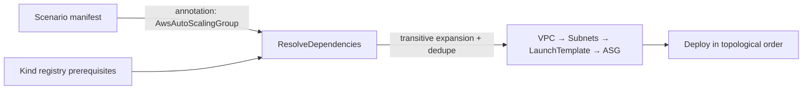

# AWS EC2 Instance + ECS Cluster: Compute-Primitives Rebuild to the Full Provider Surface

**Date**: July 4, 2026
**Type**: Feature (breaking, zero users)
**Components**: API Definitions, AWS Provider, Terraform Modules, Pulumi Modules, Testing Framework, E2E Harness

## Summary

`AwsEc2Instance` and `AwsEcsCluster` — the two compute primitives real users touch first — are rebuilt to their full provider surfaces. The EC2 instance grows from a 17-field 80/20 spec to the complete `aws_instance` surface (launch-template composition, IMDSv2 posture, Spot, placement, capacity reservations, full block-device control), retiring a synthetic connection-method abstraction, module-side SSH key generation that leaked private-key PEMs into stack outputs, and a per-kind `tags` map that diverged from the platform convention. The ECS cluster gains EC2 capacity: folded per-name capacity providers that wrap referenced auto-scaling groups, enhanced Container Insights, honest ECS Exec auditing, Fargate storage encryption, and Service Connect defaults. The E2E framework gains scenario-declared prerequisites — the mechanism that lets optional-composition scenarios run live without polluting the honest kind registry — and both kinds passed live dual-engine E2E (six lanes) with a zero-orphan sweep.

## Problem Statement / Motivation

### Pain Points

- **The EC2 instance module invented behavior AWS does not have.** A `connection_method` enum (SSM/BASTION/INSTANCE_CONNECT) gated field requirements that the EC2 API does not impose, and when `key_name` was empty the Pulumi module silently generated an RSA-4096 key pair and exported the private-key PEM as a stack output — while the Terraform module exported `null` for the same fields. A live cross-engine divergence AND secret material in state, in a module that must never create side resources.
- **A live parity defect on the instance profile**: the provider's `iam_instance_profile` argument takes the profile NAME (the API's `AssociateIamInstanceProfile` passes `Name`), but the Pulumi module passed the ARN while the Terraform module extracted the name from it.
- **The EC2 TF variable contract was the legacy hand-written shape** (`{key, value}` label objects) that the tfvars pipeline can never satisfy — the kind had never been deployable on Terraform.
- **The instance spec carried a per-kind `tags` map** (identity tags derive from metadata everywhere else) and a redundant `instance_name` duplicating `metadata.name`.
- **The ECS cluster could not model EC2 capacity at all** — `capacity_providers` was validation-locked to the FARGATE built-ins, so an EC2-backed cluster was unrepresentable; exec logging used proto enums with an UNSPECIFIED-means-disabled sentinel; `managed_storage_configuration`, `service_connect_defaults`, and `containerInsights: enhanced` were missing.
- **The harness forced a bad choice for optional composition**: prerequisites resolve only from the kind registry (transitively), so live-testing a scenario that composes an OPTIONAL reference meant either padding the registry (taxing every downstream lane — declaring an auto-scaling group a prerequisite of every ECS cluster would bloat the ECS-service chain) or never live-testing the composed arm.

## Solution / What's New

### E2E framework: scenario-declared prerequisites

A scenario manifest can now declare the dependencies it composes via the `planton.dev/e2e-prerequisites` metadata annotation (comma-separated kind names). Declared kinds expand through their own registry graphs, merge and dedupe with the component's registry prerequisites, and deploy in topological order; unknown kinds and self-references fail loudly. The registry stays the honest statement of what a kind REQUIRES to deploy; the annotation carries what one scenario additionally composes.

### AwsEc2Instance

- **Retired (breaking)**: `connection_method` + its CELs, the SSH key generation + `ssh_private_key`/`ssh_public_key` outputs (and the `pulumi-tls/sdk/v5` dependency), the per-kind `tags` map, and `instance_name` (naming basis is `metadata.name`, EC2's name IS the Name tag). `key_name` is a plain optional bring-your-own field; SSM posture composes through the instance-profile reference.
- **Launch source honesty**: `ami` and `instance_type` optional with the provider's own at-least-one rules as CEL; a new `launch_template` message (ID reference to `AwsLaunchTemplate` XOR name, version) with inline fields as per-instance overrides.
- **`instance_profile` repointed to the profile NAME output** (`AwsIamInstanceProfile.status.outputs.instance_profile_name`) — fixing the parity defect at the spec level; launch templates correctly keep their ARN-based reference (their block accepts ARNs), with the asymmetry documented on both sides.
- **Full networking surface**: optional subnet/SG references (default-VPC fallback documented as not-production), `primary_network_interface_id` (the modern pre-provisioned-ENI arm, with CEL excluding inline networking), secondary private IPs, IPv6 count-XOR-addresses, primary-IPv6 designation, private DNS name options, secondary network interfaces on non-primary cards.
- **Full storage/posture/market surface**: root + EBS + ephemeral block devices with KMS references, IMDSv2 metadata options, CPU options (core trimming, AMD SEV-SNP, nested virtualization), credit specification, detailed monitoring, hibernation XOR enclaves, auto-recovery, shutdown behavior, stop/termination protection, Spot options (persistent-request couplings as CEL), capacity reservations, and placement (AZ / groups / tenancy / dedicated hosts).
- **Outputs**: `instance_id` (the target-group join key, preserved), `arn`, `instance_state`, `availability_zone`, `private_ip`, `private_dns`, `public_ip`, `public_dns`, `primary_network_interface_id`.
- **Recorded skips**: `get_password_data`/`password_data` (Windows password material in state), `volume_tags` (tags convention), the deprecated `network_interface` block, EC2-Classic `security_groups`.

### AwsEcsCluster

- **Folded EC2 capacity providers**: per-name `ec2_capacity_providers` blocks — each wrapping a referenced `AwsAutoScalingGroup` (by ARN output) with managed scaling (target capacity, step bounds, warmup), managed draining, and managed termination protection. Each entry materializes as its own `aws_ecs_capacity_provider` (keyed by name — adding one never disturbs its siblings) plus exactly ONE `aws_ecs_cluster_capacity_providers` association that PUTs the union of the FARGATE built-ins and the folded names (the association is a whole-set PUT; two association resources would fight on every apply). The existing `capacity_providers` list keeps its built-ins-only meaning, so existing manifests keep working. Reserved-prefix (`aws`/`ecs`/`fargate`), name-uniqueness, and strategy-names-an-associated-provider rules are CEL-enforced.
- **Honest cluster posture**: `container_insights` as the provider string (`enabled`/`enhanced`/`disabled`), exec auditing rebuilt without the UNSPECIFIED sentinel (`logging` = DEFAULT/OVERRIDE/NONE with the OVERRIDE↔log-configuration coupling as CEL, KMS reference for session encryption), `managed_storage_configuration` (Fargate ephemeral-storage + managed-storage KMS references), and `service_connect_namespace_arn`.
- **Outputs**: `cluster_name`, `cluster_arn` (the ECS-service join key, preserved), `capacity_provider_names` (the strategy vocabulary), `capacity_provider_arns`.
- **Recorded verdicts**: ECS Managed Instances provider arm deferred (a brand-new cluster-scoped surface); no standalone capacity-provider kind (the fold covers the real shape).

### Both kinds, one contract

Generator-owned `variables.tf` under the drift guard (the EC2 legacy hand-written contract is gone); per-resource TF layouts (`instance.tf`; `cluster.tf` + `capacity_providers.tf`); provider floors verified against resolved v6.53 (EC2 `>= 6.33.0`, ECS `>= 6.0.0`); naming basis `metadata.name` with the cloud name argument set explicitly; Pulumi entrypoint anatomy completed (EC2 gained its stack-input template); presets, catalog pages, READMEs, and deep docs rewritten to the new shapes (the SSH-accessible preset is replaced by launch-template-composed and Spot-worker presets); zero PARITY-EXCEPTIONs (every field verified on pulumi-aws v7.35.0).

### E2E (first-class for both kinds)

- **EC2 instance**: a `DescribeInstances` verifier (terminated/shutting-down = absent), a second named document in the shared security-group install profile (an egress-only instance group beside the Kafka broker group — one document per consumer shape), and a scenario launching one t3.micro with IMDSv2 required, an encrypted gp3 root, and a `${...}`-bearing user-data script (proving the tfvars template-introducer escaping live) — prerequisites composed via the new annotation (`AwsSubnet,AwsSecurityGroup`).
- **ECS cluster**: two scenarios per engine — a Fargate leaf (enhanced insights, exec auditing, the Spot-blend default strategy; no prerequisites, proving the leaf claim) and the EC2-capacity chain (annotation: `AwsAutoScalingGroup`, whose own registry graph pulls VPC → subnets → launch template), proving the folded provider materializes and associates live with no instance ever launched.

## Validation

- **Offline gate green**: spec/CEL tests for both kinds (fresh runs), outputs conformance (2 new cases incl. list outputs), TF drift guard (EC2 newly enrolled), refcheck + crkreflect + E2E-runner suites, `validate-refs` (all foreign keys resolve), `secret-coverage` (gate passed), `tofu init`+`validate` on both modules (resolved aws v6.53.0), release-equivalent Pulumi builds, `go vet` on the e2e-tagged package, `make build-go`, Bazel build of all touched targets (after `bazel mod tidy` swept the dropped `pulumi-tls/v5` from MODULE.bazel), `make protos` regen proof, all 12 touched manifests CLI-validated (including each document of the multi-doc SG fixture), mechanical field-parity sweep clean on both kinds and both engines, and a scaffolding-leakage grep on the full diff.
- **Live dual-engine E2E: 6/6 lanes green** — EC2 instance minimal 4m20s (Pulumi) / 4m06s (Terraform); ECS EC2-capacity chain 3m33s (Pulumi) / 6m41s (Terraform); ECS Fargate leaf 56s (Pulumi) / 2m31s (Terraform). Serial lanes with a private TMPDIR/PULUMI_HOME and `-count=1`.
- **Zero-orphan sweep clean**: no instances, ECS clusters, custom capacity providers, auto-scaling groups, launch templates, or e2e-tagged security groups/VPCs/subnets remain in the account.

## Breaking Changes

Zero users; no migration. For the record — EC2 instance: `connection_method`, `tags`, `instance_name`, `root_volume_size_gb` (now inside `root_block_device`), and the `ssh_private_key`/`ssh_public_key`/`instance_profile_arn`/`private_dns_name` outputs removed; `iam_instance_profile_arn` became `instance_profile` (NAME-based); `ebs_optimized`/`disable_api_termination` semantics unchanged but the latter is now presence-honest. ECS cluster: `enable_container_insights` became the `container_insights` string; the `ExecConfiguration` enum shape became provider strings; `cluster_capacity_providers` output renamed to `capacity_provider_names` (+ new `capacity_provider_arns`). No chart breaks: both charts composing `AwsEcsCluster` use only `capacityProviders` with the built-ins, which kept its shape by design; no chart composes `AwsEc2Instance`.

## Impact

The two most-adopted compute primitives now stand at the same bar as the rest of the rebuilt catalog: a pet instance can graduate into a templated fleet without relearning vocabulary (the spec deliberately shares the launch template's field names), EC2-backed ECS is finally representable and proven live end-to-end (VPC → subnets → launch template → zero-capacity ASG → cluster → capacity provider), and the harness extension closes a whole testing class — any kind's optional composition can now run live behind an honest registry.
