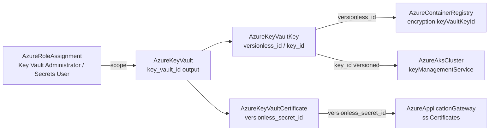

# Azure Key Vault Trio: Vault Depth Rework, Key Vault Key and Key Vault Certificate Kinds

**Date**: July 4, 2026
**Type**: Feature | Breaking Change
**Components**: Azure Provider, API Definitions, Pulumi CLI Integration, IAC Stack Runner, Testing Framework

## Summary

The Azure catalog gains its secrets-and-encryption backbone as a three-component shape. `AzureKeyVault` (405) is reworked from its 80/20 spec to the full azurerm v4.80 surface — explicit globally-unique `vault_name`, both authorization modes (Azure RBAC by default, the legacy access-policy mode fully modeled with closed permission enums), the resource-manager integration switches, public-network and purge-protection posture, and network ACLs with a provider-authentic bypass enum — while shedding its secret-creation surface entirely (secret VALUES are a secrets-management concern, never IaC state). `AzureKeyVaultKey` (425, `azkvkey`) is forged as the customer-managed-key building block: all four algorithm families, the capability-boundary `key_opts`, and automatic rotation policies, with `versionless_id` as the rotation-following composition seam. `AzureKeyVaultCertificate` (426, `azkvcert`) is forged as the TLS building block: vault-generated (self-signed or CA) and/or imported certificates with lifetime actions and full X.509 shape, exporting the `secret_id`/`versionless_secret_id` seam TLS terminators consume. All three passed live dual-engine E2E (6 scenario runs, both engines, all 8 phases, zero orphans including the soft-deleted-vault sweep).

## Problem Statement / Motivation

- **The vault modeled the wrong thing.** Its 80/20 spec created placeholder secret entries from IaC (empty values with drift-suppression — plaintext-shaped state that belongs to a secrets workflow), while missing the surfaces Azure orgs actually govern at the vault: the authorization mode was a bare bool with no legacy-mode modeling, integration switches were hardcoded off, the vault's globally-unique name was silently derived, and purge protection carried an invented always-on default that made every dev vault un-purgeable for its retention window.
- **No CMK story.** Azure has no standalone KMS — Key Vault keys ARE how Storage, disk encryption sets, container registries, and databases do bring-your-own-key. The registry's CMK field and the AKS KMS field had nothing first-class to reference.
- **No TLS story.** Application Gateway consumes certificates through Key Vault secret identifiers; without a certificate kind the seam was a hand-pasted string.

## Solution / What's New

### AzureKeyVault rework (405, breaking)

- Explicit `vault_name` (3-24, letter-start, globally unique — it becomes `{name}.vault.azure.net`), the ACR `registry_name` precedent for global names.
- `rbac_authorization_enabled` (azurerm v4 canonical name) defaults true — Azure's own recommendation; grants compose as `AzureRoleAssignment`. The legacy mode is fully modeled: `access_policies` (max 1024) with `object_id` as a reference defaulting to a user-assigned identity's `principal_id`, optional tenant/application ids, and four closed permission enums (20 key / 8 secret / 16 certificate / 14 storage values) with exhaustive wire vocabularies on both engines.
- `enabled_for_deployment` / `_disk_encryption` / `_template_deployment`, `public_network_access_enabled`, `soft_delete_retention_days`, and `purge_protection_enabled` conformed to azurerm's real default (false; the invented always-true default removed — presets teach enabling it for production and CMK vaults).
- `network_acls.bypass` promoted from a bool to the provider-authentic enum (AZURE_SERVICES / NONE); subnet allowlist entries are now references to `AzureSubnet` outputs. User `tags` added.
- **`secret_names` REMOVED** along with both engines' placeholder-secret resource creation and the `secret_id_map` output.
- Outputs renamed to the kind-authentic grain: `key_vault_id` / `key_vault_name` + `vault_uri`, `tenant_id`, `resource_group_name`; the three FK consumers (VMSS secrets ×2, AKS service-mesh CA) repointed.
- Registry gains `prerequisites: [AzureResourceGroup]`; the Pulumi module moved off inline `azure.NewProvider` onto the shared provider builder, deriving the tenant from the client configuration exactly like the Terraform module.

### AzureKeyVaultKey (new, 425, `azkvkey`)

The CMK building block: `key_type` (RSA / RSA_HSM / EC / EC_HSM; HSM variants need the vault's Premium SKU), `key_size` XOR `curve` with CELs mirroring azurerm's contract, required `key_opts` as the capability boundary (Azure rejects unlisted operations), activation/expiry instants, and a rotation policy (paired `expire_after`/`notify_before_expiry` plus an automatic trigger) — rotation is why consumers reference the `versionless_id` output. Outputs export both data-plane identities, both ARM-proxy identities, and the public key halves (PEM + OpenSSH). `release_policy` (secure key release) is a recorded skip: the latest pulumi-azure v6 SDK cannot express it, and a one-engine-only input would break the catalog's 100%-parity invariant.

**Retrofits shipped with the forge**: `AzureContainerRegistry.encryption.key_vault_key_id` now defaults to the key's `versionless_id` (rotation propagates to the registry automatically); `AzureAksCluster` KMS `key_vault_key_id` converted from a plain string to a reference defaulting to the versioned `key_id` (AKS pins key versions by design — the deliberate contrast is documented in both specs).

### AzureKeyVaultCertificate (new, 426, `azkvcert`)

The TLS building block, modeling Azure's three-faces-one-name reality (certificate + private key + secret bundle). Import (`certificate.contents`/`password`, both sensitive) and/or generate (`certificate_policy`) per azurerm's at-least-one contract; the policy carries the issuer (Self / Unknown / vault-configured CA), key properties, lifetime actions (AUTO_RENEW / EMAIL_CONTACTS with exactly one trigger — ARM's real contract, caught at validation time), the PKCS12/PEM secret face, and full X.509 shape (subject, DNS/email/UPN SANs, key usages, EKU OIDs, validity). Outputs export all three faces versioned and versionless; `versionless_secret_id` is the value TLS terminators should reference so renewals propagate.

**Retrofit shipped with the forge**: `AzureApplicationGateway.ssl_certificates[].key_vault_secret_id` converted from a plain string to a reference defaulting to `versionless_secret_id`.

### E2E: the catalog's first data-plane components

Keys and certificates live behind the vault's endpoint, not ARM — even a subscription Owner cannot create one without a data-plane grant. The Azure harness Setup now ensures (idempotently, best-effort) that the signed-in test principal holds "Key Vault Administrator" at the test-subscription scope — a one-time bootstrap in the same class as the resource-provider-registration opt-out, applied once so RBAC propagation never races per-run. Verifiers: the vault and the key ride the generic ARM GetByID pattern (keys through their read-only ARM proxy); the certificate verifies through the `azcertificates` data-plane SDK, because ARM exposes no certificate read proxy. The zero-orphan sweep now also checks `az keyvault list-deleted` — soft-deleted vaults are a new orphan class; scenarios keep purge protection off so destroy purges and the globally unique names free immediately.

## Validation

- Spec tests: 28 (vault) + 24 (key) + 26 (certificate) cases, every CEL error path covered.
- `make protos`, kind-map + gazelle regen, targeted + release-equivalent builds, `make build-go` — all green.
- `secret-coverage --check` (Azure 100%; certificate `contents` + `password` covered), `validate-refs --check` (all five FK repoints/conversions resolve).
- `pkg/outputs` conformance cases added for all three kinds; live runs populated 5/5, 8/8, and 9/9 proto fields.
- Full `planton tofu plan` on all three hack manifests, proving every enum vocabulary (SKU, default-action, bypass, four permission sets, key types/curves/ops, action types, content types, key usages).
- All 9 presets validate; parity audits ×3 at 100% Fully Complete, PARITY ✅ COVERAGE ✅.
- Live dual-engine E2E on the test subscription: vault (Pulumi 894s / Terraform 907s), key through the composed RG → vault chain (975s / 1006s), certificate through the same chain (988s / 1069s) — all 8 phases each; `az group list`, `az keyvault list`, and `az keyvault list-deleted` all empty afterward.

## Impact

- Azure customer-managed-key and TLS scenarios are now first-class and composable: registry encryption, AKS etcd encryption, and Application Gateway TLS all reference real nodes instead of hand-pasted identifiers.
- Secret values can no longer enter IaC manifests or state through the vault kind — the security posture the removal exists for.
- Breaking: vault manifests must add `vault_name` and drop `secret_names`; consumers of the old `vault_id` output move to `key_vault_id`.
