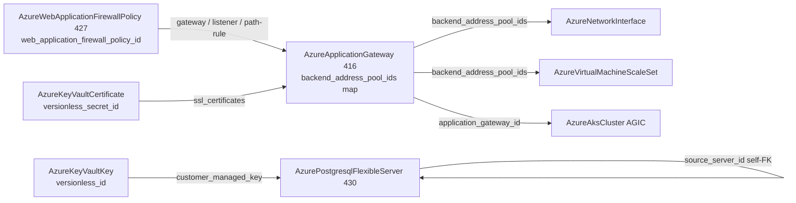

# Azure Data + L7 Depth: Postgres Flexible Server Rework, WAF Policy Kind, Application Gateway Rework

**Date**: July 4, 2026
**Type**: Feature | Breaking Change
**Components**: Azure Provider, API Definitions, Pulumi CLI Integration, IAC Stack Runner, Testing Framework

## Summary

Three components move to the full azurerm v4.80 surface. `AzurePostgresqlFlexibleServer` (430) is reworked from its 25-field 80/20 spec into the real managed-Postgres contract — Entra (AAD) authentication with AAD administrators, customer-managed keys against `AzureKeyVaultKey`, managed identity, create modes (replica / point-in-time restore / geo-restore / revive-dropped) with a self-referencing `source_server_id` seam, the storage size→tier matrix, maintenance windows, server parameters, elastic clusters (PG17+), and an explicit `public_network_access_enabled` replacing an invented derived default. `AzureWebApplicationFirewallPolicy` (427, `azwafpol`) is forged as a first-class kind — the regional WAF policy Application Gateways reference by ARM id at three levels — with custom match/rate-limit rules, managed rule sets with overrides and scoped exclusions, and policy settings including log scrubbing. `AzureApplicationGateway` (416) is reworked to the full L7 + L4 surface: URL path maps, redirects, rewrite rule sets, SSL policies/profiles/mTLS, the TCP/TLS proxying trio, private link, custom error pages, and name-keyed map outputs that make bundled sub-resources referenceable per key. WAF policy and Application Gateway passed live dual-engine E2E (six runs including the composed WAF-attach chain, zero orphans); Postgres live E2E is deferred on a subscription-level quota restriction (details below).

## Problem Statement / Motivation

- **Postgres was a demo spec.** No Entra auth, no CMK, no replicas or restores, no server parameters, no maintenance window — and it derived public-network posture from subnet presence, contradicting azurerm's real contract where the two are independent inputs.
- **"WAF" was two booleans.** The gateway spec carried `waf_enabled`/`waf_mode` while Azure's actual model is a standalone policy resource with custom rules, managed rule sets, and per-listener/per-path attachment. Without the kind, first-class WAF degrades to a hand-pasted string.
- **The gateway modeled a fraction of the resource.** No path-based routing, no redirects or rewrites, no SSL policy/profiles, no mTLS, no L4 proxying, no private link — and its outputs exposed no per-pool ids, so NIC/VMSS backend-pool membership seams stayed plain strings.

## Solution / What's New

### AzurePostgresqlFlexibleServer rework (430, breaking)

- `name` → `server_name` (azurerm's real regex); `sku_name` full regex including v5/v6/confidential-compute sizes; `version` enum PG 11–18 (default 16); `storage_mb` closed set plus `storage_tier` with the size→tier validity CELs; HA block (mode + standby zone); explicit `public_network_access_enabled`.
- **Authentication**: `authentication` block (password + AAD + tenant) and repeated `aad_administrators` realized as the child resource on both engines; `administrator_login`/`password` conditional per CELs (password-auth-off servers must not set them — azurerm's contract).
- **Lifecycle**: `create_mode` (Default / PointInTimeRestore / Replica / ReviveDropped / GeoRestore) + self-referencing `source_server_id` FK + `point_in_time_restore_time_in_utc` + `replication_role`, with azurerm's mode-pairing CELs.
- **CMK + identity**: `customer_managed_key` referencing `AzureKeyVaultKey.versionless_id` plus the geo-backup pair; identity block with user-assigned identity FKs. Outputs gain `identity_principal_id`.
- Maintenance window, `server_parameters` map (child resources on both engines), elastic `cluster` (PG17+), user `tags`; databases and firewall rules stay folded (no independent FK-referenced lifecycle). 57 spec tests.
- Recorded skips: `virtual_endpoint` and on-demand `backup` child resources (span-two-servers / imperative action), `administrator_password_wo` (Terraform-only write-only ergonomic).

### AzureWebApplicationFirewallPolicy (new, 427, `azwafpol`)

The regional WAF policy: custom rules (match + rate-limit with grouping, priorities, all match variables/operators/transforms as closed enums), managed rule sets (OWASP / Microsoft_DefaultRuleSet / BotManager with rule-group overrides and scoped exclusions), and policy settings (mode, request-body inspection limits, JS challenge cookie lifetime, log scrubbing rules). Outputs export `web_application_firewall_policy_id` — consumed by the gateway at gateway-, listener-, and path-rule-level. 31 spec tests; three presets (OWASP baseline, rate-limit + geo, detection tuning).

### AzureApplicationGateway rework (416, breaking)

- Explicit frontends + frontend ports, URL path maps with path rules, redirect configurations, rewrite rule sets (conditions + header/URL actions), SSL policy (predefined/custom, TLS versions, cipher suites), SSL profiles with mTLS (trusted client certificates), trusted root certificates, connection draining, custom error pages, `fips_enabled`, `global` buffering, autoscale XOR fixed capacity with Basic/Standard_v2/WAF_v2 SKU gates.
- **L4 surface**: TCP/TLS listeners, backend settings, and routing rules — the gateway's non-HTTP proxying trio.
- Private link configurations; WAF policy FK at all three attachment levels; the legacy inline `waf_configuration` block deliberately NOT modeled (superseded by the policy resource — two contradictable WAF sources on one spec is the anti-pattern).
- Outputs renamed `application_gateway_id`/`application_gateway_name` and extended with name-keyed `backend_address_pool_ids` / `frontend_ip_configuration_ids` maps plus private IPs — the LB map-output precedent, making bundled sub-resources referenceable per key. Registry gains `prerequisites: [AzureSubnet]`. 48 spec tests.
- Recorded skips: azurerm 4.80's three newest `backend_http_settings` fields (`sni_name`, `sni_validation_enabled`, `certificate_chain_validation_enabled`) are absent from pulumi-azure v6.38 — one-engine-only inputs would break the 100%-parity invariant.

### Retrofits (seams recorded by earlier sessions, closed here)

- `AzureAksCluster` AGIC `gateway_id` FK repointed to the renamed `application_gateway_id` output.
- `AzureNetworkInterface` and `AzureVirtualMachineScaleSet` (all three orchestration-mode paths) App-Gateway backend-pool ids converted plain string → `StringValueOrRef` resolving through the gateway's `backend_address_pool_ids` map.
- All three Pulumi modules moved off inline `NewProvider` onto the shared Azure provider builder (keyless-auth correctness); shared-builder migration now covers 19 of ~43 Azure modules.

## Validation

- Spec tests: 57 (postgres) + 31 (WAF policy) + 48 (gateway), every CEL error path covered.
- `make protos`, kind-map + gazelle regen, targeted builds, `make build-go` — all green.
- `secret-coverage --check` (Azure 100%), `validate-refs --check` (all FK repoints/conversions resolve).
- `pkg/outputs` conformance cases for all three kinds, including the gateway's map-keyed outputs.
- Full `planton tofu plan` on all three hack manifests; 9 presets validate; parity audits ×3 at 100% Fully Complete, PARITY ✅ COVERAGE ✅.
- **Live dual-engine E2E**: WAF policy green both engines (213s/290s); Application Gateway green ×4 — minimal (Pulumi 1166s / Terraform 1173s) and the composed WAF-attach chain RG → VNet → Subnet → PublicIp → WAF policy → gateway (1250s / 1266s); Postgres green both engines (Pulumi 613s / Terraform 657s). Zero orphans (`az group list` clean).
- **Postgres E2E region note**: the test subscription is offer-restricted from provisioning PostgreSQL Flexible Servers in several regions — `LocationIsOfferRestricted` verified live in eastus, eastus2, AND westus2. The per-region flag is queryable up front via the `Microsoft.DBforPostgreSQL` locations/{region}/capabilities API (`restricted`); westus3 verified clean and the scenario pins it (a server may live in a different region than its resource group, so the shared eastus fixture RG serves unchanged).

## Impact

- Managed Postgres on Azure is now modeled honestly: Entra-only authentication postures, CMK, replicas and point-in-time restores are first-class instead of impossible.
- WAF is a governed, shareable policy node — one policy, many gateways, three attachment levels — instead of two booleans.
- The Application Gateway can express real production topologies (path routing, redirects, rewrites, mTLS, L4 passthrough, private link), and its bundled pools are finally referenceable by NIC/VMSS members through map outputs.
- Breaking: postgres manifests rename `name` → `server_name`; gateway consumers of `app_gateway_id`/`app_gateway_name` move to `application_gateway_id`/`application_gateway_name`; the gateway's `waf_enabled`/`waf_mode` booleans are replaced by the WAF-policy FK.
