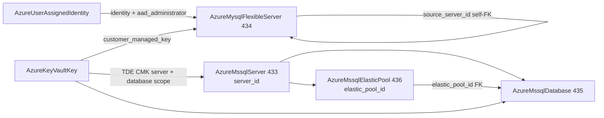

# Azure Data Wave: MySQL Flexible Server Rework + MSSQL Family Decomposition (Server Rework, Database and Elastic Pool Kinds)

**Date**: July 5, 2026
**Type**: Feature | Breaking Change
**Components**: Azure Provider, API Definitions, Pulumi CLI Integration, IAC Stack Runner, Testing Framework

## Summary

Four components move to the full azurerm v4.80 surface. `AzureMysqlFlexibleServer` (434) is reworked from its 80/20 spec into the real managed-MySQL contract — MySQL's own storage block (provisioned IOPS XOR elastic IO scaling, log-on-disk), create modes (replica / point-in-time restore) with a self-referencing `source_server_id` seam, customer-managed keys against `AzureKeyVaultKey` with the geo-backup pair, the user-assigned-only identity model, an AAD administrator riding a user-assigned identity, and an explicit `public_network_access` enum. The MSSQL surface decomposes along Azure's own architectural seams into three first-class kinds: `AzureMssqlServer` (433, reworked breaking) is the pure logical server — Entra-only or mixed authentication, identity + primary user-assigned identity, server-level TDE CMK, inline firewall/VNet rules — with its bundled databases dissolved; `AzureMssqlDatabase` (435, new, `azmsqldb`) is the unit of compute and billing with the full ~40-field surface (DTU/vCore/serverless/Hyperscale SKU vocabularies, create modes with source pairings, serverless auto-pause dials, database-scoped TDE CMK with rotation, short/long-term retention, threat detection, bacpac import, ledger, enclaves); and `AzureMssqlElasticPool` (436, new, `azmsqlpool`) is the shared-compute pool (DTU and vCore SKU ladders with derived tier/family, per-database min/max bounds, Hyperscale HA replicas) that databases join through an `elastic_pool_id` FK. All four passed live dual-engine E2E including the composed database-joins-pool chain; zero orphans.

## Problem Statement / Motivation

- **MySQL was a demo spec.** No create modes, no CMK, no identity, no AAD administrator, no IOPS/IO-scaling dials — and MySQL's contract differs from Postgres in exactly the places a shared mental model would get wrong (user-assigned-only identity, versioned CMK key ids, `public_network_access` as a derived enum rather than a boolean).
- **MSSQL bundled the database into the server.** Azure's model gives the logical server no compute at all — databases and elastic pools are the billing units, each with independent lifecycle, ~40 configuration fields, and cross-references (a database joins a pool by ARM id). Bundling made pools unrepresentable and capped databases at a name string.

## Solution / What's New

### AzureMysqlFlexibleServer rework (434, breaking)

- Full `sku_name` vocabulary (Burstable/GP/Business-Critical), version enum (5.7/8.0.21), zone + HA block (`ZONE_REDUNDANT`/`SAME_ZONE` with standby zone), maintenance window.
- **MySQL's own storage block**: `size_gb`, provisioned `iops` XOR `io_scaling_enabled` (CEL), `auto_grow_enabled`, `log_on_disk_enabled`.
- **Lifecycle**: `create_mode` (Default / PointInTimeRestore / Replica) + self-referencing `source_server_id` FK + `point_in_time_restore_time_in_utc`, with mode-pairing CELs.
- **CMK + identity**: user-assigned-only identity model (`user_assigned_identity_ids` directly — MySQL supports no system-assigned identity); `customer_managed_key` referencing the VERSIONED `AzureKeyVaultKey.key_id` plus the geo-backup key/identity pair (pairing CELs).
- **AAD administrator** as the child resource on both engines — MySQL requires it to ride a user-assigned identity (`identity_id` FK + `object_id`).
- Explicit `public_network_access` enum (ENABLED/DISABLED — Azure derives the default from delegated-subnet presence); VNet injection (`delegated_subnet_id` + `private_dns_zone_id` pairing CELs); inline `databases` (charset/collation) and `firewall_rules`; `server_parameters` map. Outputs: `server_id`, `fqdn`, `database_ids` map, `replica_capacity`. 53 spec tests.

### AzureMssqlServer rework (433, breaking)

- The pure logical server: version, SQL-auth credentials XOR Entra-only (`azuread_administrator` with `azuread_authentication_only` — CEL-gated), identity block + `primary_user_assigned_identity_id` FK, server-level `transparent_data_encryption_key_vault_key_id` → `AzureKeyVaultKey`, connection policy, TLS floor, `public_network_access_enabled`, outbound network restriction, express vulnerability assessment.
- Inline `firewall_rules` + `virtual_network_rules` (no independent FK-referenced lifecycle — the fold verdict).
- **Bundled databases dissolved** — the databases field is gone; databases are their own kind.

### AzureMssqlDatabase (new, 435, `azmsqldb`)

The unit of compute and billing on a logical server, by `server_id` FK: full SKU vocabulary (`Basic`/`S*`/`P*` DTU, `GP_`/`BC_`/`HS_` vCore, `GP_S_` serverless, `ElasticPool`), `elastic_pool_id` FK → the pool kind with pool-membership CELs (pooled databases carry sku `ElasticPool`, no own maintenance window), max size, collation, serverless auto-pause/min-capacity dials (CEL-gated to serverless SKUs), Hyperscale read replicas, read scale-out, zone redundancy, ledger, VBS enclaves, create modes (copy/secondary/PITR/recovery/restore/LTR-restore) each pairing its source (CELs), database-scoped TDE CMK (versioned key + rotation flag riding the key — the provider requires the two together) with database-scoped user-assigned identities, short/long-term retention, threat detection, bacpac import, license type, geo-backup. Outputs `database_id`/`database_name`. 46 spec tests; scenarios prove both the standalone and the pool-attach paths.

### AzureMssqlElasticPool (new, 436, `azmsqlpool`)

The shared-compute pool on a logical server: sku ladder (BasicPool/StandardPool/PremiumPool DTU; GP/BC/HS vCore) with tier and hardware family DERIVED from the sku name (mismatches unrepresentable), capacity, required per-database min/max bounds, `max_size_gb` XOR `max_size_bytes` (CEL), zone redundancy, enclave type (pool-wide — every member must match), Hyperscale HA replica count, maintenance window, license type. Output `elastic_pool_id` — the seam the database FK resolves through. 18 spec tests.

## Validation

- Spec tests: 53 (MySQL) + 39 (MSSQL server) + 46 (database) + 18 (pool), every CEL error path covered.
- `make protos`, kind-map regen, targeted builds, `make build-go`, Bazel builds ×4 component trees — all green.
- `secret-coverage` (Azure 100% at 28 covered), `validate-refs` (all FK seams resolve), `pkg/outputs` conformance ×4.
- Full `planton tofu plan` on all four hack manifests (7/1/8/1 resources); 12 presets; parity audits ×4 at 100% Fully Complete, PARITY ✅ COVERAGE ✅; site catalog regenerated (mssql-database and mssql-elastic-pool pages added).
- **Live dual-engine E2E, all green**: MSSQL server (Pulumi 221s / Terraform 268s); MSSQL database minimal + pool-attach both engines (Pulumi 357s + 442s; Terraform ~30m for the pair) — pool-attach proves the composed RG → server → pool → pooled-database chain; elastic pool (Pulumi 300s / Terraform 288s); MySQL (Pulumi 524s / Terraform 592s, in westus2). Final sweep: subscription fully clean — zero resource groups, zero SQL servers, zero MySQL servers.
- **MySQL E2E region note**: the test subscription's MySQL offer restrictions do NOT match PostgreSQL's — westus3 (clean for Postgres) fails with `ProvisionNotSupportedForRegion` while westus2 (blocked for Postgres) is MySQL-clean. The `Microsoft.DBforMySQL` capabilities API is the probe: restricted regions answer 500, usable regions return their edition ladder. Recorded in `e2e/README.md`.

## Harness Learnings (recorded in e2e/README.md)

- **Globally unique parent names must not be destroyed and recreated across sequential scenarios.** Azure can hold a just-deleted SQL server name long enough that the next scenario's recreate hangs indefinitely. Scenario-local parent fixtures (via the `e2e-extra-prerequisites` path form, kept outside `e2e/scenarios/`) replace the shared-fixture registry chain for `AzureMssqlDatabase`; the kind's registry prerequisite on `AzureMssqlServer` is dropped accordingly.
- **The tfvars wire format drops zero-valued proto fields**: Terraform object attributes where zero is meaningful (the pool's `per_database_settings.min_capacity`) must be `optional()` with the zero default or `terraform apply` fails on a legitimate `0`.

## Impact

- Managed MySQL on Azure is modeled honestly: replicas, PITR, CMK with geo-backup pairs, Entra administrators, and elastic IO scaling are first-class instead of impossible.
- The MSSQL family is composable the way Azure actually bills it: one governed server, many independently owned databases, shared-compute pools databases join by reference — an org can now express "move this database into that pool" as a one-field change.
- Breaking: MSSQL server manifests lose their bundled `databases`; MySQL manifests rename/restructure storage and identity fields to azurerm's real shape.
