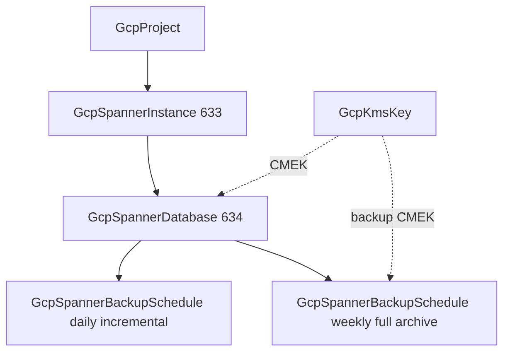

# GCP Spanner Depth Rebuild and Backup Schedule Kind

**Date**: July 5, 2026
**Type**: Enhancement
**Components**: GCP Provider, API Definitions, IAC Stack Runner, Testing Framework

## Summary

Deep-rebuilt `GcpSpannerInstance` (633) and `GcpSpannerDatabase` (634) to the released Terraform Google provider 6.x floor and forged the new `GcpSpannerBackupSchedule` kind (641) — cron-driven full/incremental database backups as a first-class, many-per-database resource. Both existing kinds shed a set of long-standing module defects (converter-contract ref typing, stale Pulumi entrypoint options, label-key drift, ambient-project violations, missing API enablement) including a live cross-engine destroy-parity break on the database. All three kinds are proven with live dual-engine E2E on both Pulumi and OpenTofu, zero orphans.

## Problem Statement / Motivation

The Spanner pair predated the modern module contract and sat below the provider floor:

### Pain Points

- **Below-floor specs**: the instance lacked user labels, the `total_cpu_utilization_percent` autoscaling target, and the per-replica `asymmetric_autoscaling_options` surface (the multi-region ENTERPRISE feature); the database lacked multi-region CMEK (`kms_key_names`) and any deletion-protection stance.
- **A live destroy-parity break**: the database's Terraform module hardcoded `deletion_protection = false` (silently weakening the provider's safe default) while the Pulumi module never set the flag — whose bridged provider defaults it TRUE. The same manifest destroyed cleanly on one engine and was blocked on the other.
- **Stale defect classes** in all four modules: `object({value})` ref typing in `variables.tf` (fails at plan through the tfvars converter), `runtime.options.binary` in both `Pulumi.yaml` files (breaks source-mode `pulumi up`), legacy `planton-resource*` label keys on the instance's Terraform side, outputs built from raw spec values (breaks under the ambient-project fallback), `project_id` required, and no `spanner.googleapis.com` enablement.
- **No backup story**: `google_spanner_backup_schedule` was unmodeled, leaving the instance's `default_backup_schedule_type` field pointing at a capability the catalog could not express. Point-in-time recovery covers at most 7 days; backups cover months.
- **No E2E coverage** for any Spanner kind.

## Solution / What's New

### GcpSpannerInstance (633) — depth rebuild

- User `labels` merged beneath the platform attribution labels (identical merge order on both engines).
- Autoscaling gains `asymmetric_autoscaling_options[]` — per-replica-location node bounds so a read-heavy region scales independently of the rest of a multi-region instance — with coherence CEL.
- `project_id` optional with the ambient-project fallback; `instance_name` defaults to `metadata.name`.
- Outputs gain `config` (the geographic-topology handle); `instance_id` is built from the created resource's resolved project.

### GcpSpannerDatabase (634) — depth rebuild

- `encryption_config` message: single-region `kms_key_name` XOR multi-region `kms_key_names[]` (one key per region), both FK → `GcpKmsKey.key_id`, enforced pre-deploy by CEL.
- `deletion_protection` modeled with default TRUE and set EXPLICITLY on both engines — the destroy-parity break is structurally closed.
- The two deletion guards (IaC-side `deletion_protection` vs GCP API-side `enable_drop_protection`) documented side by side in the spec.
- Registry gains `prerequisites: [GcpSpannerInstance]`.

### GcpSpannerBackupSchedule (641) — new kind

- Instance + database by reference, crontab cadence (UTC; 12-hour/daily/weekly/monthly), `retention_duration` up to 366 days, `backup_type` FULL (default) XOR INCREMENTAL (ENTERPRISE+ edition), and all three backup-encryption arms (inherit / Google-default / explicit CMEK with key XOR keys).
- The provider expresses the backup kind as a pair of empty marker blocks (`full_backup_spec` / `incremental_backup_spec`); the spec folds that into one honest `backup_type` field, mapped identically on both engines.
- Ownership semantics documented: deleting the database deletes its schedules, but the backups survive until retention expires — which is what blocks instance destruction unless `force_destroy` is set.

## Implementation Details

- **Module conformance across all six modules**: converter-contract plain-string ref variables, `spanner.googleapis.com` enablement (`disable_on_destroy=false`) with explicit dependency ordering, ambient-project fallback (null/omitted arg), canonical `Pulumi.yaml` (runtime-only), `planton-ai_*` label keys with identical merge order, and outputs derived from resolved resource attributes.
- **A live-only parity defect found and fixed**: the bridged Pulumi provider returns the instance's `config` attribute as the fully qualified `projects/{p}/instanceConfigs/{name}` path while the released Terraform provider stores the plain name. The raw export broke output parity (and the E2E verifier) on one engine only — invisible to every offline gate. The Pulumi module now normalizes to the plain config name with an explanatory comment; `pkg/iac/MODULE_PARITY.md` gained the "bridged-provider attribute value format" parity class.
- **E2E**: three new verifiers on the Spanner Admin API (instance READY/config/capacity posture; database READY/name; schedule cron/retention/exactly-one-backup-kind posture); the instance's published `e2e/prerequisite.yaml` (100 processing units — the smallest billable footprint) and the database's prerequisite for the schedule chain; four scenarios; six test entrypoints.
- Recorded live-E2E exclusion: the FREE_INSTANCE arm (GCP allows one free instance per billing account; an ephemeral scenario collides with any existing one and its own reruns) — proven by spec tests and offline plan instead.

## Validation

- Offline: spec tests 60+37+34 green; release-equivalent Pulumi builds ×3; `tofu validate` + offline `planton tofu plan` through the real tfvars converter ×3 (plans inspected); `secret-coverage --check`; `validate-refs --check`; `validate-outputs` dry-runs fully populated on BOTH module dirs ×3; three new `pkg/outputs` conformance cases; all 17 preset/hack/scenario/prerequisite manifests through `planton validate` (which caught six presets carrying a wrong `valueFrom` sub-key — `field:` instead of `fieldPath:` — now fixed and encoded in the preset-authoring rule); `make build-go`; framework tests green.
- Live dual-engine E2E on the test project, all green: instance minimal 34s/38s + autoscaling 43s/49s (Pulumi/Terraform), database chain 2m45s/3m38s, backup-schedule chain (instance → database → schedule) 2m01s/1m47s. Zero orphans (post-run instance sweep empty).
- Audits: all three kinds **Fully Complete — PARITY ✅** (`docs/audit/2026-07-05-093350.md` per kind).

## Impact

- Spanner architectures compose from three first-class nodes — capacity/topology (instance), schema/data/encryption (database), and protection (backup schedules) — each independently ownable and referenceable, with the daily-plus-weekly two-schedule pattern expressible for the first time.
- The database's destroy behavior is now identical on both engines and safe by default; teardown is an explicit, auditable opt-out.
- Advanced organizations reach the provider's long tail: asymmetric multi-region autoscaling, multi-region CMEK, incremental backup chains, and 366-day compliance retention.

## Related Work

- Follows the AlloyDB wave decomposition (cluster/instance/user) and the Cloud SQL wave (instance/database/user) in the data family.
- Extends the GCP E2E harness introduced with the IAM kinds and grown per-wave since.

---

**Status**: ✅ Production Ready
