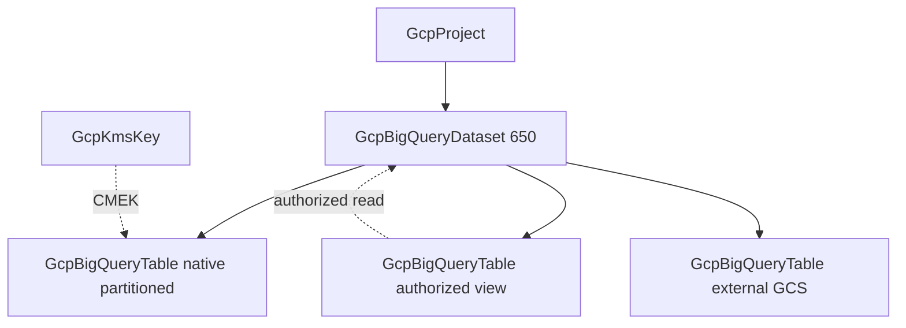

# GCP BigQuery Dataset Depth Rebuild and Table Kind

**Date**: July 5, 2026
**Type**: Enhancement
**Components**: GCP Provider, API Definitions, IAC Stack Runner, Testing Framework

## Summary

Deep-rebuilt `GcpBigQueryDataset` (650) to the released Terraform Google provider 6.50.0 floor and forged the new `GcpBigQueryTable` kind (653, `gcpbqtbl`) — one kind covering native tables, logical views, materialized views, and external/BigLake tables, mirroring the single provider resource. The dataset shed the classic module defect set (no user labels at all in Terraform — a live label-parity break — `~> 5.0` pin, `object({value})` ref typing, missing API enablement, required `project_id`), gained the full access surface with arm-aware CEL enforcement, and both kinds are proven with live dual-engine E2E on Pulumi and OpenTofu, zero orphans.

## Problem Statement / Motivation

The dataset kind predated the modern module contract and sat well below the provider floor; the catalog had no way to express infrastructure-owned tables at all.

### Pain Points

- **Below-floor dataset spec (14 fields)**: no user `labels` (while the provider models them), no `resource_tags`, no `external_dataset_reference` (BigQuery Omni), no `external_catalog_dataset_options` (Hive interop), and the access list lacked the `routine`, authorized-`dataset`, and IAM `condition` arms. The "exactly one identity" access rule was doc-only — a malformed entry reached the BigQuery API before failing.
- **A live label-parity break**: the Terraform module set zero labels while Pulumi stamped the platform set — the same manifest produced differently-labeled datasets per engine.
- **Stale defect classes**: `object({value})` ref typing in `variables.tf`, `~> 5.0` provider pin, no API enablement on either engine, stale `Pulumi.yaml` `binary:` option, required `project_id` (breaking the harness's omit-project contract), and docs describing legacy `planton-resource*` label keys.
- **No table kind**: partitioned fact tables, authorized views, and external tables — the things infrastructure legitimately owns — could not be modeled. The dataset docs' "tables are app-code territory" stance was folded into a real design boundary instead.
- **No E2E coverage** for BigQuery at all (no verifier, no bigquery client in the harness, no scenarios).

## Solution / What's New

### GcpBigQueryDataset (650) — depth rebuild

- User `labels` merged beneath the platform attribution labels (identical merge order on both engines — the Spanner-instance precedent); `resource_tags` for IAM-condition/org-policy governance.
- Access surface completed: five principal identities + authorized `view` / `routine` / `dataset` entries + IAM `condition` gating, with two new CEL rules enforced pre-deploy — exactly-one-identity, and role coherence (required for principal grants, forbidden for resource authorizations, which BigQuery grants implicit read).
- `external_dataset_reference` (read-only AWS Glue projection through a BigQuery Omni connection) and `external_catalog_options` (Hive Metastore compatibility).
- `project_id` optional with the ambient-project fallback; outputs gain `location` and `etag` (extend-only — the GKE resource-usage-export FK on `dataset_id` untouched).

### GcpBigQueryTable (653, `gcpbqtbl`) — new kind

- One kind, four arms — native table, logical view, materialized view, external/BigLake table — with CEL-enforced mutual exclusivity, mirroring the single `google_bigquery_table` resource rather than inventing kinds GCP does not have.
- Native shape: JSON-string `schema` (provider-authentic — BigQuery schemas are recursively nested RECORDs; a structured re-model would be lossy and fight the provider's diff-suppress machinery), time XOR range partitioning, clustering (≤4), `require_partition_filter`, expiration, CMEK ref → GcpKmsKey.
- Full `external_data_configuration`: ten source formats, CSV/JSON/Sheets/hive-partitioning/Avro/Parquet/Bigtable options, object tables, and BigLake `connection_id` as a documented plain string until a connection kind exists.
- `table_constraints` (primary key + foreign keys, with the referenced table as a self-kind ref), `table_replication_info`, `biglake_configuration`, `schema_foreign_type_info`, `external_catalog_table_options`.
- `deletion_protection` defaults TRUE and is sent EXPLICITLY on both engines — the destroy-parity lesson from the Spanner wave applied at forge time, not as a later fix.
- Registry entry with `prerequisites: [GcpBigQueryDataset]`; kind map regenerated.

## Implementation Details

- **Module conformance across all four modules**: converter-contract plain-string ref variables, `bigquery.googleapis.com` enablement (`disable_on_destroy=false`) with explicit dependency ordering, ambient-project fallback (null/omitted arg), canonical `Pulumi.yaml`, `planton-ai_*` label keys with identical merge order, outputs from resolved resource attributes, and `~> 6.0` provider floats (GA/beta provider files are byte-identical for both resources — no beta dependency).
- **Presence-tracked CSV `quote`**: unset means the API-default double-quote; an explicit empty string means unquoted data — mapped identically on both engines with explanatory comments.
- **The provider's nested authorized-dataset wrapper** (`dataset { dataset { ... } target_types }`) is flattened in the spec and re-nested in both modules.
- **E2E**: bigquery v2 client added to the harness; two new verifiers (dataset get + location posture; table get + type/partitioning posture); dataset scenarios `minimal` + `access-entries` plus a published `e2e/prerequisite.yaml`; table scenarios `partitioned-native` (day partitions + clustering on the dataset prerequisite chain) and `literal-view` (a self-contained literal-SELECT view — valid BigQuery, no base-table self-prerequisite, no staged data); four test entrypoints.
- **Recorded skips with reasons**: `deletion_policy` and `csv_options.source_column_match` are absent from the released 6.50.0 schema (verified with a fresh `tofu providers schema -json` probe); `ignore_auto_generated_schema` / `ignore_schema_changes` / `table_metadata_view` are TF-client drift-handling knobs, not cloud state (parity-neutral); CMEK excluded live (org-level KMS grant to the BigQuery service agent) and the external-GCS arm excluded live (needs staged object data) — both proven offline.

## Validation

- Offline: spec tests 49 + 47 green; release-equivalent Pulumi builds ×2; `tofu validate` + offline `planton tofu plan` through the real tfvars converter ×2 (plans inspected — labels, access blocks, partitioning, deletion guard all present); `secret-coverage --check`; `validate-refs --check`; `validate-outputs` dry-runs on BOTH module dirs ×2; two new `pkg/outputs` conformance cases; all 13 preset/hack/scenario/prerequisite manifests through `planton validate`; `make build-cli` green.
- Live dual-engine E2E on the test project, all 8 green: dataset minimal 18s/21s + access-entries 20s/23s (Pulumi/Terraform), table chain partitioned-native 32s/40s + literal-view 32s/39s. Zero orphans (post-run dataset list empty).
- Audits: both kinds **Fully Complete — PARITY ✅** (`docs/audit/2026-07-05-121500.md` per kind).
- Site catalog regenerated: the dataset's public page refreshed, the table's created (`bigquery-table/`), GCP index updated.

## Impact

- Analytics stacks compose from first-class nodes — the dataset (location, ACL, lifecycle/encryption defaults) and its tables (partitioned facts, authorized views, external data-lake tables) — each independently ownable, referenceable, and destroyable.
- The dataset ACL is now validated pre-deploy: a malformed access entry can no longer reach the BigQuery API, and the authorized-view/routine/dataset pattern (the standard mechanism for exposing filtered slices of sensitive data) is expressible.
- The engines are behaviorally identical, including labels — the live label-parity break is closed structurally.

## Related Work

- Follows the Spanner wave (instance/database/backup-schedule) in the data family; applies its destroy-parity lesson at forge time.
- Opens the analytics sub-band (650s); the deferred additive `GcpBigQueryDatasetAccess` single-grant kind is recorded as a Tier-2 candidate.

---

**Contributors**: Swarup Donepudi
**Review Status**: Implemented in the 90/10 working clone
