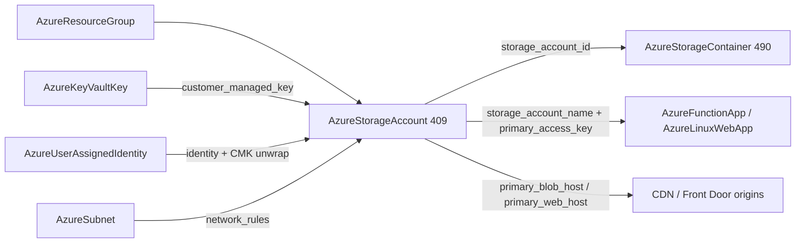

# Azure Data Wave: Storage Account Depth Rework + First-Class Storage Container Kind

**Date**: July 5, 2026
**Type**: Feature | Breaking Change
**Components**: Azure Provider, API Definitions, Pulumi CLI Integration, IAC Stack Runner, Testing Framework

## Summary

The Azure Storage Account moves from an 11-field 80/20 spec to the full azurerm v4.80 surface, and blob containers become a first-class kind. `AzureStorageAccount` (409, reworked breaking) now models the real multi-service primitive: the SKU trio (kind/tier/replication including the zonal/non-zonal replacement boundary), the complete security posture (TLS floor, shared-key policy, OAuth default, anonymous-access gate, copy-scope restriction, SAS lifetime policy, SFTP/local users), data-lake switches (hierarchical namespace, NFSv3, partitioned DNS), encryption depth (infrastructure double-encryption, queue/table key scopes, customer-managed keys against `AzureKeyVaultKey` with a required user-assigned identity), the full blob/file service settings (versioning, both soft-delete recycle bins, point-in-time restore, change feed, CORS, SMB dials), Azure Files identity-based authentication (AADDS/AADKERB/AD), account-level WORM immutability, network rules with subnet references and private-link exceptions, static-website hosting, routing preference, custom domains, and the folded blob lifecycle-management policy. `AzureStorageContainer` (490, new, `azsc`) is the namespace unit the account's old bundled `containers` list dissolves into — many-per-account, independently owned, referencing the account by ARM id. Outputs now carry every service endpoint plus the access keys and connection strings the app-hosting kinds consume; Function App and Linux Web App access-key fields gained `default_kind` wiring to the new `primary_access_key` output. Both kinds passed live dual-engine E2E (account 187s/213s; container through the composed RG → scenario-local account chain 216s/241s); zero orphans.

## Problem Statement / Motivation

- **The account spec was a demo.** No explicit account name (the module derived one from metadata by stripping hyphens — two resources could silently collide on a GLOBALLY unique name), no identity, no CMK, no SFTP/HNS/NFSv3, no lifecycle management, no file-service settings, no immutability, an invented always-DENY firewall default that diverged from Azure's real contract, and outputs missing the access keys that Function App bindings genuinely require.
- **Containers were a bundled list** — no independent lifecycle, no per-container RBAC scope, no encryption-scope pinning, and nothing downstream could reference one.
- **Azure models lifecycle management as a singleton per-account policy document** (ARM hardcodes its name to "default") — it belongs INSIDE the account spec, not as a kind.

## Solution / What's New

### AzureStorageAccount rework (409, breaking)

- **Explicit `account_name`** (3-24 lowercase alphanumerics ONLY — no hyphens; globally unique) replaces metadata-derived naming.
- **The SKU trio as closed enums** with Azure's real transition semantics documented: only Storage→StorageV2 upgrades kind in place; zonal↔non-zonal replication switches replace the account.
- **Security posture at the v4.80 floor**: `https_traffic_only_enabled` (the v4 rename), `min_tls_version`, `shared_access_key_enabled`, `default_to_oauth_authentication`, `allow_nested_items_to_be_public` (Azure's REAL default true, documented rather than silently hardened), `public_network_access_enabled`, `allowed_copy_scope`, `sas_policy` (D.HH:MM:SS-validated period + Log/Block action), `local_user_enabled`, `sftp_enabled`, `cross_tenant_replication_enabled`.
- **Data-lake/protocol switches**: `is_hns_enabled`, `nfsv3_enabled` (with ARM's full pairing matrix as CELs), `large_file_share_enabled` (one-way; both engines send it only when true — false means "leave it to Azure"), `dns_endpoint_type` (AzureDnsZone × restore-policy conflict CEL).
- **Encryption depth**: `infrastructure_encryption_enabled` (kind/tier gates), `queue_encryption_key_type` / `table_encryption_key_type` (Account scope rejected on legacy Storage kind), `identity` (VM-precedent shape), `customer_managed_key` → `AzureKeyVaultKey.versionless_id` (rotations propagate) + required UAI FK.
- **Service settings**: `blob_properties` (versioning, blob + container delete retention, point-in-time restore with its three prerequisite CELs, change feed + retention, CORS with closed method vocabulary, last-access tracking), `share_properties` (retention, all five SMB dials, CORS; premium-only multichannel CEL), `azure_files_authentication` (AADDS/AADKERB/AD with domain coordinates), account-level `immutability_policy` (requires versioning; one-way LOCKED documented), `routing`, `custom_domain`, `static_website`.
- **`static_website` realized via the standalone `storage_account_static_website` resource on BOTH engines** — azurerm's inline block is deprecated for removal in v5.
- **`lifecycle_rules` folds the management policy in**: rules with blob-type/prefix/index-tag filters and the full base-blob/snapshot/version tiering + deletion schedules (24 thresholds), per-destination one-aging-basis CELs, the auto-tier-to-hot pairing rule, and ARM's tag-filter × snapshot/version exclusion. Absent thresholds are simply not rendered — the provider's -1 sentinel never appears.
- **~20 message-level CELs** mirror ARM's real conditional matrix (access-tier/HNS/NFSv3/infrastructure-encryption kind gates, BlobStorage×ZRS rejection, versioning×HNS conflict, share/blob/static-website service gates, CMK-requires-user-assigned-identity).
- **Outputs**: all six primary + secondary service endpoints, the blob/web hostnames (CDN/Front Door origin seams), `primary_access_key`/`secondary_access_key` + four connection strings (prose-documented secret-bearing outputs, `sensitive` in the TF module — the registry-admin-credentials precedent), `identity_principal_id`. The bundled `container_url_map` leaves with the container list.
- 63 spec tests; TF `~> 4.0` with the canonical empty provider block (the stale `features { resource_group {...} }` override removed); Pulumi migrated off inline `azure.NewProvider` onto the shared keyless-capable builder.

### AzureStorageContainer (new, 490, `azsc`)

The namespace unit of blob storage, referencing the account by ARM id (the control-plane path — azurerm's account-name form is the legacy data-plane path removed in v5): `container_name` (3-63, CEL with a plain-English message), `container_access_type` (private/blob/container — anonymous access doubly gated by the account's `allow_nested_items_to_be_public`), `default_encryption_scope` + `encryption_scope_override_enabled` (sub-account key isolation; the scope stays a plain value until an encryption-scope kind lands — recorded), container `metadata`. Outputs `container_id` (the data-plane RBAC scope), `container_name`, and `storage_account_name` parsed from the account id on both engines with identical anchored semantics. Deliberately NO url output — only the account knows its real endpoint (partitioned DNS differs), so URLs compose from the account's `primary_blob_endpoint`. No registry prerequisite on the account (globally-unique names must not recreate per scenario — the MSSQL database precedent); the E2E scenario declares a scenario-local account fixture instead.

### Retrofits

- `AzureFunctionApp.storage_account_access_key` and `AzureLinuxWebApp.storage_mounts[].access_key` gained `default_kind` → `AzureStorageAccount.primary_access_key` (the storage binding now composes in one manifest set); the web-app mount key also gained its missing `sensitive` annotation.
- The stale Function App comment claiming the account "does not export access keys by design" is gone — the rework made it false.
- Registry: account gains `prerequisites: [AzureResourceGroup]`; enum 490 opens the storage-data sub-band (490-499).

## Validation

- Offline: 63 + 10 spec tests green (every CEL error path); `make protos`; kind-map + gazelle regen; targeted + release-equivalent builds; `make build-go`; `secret-coverage --check` (Azure 100%); `validate-refs --check`; `pkg/outputs` conformance ×2; full `planton tofu plan` on both hack manifests (account: 3 resources, every enum seam verified rendering ARM values — RAGRS/Cool/AADKERB/StorageFileDataSmbShareReader/Block/InternetRouting); 6 presets validate; site catalog regenerated (storage-account + storage-container pages).
- Audits ×2 (`--parity`, dated reports + addenda): both driven to **100% Fully Complete, PARITY ✅ COVERAGE ✅**. The audits caught and the session fixed: a `large_file_share_enabled` one-way-flag divergence (both engines now send only-when-true), a one-sided PARITY-EXCEPTION comment, a stale container stub with wrong wire tags, a weaker Pulumi ARM-id guard, a pattern rule without a friendly message, and preset naming drift.
- Live (test subscription `8158df85-…`): **4 scenario runs green** — account Pulumi 187s / TF 213s (blob properties + DENY firewall + lifecycle policy applied and destroyed), container Pulumi 216s / TF 241s (composed RG → scenario-local account → container chain) — all 8 phases each. Final sweep: zero resource groups, zero storage accounts.

## Workflow Uplift (learn-once)

Forge flow rule 009 (Pulumi module) now documents the **one-way / Computed provider-flag class**: send such bools only when true, on BOTH engines, with the "false means leave it to the provider" contract on the spec field — always-sending false plans destructive replacements on one engine while the other silently no-ops, a divergence only the parity audit catches.

## Impact

Storage is the highest-fan-in data primitive in the Azure catalog: Function Apps, Web Apps, and future data services all bind to it. This rework closes the widest remaining composition seam in the data wave — accounts are now production-shaped (locked-down networking, CMK, immutability, lifecycle economics), containers are referenceable nodes RBAC can scope to, and the access-key seam the app-hosting kinds documented but could not reach now resolves through a reference.
