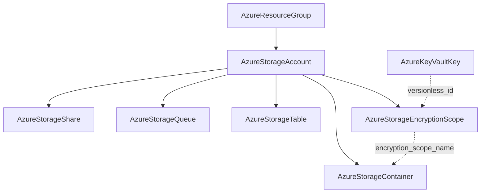

# Azure Storage Data Services: Share, Queue, Table, and Encryption Scope Kinds

**Date**: July 5, 2026
**Type**: Feature
**Components**: Azure Provider, API Definitions, IAC Modules, E2E Framework

## Summary

Forged four first-class storage data-service kinds on the reworked
`AzureStorageAccount` — `AzureStorageShare` (491), `AzureStorageQueue` (492),
`AzureStorageTable` (493), and `AzureStorageEncryptionScope` (494) — completing the
composition story the account rework and `AzureStorageContainer` opened: every major
data surface of an Azure storage account is now an independently ownable, referenceable
node. The container's `default_encryption_scope` was retrofitted from a plain string to
a real foreign-key reference to the new scope kind. All four kinds ship with dual-engine
parity, full docs and presets, and live dual-engine E2E green (12 runs, zero orphans).

## Problem Statement / Motivation

The Azure storage account modeled blob containers as a first-class child kind, but the
account's other data services — Azure Files shares, Storage queues, Storage tables, and
encryption scopes — had no kinds at all. Teams composing real Azure environments could
not declare a mountable file share for an AKS volume, a Functions work queue, a NoSQL
entities table, or a per-tenant encryption boundary as owned infrastructure; and the
container's encryption-scope field was a plain string pointing at a resource type the
catalog could not create.

### Pain Points

- No mountable-share, queue, or table nodes for infra-charts to compose or role
  assignments to scope to
- Encryption scopes — the multi-tenant key-isolation primitive — were unrepresentable,
  leaving the container's `default_encryption_scope` a dangling plain value
- Azure Files RBAC scopes to a DIFFERENT ARM segment than the share's management id;
  without a share kind exporting both, users had to hand-rewrite ids for grants

## Solution / What's New

### Four kinds, one addressing grain

All four take their parent as `storage_account_id` (`StringValueOrRef` →
`AzureStorageAccount.storage_account_id`) — the resource-manager addressing that is
azurerm's v5 direction. The deprecated `storage_account_name` / `resource_manager_id`
compat shims are not modeled. None declares a registry prerequisite on the account
(globally-unique names + Azure's post-delete reservation); E2E scenarios declare
scenario-local account fixtures.

### AzureStorageShare (491, `azshare`)

The SMB/NFS file-share unit: required `quota_gb` (1-102400), protocol enum (SMB default
/ NFS with the FileStorage-account gate documented), access-tier enum (sent only when
chosen so Azure's per-account-kind default applies), stored access policies with
optional RFC-3339 windows, metadata. Exports BOTH `share_id` (management ARM id) and
`rbac_scope_id` — Azure Files role assignments deliberately target the different
`fileServices/default/fileshares/{name}` segment, and the module spares every grant
from composing it by hand.

### AzureStorageQueue (492, `azsq`)

The work-queue/load-leveling primitive: name + metadata (the management surface really
is that small — everything else is data-plane runtime behavior, documented). The docs
teach the queue-vs-Service-Bus boundary and the `-poison` companion convention.

### AzureStorageTable (493, `azst`)

The serverless NoSQL store: azurerm's exact name contract as CEL (letter-start
alphanumerics, never the literal "table"), stored access policies with REQUIRED
start/expiry (the table-specific contract) and strict `raud` permission ordering.
Carries the session's one `PARITY-EXCEPTION`: pulumi-azure v6.38 (the latest v6) has
not bridged the table's `storage_account_id` input, so TF addresses by RM id while
Pulumi passes the account name parsed from the same resolved ARM id — the created table
is identical and `table_id` carries `resource_manager_id` on BOTH engines, so outputs
are byte-identical. Documented in both modules with the re-alignment trigger.

### AzureStorageEncryptionScope (494, `azses`)

The named encryption boundary for per-tenant/mixed-sensitivity key isolation:
source enum (MICROSOFT_STORAGE / MICROSOFT_KEY_VAULT), `key_vault_key_id` as a
`StringValueOrRef` → `AzureKeyVaultKey.versionless_id` (rotation propagates) with a
message-level presence-check CEL enforcing required-when-KeyVault, and
`infrastructure_encryption_required` (sent only when true on both engines). ARM has no
true delete for scopes — destroy soft-disables — so the E2E verifier is STATE-AWARE:
it reads `properties.state` and treats `Disabled` as absent (a 404 probe would report
every cleanly-destroyed scope as an orphan).

### Container retrofit: the scope seam becomes a real FK

`AzureStorageContainer.default_encryption_scope` converted plain string →
`StringValueOrRef` with `default_kind: AzureStorageEncryptionScope` → the scope's
`encryption_scope_name` output; its override-pairing CEL restructured to a presence
check. Module boundaries unchanged (references resolve to literals before modules run).

## Implementation Details

- **Registry**: 491-494 extend the storage-data grouping opened at 490, with the shared
  no-account-prerequisite rationale comment
- **Both engines** on `azurerm ~> 4.0` + the canonical empty provider block and the
  shared `pulumiazureprovider.Get` builder (28 of ~48 Azure Pulumi modules migrated)
- **E2E**: four verifiers (three on the generic ARM GetByID at the pinned
  Microsoft.Storage `2023-05-01` API version — shares/queues/tables all answer;
  the scope's state-aware) plus a composed container scenario
  (scenario-local account → encryption scope → container pinning the scope with
  overrides disabled) that live-proves the new FK seam end to end
- **Guards**: `pkg/outputs` conformance cases ×4; `validate-refs` green (the two new
  FK edges resolve); Azure secret-coverage stays 100% (key REFERENCES are not key
  material — the established CMK treatment)

## Validation

- Offline: spec tests 17/10/14/13 + the container's extended suite — all pass;
  `make protos`; kind-map + Gazelle regen; targeted + release-equivalent builds ×5;
  `make build-go`; `secret-coverage --check`; `validate-refs --check`; `pkg/outputs`;
  full `planton tofu plan` on all five hack manifests (every enum seam rendered:
  SMB/COOL, Microsoft.KeyVault + key pairing, `raud` ACLs); 13 presets + 11 E2E
  manifests validate; audits ×4 at **100% Fully Complete, PARITY ✅ COVERAGE ✅**
  (+ a container audit addendum); site catalog regenerated (four new slugs)
- Live (test subscription): **12 scenario runs green** — container encryption-scope
  chain 257s/275s + minimal 218s/244s; share 225s/236s; queue 217s/238s; table
  223s/242s; encryption scope 217s/227s (state-aware destroy verification proven) —
  all 8 phases each, both engines. Final sweep: zero resource groups, zero storage
  accounts, empty vault recycle bin.

## Impact

Azure storage is now fully composable: an infra-chart can declare an account, its
containers/shares/queues/tables, per-tenant encryption scopes, and least-privilege
data-plane grants scoped to each child — with key rotation flowing from Key Vault
through scopes to containers with zero manual intervention.

## Related Work

- The storage-account depth rework and `AzureStorageContainer` forge (the parent
  session's changelog) — this completes the decomposition it started
- The Key Vault trio — `AzureKeyVaultKey.versionless_id` is the scope's CMK seam
- Remaining storage children (ADLS Gen2 filesystem, SFTP local users, object
  replication) recorded as follow-ups

---

**Status**: ✅ Production Ready
