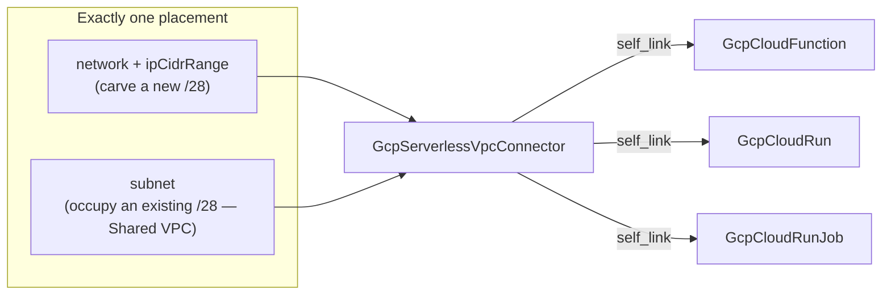
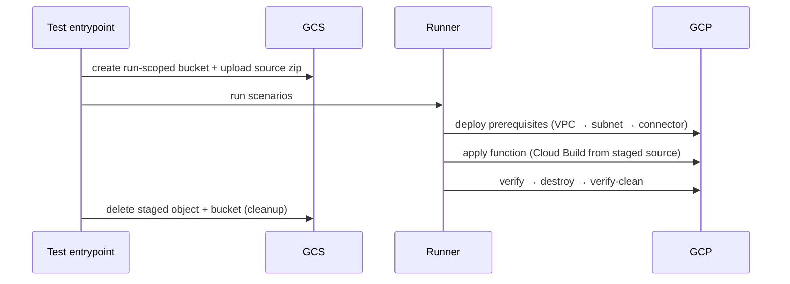

# GCP Serverless VPC Connector Kind and Cloud Function Depth Rebuild

**Date**: July 5, 2026
**Type**: Feature
**Components**: GCP Provider, API Definitions, IaC Modules, E2E Framework, Secret Coverage

## Summary

The GCP serverless family is complete: `GcpServerlessVpcConnector` (enum 721) is
forged as the first-class bridge from serverless into a VPC, and
`GcpCloudFunction` (602) is deep-rebuilt to the released Gen 2 provider floor.
The rebuild closes the GCP surface's last secret-coverage baseline entry by
remodeling secret environment variables as provider-authentic Secret Manager
references, fixes a live label-parity break between the two engines, and wires
the connector into every serverless consumer's foreign keys. Both kinds are
live-proven on both engines, including a composed scenario in which a Cloud
Function resolves its connector reference through the FK default at deploy time.

## Problem Statement / Motivation

Cloud Functions could not reach private VPC resources through composition: the
spec's `vpc_connector` was a raw regex-validated string, and no connector kind
existed for it — or for Cloud Run and Cloud Run Job, whose ref-shaped
`connector` fields were forged default-less for exactly this reason.

### Pain Points

- **No connector kind.** The Serverless VPC Access connector — regional shared
  infrastructure consumed by Cloud Functions, Cloud Run, and App Engine — was
  not modeled at all, leaving the private-egress path uncomposable.
- **The last accepted secret-coverage gap.**
  `GcpCloudFunction:spec.service_config.secret_environment_variables` was a
  `map<string,string>` that looked like (and invited) literal secret material,
  parked in the coverage baseline.
- **A live label-parity break.** The Terraform module attached unprefixed label
  keys while the Pulumi module attached the `planton-ai_*` platform set — the
  same function deployed with different labels depending on engine.
- **Stale module scaffolding.** Hard-pinned `google = "6.19.0"`, no API
  enablement, a hack manifest that declared the WRONG KIND
  (`GcpArtifactRegistryRepo`), a stale commented `binary:` option in
  `Pulumi.yaml`, and the pre-convention `module/resources.go` entrypoint.
- **Shallow spec.** No CMEK, no build identity, no worker pool, no repo-source
  arm, no secret volumes, no update policy, no traffic pinning, no binary
  authorization; memory modeled as a MB integer instead of the API's quantity
  strings; a hardcoded runtime allowlist regex that goes stale every time GCP
  ships a runtime.

## Solution / What's New

### GcpServerlessVpcConnector (721, `gcpvpcconn`)

One kind, two placement arms, mirroring `google_vpc_access_connector`:

- Placement enforced pre-deploy by three reference-safe CEL rules
  (exactly-one, network-requires-cidr, cidr-requires-network).
- Instance-band scaling only (`min_instances` 2–9 / `max_instances` 3–10,
  min < max by CEL) with the provider's sharp edges taught in the spec and
  both modules: the fleet never scales in on its own, and band decreases
  REPLACE the connector while increases apply in place.
- Recorded skips: the legacy `min_throughput`/`max_throughput` contract
  (provider-discouraged, conflicts with the instance fields, ForceNew),
  `deletion_policy` (absent from released 6.50.0 — one-engine field), and the
  read-side `connected_projects`.
- The resource has no labels surface — documented in both modules; the engines
  skip labels identically.
- Registry: `prerequisites: [GcpVpcNetwork, GcpSubnetwork]` (one per placement
  arm); outputs `name`, `self_link`, `state`, `region` (region emitted from the
  plain spec value — the bridged-attribute-format parity class pre-empted).

### GcpCloudFunction depth rebuild (602)

Spec rebuilt to the released Gen 2 floor with fields renumbered contiguously:

- **Composition:** `source.bucket` → GcpGcsBucket; all three service-account
  fields (build / runtime / Eventarc invoker) → GcpServiceAccount;
  `vpc_connector` → GcpServerlessVpcConnector (`self_link`); `pubsub_topic` →
  GcpPubSubTopic; `kms_key_name` → GcpKmsKey.
- **Secret-gap closure:** `secret_environment_variables` remodeled from
  `map<string,string>` to `{key, secret, version, project_id}` reference
  messages (the Gen 2 API accepts no literal secret material), with
  `sensitive_exempt_reason` on the secret NAME; `secret_volumes` added with the
  same shape. The `GcpCloudFunction` line is REMOVED from
  `pkg/secretcoverage/baseline.yaml`.
- **New surfaces:** description, user labels, CMEK, build service account,
  worker pool, docker repository, AUTOMATIC-XOR-ON_DEPLOY update policy, the
  `repo_source` arm (branch/tag/commit exactly-one by CEL), quantity-string
  `available_memory` + `available_cpu`, `all_traffic_on_latest_revision`
  (the manual canary/rollback lever), `binary_authorization_policy`.
- **Honest runtime contract:** the runtime allowlist regex is gone — the
  provider models runtime as a free string and the API rejects deprecated
  runtimes at deploy time; a hardcoded list only goes stale.
- **Outputs extend-only:** `name` (the bare function name serverless NEGs
  compose on), `uri`, `environment`, `update_time` added.
- **Recorded skips (schema-probe verified against released 6.50.0):** direct
  VPC egress (`direct_vpc_network_interface`/`direct_vpc_egress`) and
  `deletion_policy` are absent from the released line for this resource —
  modeling either would create a one-engine field.

### Module defect closure (both engines)

- Label parity: Terraform now attaches the `planton-ai_*` platform set with
  user labels merged beneath — identical keys, values, and order to Pulumi.
- `~> 6.0` float replaces the `6.19.0` hard pin; five APIs enabled
  (cloudfunctions, cloudbuild, run, artifactregistry, eventarc).
- Canonical `iac/hack/manifest.yaml` (the mislabeled `iac/tf/hack` copy
  removed); `module/main.go` entrypoint; clean `Pulumi.yaml`; stray
  `.code-workspace` file removed.
- Secret entries require an explicit per-entry project: both engines resolve
  the ambient project identically (Terraform `data.google_project`, Pulumi
  `organizations.GetClientConfig`) only when an entry omits it.

### FK ripple

- `gcpcloudrun` + `gcpcloudrunjob` `vpc_access.connector` gained
  `default_kind = GcpServerlessVpcConnector` (they were forged ref-shaped and
  default-less because no connector kind existed).
- `gcpregionnetworkendpointgroup`'s cloud-function target gained
  `default_kind = GcpCloudFunction` → `status.outputs.name`, and its stale
  "does not yet export a bare function-name output" comment is rewritten.
- `GcpCloudFunction` registry entry gained
  `prerequisites: [GcpServerlessVpcConnector]`.

### E2E: live proof + a new staging pattern

Gen 2 functions cannot deploy without a real source archive in GCS, object
bytes cannot be expressed as IaC, and the runner has no hook between
prerequisite deploy and the scenario apply. The test entrypoint therefore zips
a checked-in fixture (`e2e/fixtures/function-source/`) and stages it in a
run-scoped bucket whose name reproduces the runner's engine-scoped
`${E2E_RUN_ID}` expansion, with cleanup registered on the test handle. The
pattern is documented in `e2e/README.md` for future kinds with the same class
of requirement.

- Harness gained `vpcaccess` and `cloudfunctions` v2 clients; two verifiers
  with posture assertions (connector READY + placement materialized; function
  ACTIVE + GEN_2 + serving URI).
- Connector scenarios: `network-arm` and `subnet-arm` (consumer-scoped /28
  subnetwork prerequisite); a published `prerequisite.yaml` for downstream
  chains. All prerequisite manifests carry `${E2E_RUN_ID}` in cloud-side names.
- Function scenarios: `http-minimal` (public invoker) and
  `vpc-connector-egress` — the composed proof, resolving the connector
  prerequisite's `self_link` live through the FK default.
- **Live results on `planton-e2e`, zero orphans:**
  - Connector 4/4: network-arm + subnet-arm on both engines (~8m per
    scenario including the VPC/subnetwork chain).
  - Function 4/4: http-minimal 11m11s (Pulumi) / 9m18s (Terraform);
    vpc-connector-egress 10m49s / 10m05s — each deploy running a real
    Cloud Build from the staged source.
- One live-only defect found and fixed: the connector verifier asserted a
  non-empty `ip_cidr_range`, but subnet-placement connectors legitimately
  report the occupied subnet INSTEAD of a range — the posture assertion now
  accepts either placement's evidence.

## Validation

- Spec tests 33 (connector) + 51 (function), all green; Pulumi module builds
  (vet + fmt); `tofu validate` + offline `planton tofu plan` through the real
  tfvars converter on both kinds (labels, placement arms, secret env/volumes
  with resolved projects, update policy inspected in the plans).
- `secret-coverage --check` green with the baseline entry removed;
  `validate-refs --check` green; `validate-outputs` on BOTH module dirs for
  both kinds; two new `pkg/outputs` conformance cases.
- All manifests (2 hack + 6 presets + prerequisite profiles + consumer-scoped
  prerequisites + 4 scenarios) through `planton validate` on a freshly built
  CLI (token-carrying E2E manifests validated post-expansion, matching the
  runner's behavior).
- Live dual-engine E2E 8/8 green, zero orphans; both kinds audited Fully
  Complete with PARITY ✅ (`docs/audit/2026-07-05-163642.md` per kind); site
  catalog regenerated (connector page created, function page + presets
  refreshed).

## Impact

- Private-egress serverless architectures are now fully composable: VPC →
  connector → function/service, every edge a first-class reference.
- The GCP provider's secret-coverage baseline is empty — every GCP kind is
  secret-by-default with zero accepted exceptions.
- Both engines now deploy identically-labeled functions; the last stale
  module scaffolding defects for this kind are closed.

## Related Work

- Completes the serverless family opened by the Cloud Run v2 depth rebuild and
  the GcpCloudRunJob forge (the 720–729 block).
- The E2E data-staging pattern extends the harness capabilities introduced
  with `${E2E_RUN_ID}` token expansion.

---

**Status**: ✅ Production Ready
