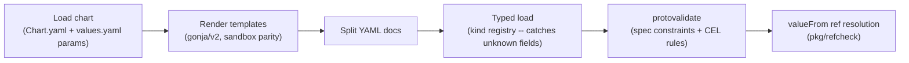

# Offline Chart Validation (`planton chart validate`) and AWS Chart Fleet Fixes

**Date**: July 6, 2026
**Type**: Feature + Bug Fix
**Components**: CLI Commands, InfraCharts, Manifest Processing, Build System, CI

## Summary

The CLI now validates infra-charts entirely offline: `planton chart validate` renders every chart template with its declared defaults (plus every boolean toggle flipped) and checks each rendered manifest against the local kind registry — protovalidate on the spec and resolution of every `valueFrom` reference. The new gate immediately caught that 10 of the 12 AWS charts were broken against the current protos (stale field shapes left behind by the AWS catalog 90/10 rebuild), and all 12 were fixed in the same pass. The gate is wired into `lint.charts` CI so proto/chart drift can no longer ship.

## Problem Statement / Motivation

Chart templates and the proto specs they render into evolve independently. The AWS catalog rebuild (#460) reshaped many specs — S3, DynamoDB, Lambda, CloudFront, KMS, Cognito, SQS, MSK, SageMaker, the Kubernetes addon kinds — but the charts that render those kinds kept their old field names. Nothing failed at PR time because the only deep chart validation lived behind the platform backend's publish flow.

### Pain Points

- **No offline gate** — a chart could only be render-validated by the platform's `chart build`, which requires a running backend. Structure-only CI let field-shape drift ship.
- **Silent breakage at scale** — 10 of 12 AWS charts failed validation once a real gate existed: unknown fields (`aliasName`, `vpcId`, `hashKey`, `codeSourceType`, `queueType`, `poolName`, `isPublic`, `cors`, `isDefault`, `certificateArn`), missing now-required fields (`region` on ~30 manifests, CloudFront `defaultCacheBehavior`, SageMaker `vpcId`/`subnetIds`, addon `namespace`/`container`, RDS `masterUsername`), and a leaked proto-enum in a public chart param.
- **Proto leakage in the params surface** — the serverless-api chart asked users to type `CODE_SOURCE_TYPE_IMAGE`/`CODE_SOURCE_TYPE_S3`, raw values of an enum that no longer exists.

## Solution / What's New

### 1. `planton chart validate` — offline chart validation in the OSS CLI

```bash
# Validate one chart
planton chart validate charts/aws/eks-environment

# Validate every chart under one or more directories
planton chart validate --all charts/aws
```

The pipeline mirrors the control plane's publish-time validation, rebuilt from machinery the CLI already owns:



Key design points:

- **Engine parity, strict-or-stricter**: templates render with gonja/v2 configured to reject the tags (`set`, `include`, `macro`, `call`, `do`, `import`, `from`) and filters (`attr`, `map`, `sort`, `shuffle`) that the control plane's sandboxed Jinjava disables, plus a custom `bool` filter matching the server's coercion semantics. A template the CLI accepts is always renderable by the engine of record. A conformance test suite pins every construct the chart fleet uses so engine drift becomes a red test.
- **Both toggle branches**: beyond the defaults render, every bool param is flipped once, so conditional manifests are validated in both states.
- **Same render context as the server**: every param is addressable bare and via `values.*`, with `org`/`env` always injected.

**Files**: `pkg/infrachart/` (loader, renderer, validator, ref checker, tests + fixtures), `cmd/planton/root/chart.go`, `pkg/refcheck/resolve.go` (exposes field-path resolution for reuse).

### 2. CI enforcement

`.github/workflows/lint.charts.yaml` gains a `chart-validate` job: build the CLI from the checkout, run `planton chart validate --all charts/aws`. Scoped to AWS for now — the other providers' charts have never been render-validated and are gated separately once their findings are triaged (a full-fleet run reports 23 of 49 charts failing across 9 other providers).

### 3. AWS chart fleet fixed (12/12)

| Chart | What changed |
|-------|--------------|
| eks-environment | KMS `aliasName` → `aliases[]`, `disableKeyRotation: false` → `enableKeyRotation: true`; all 9 Kubernetes addon manifests gained the now-required `namespace` (+ `createNamespace`) and, where required, `container.resources` |
| kafka-streaming | Dropped removed MSK `vpcId` (composes via subnets/SGs); S3 `isPublic`/`versioningEnabled` → new private-by-default spec |
| container-app | DynamoDB `tableName`/`hashKey` → `attributeDefinitions[]` + `keySchema[]`; App Runner gained the required ECR `accessRoleArn` (new dedicated pull role with `build.apprunner.amazonaws.com` trust); `region` + `aws_region` param |
| serverless-api | Lambda reshape (`memoryMb` → `memorySizeMb`, dropped `functionName`/`codeSourceType`); public param redesign: `lambda_code_source: image \| s3` replaces the leaked enum values; SQS dropped `queueType`; Cognito dropped `poolName`; `region` on all 8 manifests + `aws_region` param; README updated |
| static-website | CloudFront reshape: `originId`, required `defaultCacheBehavior` (managed CachingOptimized policy), `viewerCertificate` block (ACM arm, SNI, TLSv1.2_2021) replacing top-level `certificateArn`, dropped `isDefault`; CloudFront + ACM cert pinned to us-east-1; S3 public-website bucket now expressed via `publicAccessBlock` + public-read `policy` + top-level `corsRules` |
| microservices-backend | RDS gained required `masterUsername` (new `db_master_username` param; password stays managed by Secrets Manager) |
| ml-workbench | SageMaker domains always require a VPC, so the network foundation is now unconditional; `vpcEnabled` honestly maps to `appNetworkAccessType: VpcOnly \| PublicInternetOnly`; S3 reshape |
| event-driven-pipeline | `region` on all 8 manifests + `aws_region` param |
| data-analytics | `region` on 5 manifests; S3 lifecycle reshape (`filter.prefix`, `transitions[].days/storageClass` — the old shape leaked `STORAGE_CLASS_*` enum values) |
| terraform-backend | Added missing `table_name` param (the DynamoDB manifest previously rendered an empty name), `aws_region` param, `region` on both manifests |
| ecs-environment, pulumi-backend | Already valid — re-proven by the harness |

## Verification

- Baseline before fixes: `planton chart validate --all charts/aws` → **2 passed, 10 failed** (every failure enumerated per manifest and variant).
- After fixes: **12 passed, 0 failed** — every template, every toggle branch.
- `go test ./pkg/infrachart/...` and `bazel test //pkg/infrachart:infrachart_test` pass; `bazel build //cmd/planton/root` green with the new command wired in.
- Deepest reshapes (CloudFront, Lambda) manually cross-checked against spec.proto field comments (managed cache policy ID, viewer-certificate arms, exactly-one code source, S3 `bucket` as value-or-ref).

## Impact

- **Chart authors** get a sub-minute local gate: `planton chart validate --all charts` with per-manifest, per-variant errors.
- **Users** get 12 deployable AWS charts; the serverless-api params form now speaks plain language (`image`/`s3`) instead of proto enum constants.
- **The platform build remains authoritative** — this gate is the shippability floor, not a replacement for the engine-of-record publish validation.

## Related Work

- AWS catalog 90/10 rebuild (#460) — the spec reshapes these charts now match.
- `lint.charts` structure guard — the new `chart-validate` job runs alongside it.

---

**Status**: ✅ Production Ready
