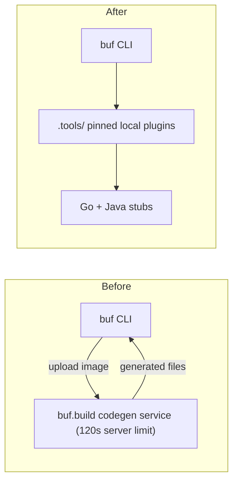

# Local Proto Stub Generation with Pinned Toolchain

**Date**: July 6, 2026
**Type**: Enhancement
**Components**: Build System, Code Generation, API Definitions

## Summary

Proto stub generation (`cd apis && make build`) now runs every code generator locally
from a pinned, self-provisioning toolchain in the git-ignored `apis/.tools/` directory,
replacing the four remote BSR plugins in `apis/buf.gen.yaml`. This eliminates the
sporadic `deadline_exceeded` failures caused by buf.build's hosted code-generation
service and makes stub generation deterministic and offline-capable. The stale
`forge-planton-provider` rule was also brought back in line with the current repo
architecture.

## Problem Statement / Motivation

`buf generate` was configured with remote BSR plugins: buf compiled the proto image
locally, uploaded it to buf.build's code-generation service, and waited for generated
files to come back. That service enforces a server-side execution limit of roughly
120 seconds that no client-side `--timeout` flag can extend (bufbuild/buf#4131,
maintainer-confirmed).

### Pain Points

- Sporadic `Failure: deadline_exceeded: context deadline exceeded` during
  `make build` in `apis/`, increasingly frequent as the proto surface grows
- Stub generation required buf.build's execution service to be reachable and healthy
- The same architecture had already hard-failed in the downstream platform repo,
  whose larger proto image could not finish hosted Java generation within the limit

## Solution / What's New

buf remains the orchestrator -- `buf.gen.yaml`, managed mode, lint, and format are
unchanged. Only plugin *execution* moved: every generator is now a pinned local
binary in `apis/.tools/`, provisioned on demand by the new `make proto-tools` target.

### Pinned toolchain (apis/Makefile)

Version pins live as Makefile variables, each coupled to the runtime dependency it
must match:

| Tool | Pin | Coupled runtime |
|------|-----|-----------------|
| `protoc` (Java builtin generator) | 30.1 | `com.google.protobuf:protobuf-java:4.30.1` (MODULE.bazel) |
| `protoc-gen-grpc-java` | 1.65.0 | `io.grpc:*` (MODULE.bazel) |
| `protoc-gen-go` | v1.36.6 | `google.golang.org/protobuf` (go.mod) |
| `protoc-gen-go-grpc` | v1.5.1 | `google.golang.org/grpc` (go.mod) |

Each tool is guarded by a version-stamped marker file: bumping a pin reinstalls that
tool on the next build; up-to-date tools cost nothing. The first run bootstraps the
toolchain automatically -- the developer command surface (`make protos`,
`cd apis && make build`) is unchanged and requires no manual installs.

### Module hygiene

- `apis/buf.yaml` moved to the explicit `modules:` form to exclude `.tools` from the
  buf module (protoc's `include/` tree ships `.proto` files that must not join it)
- `apis/.tools/` added to the repo `.gitignore`

## Implementation Details

- `apis/Makefile`: new pinned-toolchain section with stamp-file installers and a
  `proto-tools` aggregate target; `build` depends on it
- `apis/buf.gen.yaml`: `remote:` plugin entries replaced with `local:` entries
  (Go, gRPC-Go, gRPC-Java) and `protoc_builtin: java` with `protoc_path` for the
  Java message generator; managed-mode config untouched
- `architecture/README.md`: Technology Stack section updated to describe local
  pinned-plugin generation and the actual generated artifacts (Go committed,
  Java as a compile gate)

### Rule drift fix (forge-planton-provider)

`_rules/deployment-component/forge/forge-planton-provider.mdc` still instructed
agents to build the removed webapp layer: backend credential CRUD and frontend
credential UI phases targeting `app/backend`/`app/frontend` paths, TypeScript-stub
generation steps, a removed credential proto (`apis/dev/planton/app/credential/v1/api.proto`),
and reference files pointing at deleted code. The rule was rewritten to the current
4-layer architecture (proto definitions, CLI guidance, stack input / env vars,
provider detection): 11 phases reduced to 9, checkpoints from 3 to 2, and all
references now point at files that exist.

## Validation

- `cd apis && make build` -- green end to end with no BSR round-trip; first run
  self-provisioned all four tools and completed in ~32 seconds total
- **Zero-churn proof**: the committed Go stubs (~2,000 `.pb.go` files) were
  regenerated by the local plugins and are byte-identical to the previous
  remote-generated output -- `git status` before and after the regeneration is
  identical, confirming the pinned local generators produce the same output as the
  remote pins they replace
- Java build gate: `./bazelw build //apis/generated/stubs/java:java` compiles the
  locally generated Java stubs successfully (~101s, 12 actions)
- Idempotency: a second `make proto-tools` is a no-op ("Nothing to be done")

## Benefits

- The `deadline_exceeded` failure class is gone: no third-party execution service in
  the build path, no server-side timeout, no exposure to buf.build incidents
- Deterministic: every generator version is pinned in one visible place and coupled
  to its runtime dependency
- Offline-capable after the one-time toolchain bootstrap
- Faster: no multi-megabyte image uploads or remote queue waits

## Impact

Maintainers running `make protos` / `make build` get reliable, reproducible stub
generation with zero workflow changes. The forge rule fix prevents future provider
integration sessions from failing against (or attempting to recreate) the removed
webapp layer.

## Related Work

- The downstream platform repository adopted the same local pinned-plugin
  architecture for its Go/Java/TypeScript/Dart stub lanes after its Java lane
  hard-failed on the hosted service's limit
- `2026-01-20-063237-java-stubs-generation-for-early-failure-detection.md` --
  introduced the Java stub build gate this change preserves

---

**Status**: ✅ Production Ready
