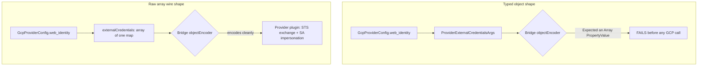

# GCP Keyless Provider: external_credentials Array Wire-Shape Fix

**Date**: July 6, 2026
**Type**: Bug Fix
**Components**: GCP Provider, Pulumi CLI Integration, Provider Framework

## Summary

The `pulumigoogleprovider` builder's keyless (Workload Identity Federation)
arm now passes `external_credentials` to the pulumi-gcp provider in its raw
single-element array wire shape instead of the typed
`ProviderExternalCredentialsArgs` object. The typed shape fails every stack
operation at provider-config encoding — before any GCP call — due to an
upstream bug in the pulumi-terraform-bridge encoder, now filed as
[pulumi/pulumi-gcp#3869](https://github.com/pulumi/pulumi-gcp/issues/3869).
With the array shape, the provider performs its native STS exchange and
service-account impersonation correctly, so every GCP Pulumi module is
keyless-capable in practice, not just on paper.

## Problem Statement

The keyless GCP auth mode hands an inline OIDC JWT to the pulumi-gcp
provider's `external_credentials` block, and the provider plugin performs the
Workload Identity Federation exchange itself. The mechanism is sound, but the
typed Go SDK shape never survives provider configuration:

```
error: cannot encode provider configuration to call ValidateProviderConfig:
objectEncoder failed on property "external_credentials": Expected an Array PropertyValue
```

### Pain Points

- Any `GcpProviderConfig` with `web_identity` set failed at
  `ValidateProviderConfig` — a hard stop for every keyless GCP deployment.
- The failure is independent of the secret wrap and reproduces across Go SDK
  v9.4.0/v9.29.0, plugin v9.4.0/v9.29.0, and CLI v3.202.0/v3.250.0, in both
  the Go and YAML runtimes — so no version bump could fix it.
- The upstream Terraform provider treats `external_credentials` as a
  max-items-one block; the bridge's provider-config encoder expects the raw
  list form while the typed SDKs emit the flattened object form. The two
  engine layers disagree about the field's wire shape.

## Solution

Keep the architecture exactly as designed — inline token, provider-side
exchange out of our process, zero new dependencies — and change only the wire
shape of the one field. The keyless arm now registers the provider with raw
properties carrying the field in its terraform LIST form:

```go
googleProvider := &gcp.Provider{}
err := ctx.RegisterResource("pulumi:providers:gcp", ProviderResourceName(nameSuffixes),
    pulumi.Map{
        "externalCredentials": pulumi.Array{pulumi.Map{
            "audience":            pulumi.String(webIdentity.GetAudience()),
            "identityToken":       pulumi.ToSecret(pulumi.String(webIdentity.GetWebIdentityToken())),
            "serviceAccountEmail": pulumi.String(webIdentity.GetServiceAccountEmail()),
        }},
    }, googleProvider, pulumi.Version(gcpPluginVersion()))
```



### Key Decisions

- **Raw registration, same seam.** `Get` keeps its signature and the
  single-switch credential dispatch; only the keyless arm routes through
  `ctx.RegisterResource` with raw properties. The SA-key and ambient arms keep
  the typed `gcp.NewProvider` path untouched. The registration uses the same
  resource type token and the same pinned resource name (`"google"`), so the
  provider URN — and provider identity in existing stacks — is unchanged.
- **Plugin-version parity.** The generated `NewProvider` stamps
  `pulumi.Version(...)` on every registration so the engine runs the pinned
  plugin version; a raw registration skips that. The builder now stamps the
  same version explicitly, resolved from the compiled pulumi-gcp module's
  build info with a constant fallback for build modes without embedded module
  info — and a test guards the fallback against `go.mod` drift.
- **Secret wrap preserved.** The SDK auto-secrets only the plain
  `AccessToken` field, never `external_credentials.identity_token`, in any
  shape. The builder keeps its explicit `pulumi.ToSecret` wrap; secretness
  survives raw property marshaling (state and preview render
  `externalCredentials: [secret]`).
- **Pure core, discriminated result.** The unit-testable core became
  `buildProviderInputs`, returning typed args XOR raw keyless properties, so
  the security-critical dispatch — including web-identity-over-stale-key
  precedence — stays testable without a Pulumi context, matching the sibling
  per-cloud builders' anatomy.
- **A switch-back recipe, not a permanent fork.** The package doc explains
  the workaround, keys it on pulumi-gcp#3869, and spells out how to verify
  the upstream fix and return to the typed args — the same documented
  upstream-workaround pattern the AWS classic builder carries for
  pulumi-aws#6228. It also records that the bridge's experimental type
  checker warns the opposite way about the array shape ("will become a hard
  error in the future"); if that warning hardens before the encoder fix, the
  arm needs immediate attention.

## Implementation Details

**File**: `pkg/iac/pulumi/pulumimodule/provider/gcp/pulumigoogleprovider/provider.go`

- `Get` dispatches on the discriminated `providerInputs`: raw
  `RegisterResource` for keyless, `gcp.NewProvider` otherwise.
- `buildProviderInputs` (formerly `buildProviderArgs`) carries the three
  fail-fast field guards and builds the raw keyless property map with the
  ToSecret-wrapped token.
- `gcpPluginVersion` resolves the pulumi-gcp module version from
  `runtime/debug.ReadBuildInfo`, falling back to a pinned constant.

**File**: `pkg/iac/pulumi/pulumimodule/provider/gcp/pulumigoogleprovider/provider_test.go`

Sixteen tests pin the contract so a future cleanup cannot silently revert to
the broken typed shape: the array wire shape (exactly one entry, exactly the
three camelCase provider-schema keys, the typed field never populated), the
secret wrap (token is an Output, never a plain string), keyless precedence
over a stale service-account key, all missing-field error paths, the
plugin-version fallback guarded against the `go.mod` pin, and the full
pre-existing SA-key/ambient/resource-name matrix.

## Validation

- `go test` (16/16), `go vet`, `gofmt`, and `bazel test` on the builder
  package — green. Targeted `go build` of a representative GCP Pulumi module
  entrypoint — green.
- **Encode-level smoke proof** (the layer unit tests cannot reach): a
  throwaway program drove the real builder with a fake JWT through
  `pulumi preview` and `pulumi up` on a local file backend. The encode error
  is gone; preview renders the provider with `externalCredentials: [secret]`
  and the pinned `version: "9.4.0"`; the fake token appears nowhere in
  preview output or state files; and `pulumi up` runs the provider's full
  WIF chain out to a real GCP-side `invalid_target` rejection of the fake
  audience at `generateAccessToken`. Failure moved from the encode layer to
  the auth layer — exactly the fix contract.
- The array shape itself was previously verified end to end against a real
  Workload Identity pool (keyless bucket create and destroy through the
  provider-native exchange).

## Impact

- Every GCP Pulumi module routes through this one shared builder, so the
  entire GCP catalog's keyless (WIF) path is fixed by this single change —
  no per-module work.
- Platforms driving these modules can now run keyless GCP deployments
  end to end; previously the failure surfaced on the first stack operation.
- No behavior change for service-account-key or ambient-credential
  configurations.

## Related Work

- The AWS classic builder's documented builder-side exchange for
  pulumi-aws#6228 — the sibling upstream-workaround this fix's documentation
  pattern converges on (different remedy, because there the provider-native
  exchange itself is broken; here only the typed wrapper's encoding is).
- Upstream: [pulumi/pulumi-gcp#3869](https://github.com/pulumi/pulumi-gcp/issues/3869)
  (the revert trigger).

---

**Status**: ✅ Production Ready
