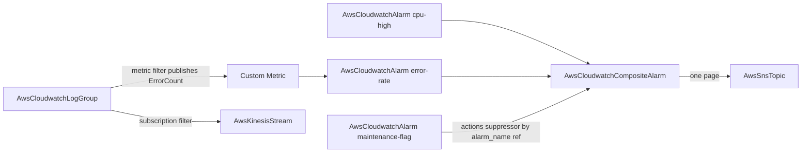

# AWS CloudWatch Observability Family: Log Group + Alarm Depth Pass, Composite Alarm Forge

**Date**: July 7, 2026
**Type**: Feature | Breaking Change
**Components**: AWS Provider, API Definitions, Pulumi CLI Integration, IAC Stack Runner, Testing Framework

## Summary

The CloudWatch observability family reaches full provider depth: `AwsCloudwatchLogGroup` folds in the four log-group-scoped satellites (metric filters, subscription filters, data protection policy, field index policy), `AwsCloudwatchAlarm` gains the provider's third alarm mode (PromQL against Amazon Managed Service for Prometheus) with a restructured per-mode requiredness contract, and `AwsCloudwatchCompositeAlarm` is forged as a first-class kind (enum 355) completing the alerting story — shared-cause paging, dependency-aware rules, and maintenance suppression. Four live cross-engine defects were fixed, both legacy `type = any` Terraform contracts moved to the generator, and all three kinds gained first-ever E2E coverage with all six live dual-engine lanes green.

## Problem Statement / Motivation

CloudWatch is the observability primitive the rest of the AWS catalog leans on — the log group is an FK target for Step Functions, Route 53 query logging, API Gateway, OpenSearch, MSK, Lambda, and ECS; the alarm is what ECS deployment rollbacks and ASG instance refreshes watch. Yet both kinds carried live defects and shallow surfaces:

### Pain Points

- **`deletion_protection_enabled` was silently dropped by BOTH engines** behind stale "not yet available in SDK" comments — the field validated, deployed, and did nothing.
- **Both Pulumi modules relied on auto-naming**: the same manifest produced `my-logs` under Terraform and `my-logs-<hex>` under Pulumi — a cross-engine identity divergence, and unstable names where the alarm name IS the composition key (composite rules).
- **`actions_enabled: false` was unreachable in the alarm's Pulumi module** — both branches of the conditional passed `true`, so alarms could never be silenced for maintenance.
- **Tag parity divergence**: the Terraform modules tagged `{Name}` + labels while Pulumi applied the `planton.ai/*` identity set without `Name`.
- Both TF contracts were legacy `type = any` pinned `= 5.82.0`; no drift-guard, no outputs conformance, no E2E.
- Log-derived alerting (metric filters), real-time log fan-out (subscription filters), PII masking, and field indexing were unmodeled; alert-storm suppression had no home at all.

## Solution / What's New

### AwsCloudwatchLogGroup (breaking-safe rebuild)

The DD-004 fold classes applied to the log-group satellites — all group-scoped, never independently referenced:

- `metric_filters` (many-per-group, per-name materialization in both engines): pattern + transformation (name/namespace/value, tri-state `default_value`, ≤3 dimensions, StandardUnit), with the AWS `default_value`-conflicts-with-`dimensions` rule as CEL.
- `subscription_filters` (AWS max 2 as CEL): destination ARN ref (Kinesis/Firehose/Lambda — no single default kind), IAM delivery-role ref, distribution, `emit_system_fields`, unique names.
- `data_protection_policy` + `field_index_policy` as Struct folds (the folded-policy class).
- INFREQUENT_ACCESS × filters incompatibility CEL'd (AWS rejects it only at apply time).
- Both engines now honor `deletion_protection_enabled`; TF pin lifted to `>= 6.25.0` (where the argument landed).

### AwsCloudwatchAlarm (three-mode contract)

- **PromQL mode**: `evaluation_criteria.promql_criteria` (query + pending/recovery periods) + `evaluation_interval` — supported by both pinned SDKs.
- **Requiredness restructured**: `comparison_operator` and `evaluation_periods` moved from field-required to per-mode CELs, because the provider REQUIRES them for metric/query alarms and FORBIDS them for PromQL alarms (mirroring the provider's own 6.42.0 change).
- New always-needed CELs: exactly one of `expression`/`metric` per query; exactly one query with `return_data: true`; alarm `unit` against the 27-value StandardUnit set; metric-query periods against `[1,5,10,20,30] ∪ 60×`.
- `actions_enabled` → presence-aware `optional bool` in the spec, fixing the never-false Pulumi defect in both engines' contract.
- TF pin → **`>= 6.43.0`**, deliberately skipping 6.42.0 where `evaluation_criteria` landed with a plan-time regression (spurious "One of 'metric_name', 'metric_query', or 'evaluation_criteria' must be set" errors) that 6.43.0 fixed.

### AwsCloudwatchCompositeAlarm (forged, enum 355, id_prefix `awscwca`)

Full anatomy: rule expression (max 10240; grammar validated by AWS — rule references compose by NAME, the metric-math-variable class), three SNS-ref action lists, presence-aware `actions_enabled` (ForceNew on this resource, documented), and the `actions_suppressor` fold whose `alarm` is a ref to `AwsCloudwatchAlarm.status.outputs.alarm_name`. Registry prerequisites: `[AwsCloudwatchAlarm]`.

## Implementation Details

- Both rebuilt kinds moved to generator-owned `variables.tf` contracts and enrolled in the drift guard; the composite alarm is generator-owned from day one. All three enrolled in outputs conformance.
- Pulumi modules set the cloud name argument explicitly from `metadata.name` (log group `Name`, metric alarm `Name`, composite `AlarmName`); tag sets converged on the catalog convention (`Name` + `planton.ai/*`, labels merged unable to override) in BOTH engines.
- Frozen outputs untouched: `log_group_arn`/`log_group_name` (9+ FK consumers) and `alarm_arn`/`alarm_name` (ECS rollback, ASG instance refresh).
- First-ever E2E: cloudwatch + cloudwatchlogs SDK clients; three verifiers (log group by exact-name DescribeLogGroups re-check — the API matches by prefix; alarms by DescribeAlarms with the alarm-type split for composites); the shared IAM-role fixture grew a ninth document (CloudWatch-Logs → Kinesis delivery); the alarm kind ships a prerequisite install profile (the composite's registry dependency); scenario-declared `AwsKinesisStream,AwsIamRole` prerequisites compose the log group's subscription-filter chain.
- ~60 new spec-test cases across the three suites cover every new field and CEL.

## Validation

- **Offline gate all green**: spec tests ×3, `tofu init -upgrade && validate` ×3 (provider resolves 6.53.0), Pulumi builds + release-equivalent entrypoint builds ×3, drift guard, outputs conformance, `validate-refs --check`, `secret-coverage --check`, `validate-outputs` dry-runs 2/2 fields ×3, all hack manifests/presets/scenarios CLI-validated, `make build-go`, kind map + gazelle regenerated, site catalog mirror regenerated (composite alarm page materialized).
- **Live dual-engine E2E 6/6 green** (`AWS_PROFILE=planton-aws-e2e`, serial, short private TMPDIR): alarm metric-math lane 25s/1m14s; composite chain (alarm fixture → composite with name-rule + suppressor ref) 44s/1m50s; log group full-surface chain (Kinesis + delivery-role fixtures → group with metric filter, subscription filter, data-protection + index policies) 4m15s/4m54s. Zero-orphan sweep clean (log groups, alarms, streams, roles).
- **Deliberately excluded from live lanes** (recorded in profiles): PromQL mode (needs an Amazon Managed Service for Prometheus workspace — proven by spec tests + both engines' builds + tofu validate), KMS association and deletion protection (the latter would fail the destroy leg by design).

## Impact

- Log-derived alerting, real-time log fan-out, PII masking, and query acceleration are now first-class, composable, and validated at authoring time instead of failing at apply.
- Alert-storm suppression and maintenance windows — the difference between a paging system people trust and one they mute — now compose from three referenceable nodes.
- Four silent cross-engine divergences that would have shipped different infrastructure depending on the provisioner are closed, and the contract classes behind them are now covered by the update-rule checklist so they cannot recur unexamined.

## Related Work

- Extends the AWS 90/10 catalog rebuild (IAM leaf through the ECR + Route 53 family).
- The update workflow rule gained two durable checks from this session: identity-tag reconciliation across engines, and the explicit-cloud-name verification for pre-mandate Pulumi modules.

---

**Status**: ✅ Production Ready
