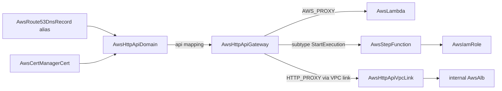

# AWS Serverless Front Door: Step Functions + HTTP API Gateway Depth Pass, VPC Link + Custom Domain Forge

**Date**: July 7, 2026
**Type**: Feature | Breaking Change
**Components**: AWS Provider, API Definitions, Pulumi CLI Integration, IAC Stack Runner, Testing Framework

## Summary

The serverless front-door family reaches full provider depth: `AwsStepFunction` is rebuilt with the versioning surface (publish + immutable version ARNs) and off the last serverless legacy `type = any` Terraform contract, `AwsHttpApiGateway` gains the complete API Gateway v2 integration surface (AWS service subtypes, private integrations through VPC links, credentials, parameter mapping, TLS SNI verification) plus per-route stage settings, and two new kinds are forged — `AwsHttpApiVpcLink` (enum 356) for private backends and `AwsHttpApiDomain` (enum 357) for production custom domains. Two live cross-engine defects were fixed, and all four kinds gained first-ever E2E coverage with all eight live dual-engine lanes green.

## Problem Statement / Motivation

An HTTP API that can only reach Lambda over the default `execute-api` endpoint is a demo, not a product. Real deployments need private backends (an internal ALB behind a VPC link), direct AWS service integrations (enqueue to SQS, start a Step Functions execution — no Lambda glue), and a custom domain with owned TLS. None of that was expressible:

### Pain Points

- **`AwsStepFunction.description` was dishonest**: the CreateStateMachine API has no description input, so both engines silently dropped the field — it validated, deployed, and did nothing.
- **No versioning surface**: `publish` and the immutable version ARN — the foundation for alias-based traffic shifting and safe rollbacks — were unmodeled.
- **`AwsHttpApiGateway` integrations were Lambda-or-URL only**: no service subtypes, no VPC-link connection, no credentials role, no request/response parameter mapping, no TLS server-name verification.
- **`auto_deploy` diverged across engines** (a plain bool that one engine defaulted differently), and `integration_uri` was field-required even for integration modes where AWS forbids it.
- **Private integrations and custom domains had no home at all** — the two resources that separate a production API from a demo were missing from the catalog.
- Step Functions' Terraform contract was legacy `type = any`; neither kind was enrolled in the drift guard or outputs conformance; neither had E2E.

## Solution / What's New

### AwsStepFunction (breaking rebuild)

- `description` removed (breaking, honest): the provider has no such input; the console derives one from the ASL definition's `Comment`.
- **Versioning surface**: `publish` bool; new outputs `state_machine_version_arn`, `revision_id`, `status`, `creation_date` — point consumers at the version ARN to pin them to an immutable snapshot.
- Generator-owned `variables.tf` contract on the v6 provider floor; drift-guard + outputs-conformance enrollment.
- Registry prerequisites: `[AwsIamRole]` — the shared IAM fixture grew a tenth document (`states.amazonaws.com` trust, deliberately empty-permission for the Pass-state smoke workflow).

### AwsHttpApiGateway (breaking rebuild)

- **Integration depth**: `integration_subtype` (direct AWS service actions — SQS SendMessage, Step Functions StartExecution, EventBridge PutEvents), `connection_type`/`connection_id` (ref → `AwsHttpApiVpcLink`) for private integrations, `credentials_arn` (ref → AwsIamRole), `request_parameters`/`response_parameters` mapping, `tls_config.server_name_to_verify`, `description`.
- **Requiredness restructured to per-mode CELs**: `integration_uri` (now carrying the AwsLambda FK) is required for proxy integrations and forbidden alongside a subtype — AWS expresses subtype targets in `request_parameters`. Coupling CELs: subtype ⇒ AWS_PROXY + credentials; VPC_LINK ⇒ HTTP_PROXY.
- **Stage depth**: per-route `route_settings` (throttling + detailed metrics overrides), `detailed_metrics_enabled`, `description`; `auto_deploy` → presence-aware `optional bool` defaulting true, converging both engines.
- API surface: `api_version`, `ip_address_type`, CORS unchanged.

### AwsHttpApiVpcLink (forged, enum 356)

Honest tiny spec — the link is deliberately its own resource because one link is shared by any number of APIs and owns its own ENI lifecycle: `subnet_ids` (refs → AwsSubnet, immutable) + optional `security_group_ids` (refs → AwsSecurityGroup, immutable). Outputs: `vpc_link_id`, `vpc_link_arn`. Registry prerequisites: `[AwsSubnet]`.

### AwsHttpApiDomain (forged, enum 357)

Domain + ACM certificate ref + folded `api_mappings` (per-key materialization; mapping-key uniqueness as CEL) + mutual TLS via an S3-hosted truststore. Endpoint type and security policy are NOT spec fields — API Gateway v2 domains accept exactly REGIONAL and TLS_1_2, so both modules hardcode them rather than model decorative knobs. DNS is composed, not embedded: `target_domain_name` + `hosted_zone_id` outputs feed a Route 53 alias record. Registry prerequisites: `[AwsCertManagerCert]`.

## Implementation Details

- All four Terraform contracts are generator-owned and drift-guard enrolled; all four kinds enrolled in outputs conformance. Zero PARITY-EXCEPTIONs across the family.
- **Live defect fixed in both engines**: `payload_format_version` was sent on `HTTP_PROXY` integrations — AWS rejects 2.0 with `BadRequestException: PayloadFormatVersion 2.0 is not supported for integration of type HTTP_PROXY`. The field is now sent only for `AWS_PROXY` (default 2.0) and service subtypes (fixed at 1.0), and omitted for HTTP_PROXY.
- **Live defect fixed in the E2E fixture**: a `$default` HTTP_PROXY route requires an explicit `integration_method` — AWS demands HttpMethod at CreateIntegration even where the docs imply it inherits from the route.
- First-ever E2E: apigatewayv2 + sfn SDK clients; four verifiers (DescribeStateMachine; GetApi + GetStage; GetVpcLink with DELETING-state semantics; GetDomainName); the HTTP API ships a dependency-free prerequisite install profile (single HTTP_PROXY route — consumers like the custom domain pay the minimum fixture cost); the domain scenario composes the ACM imported self-signed certificate fixture with the HTTP API prerequisite.
- The HTTP API's live scenario covers both proxy shapes in one lane (Lambda AWS_PROXY on `$default` + HTTP_PROXY on `GET /status`) plus the stage throttling/metrics/per-route-override surface.

## Validation

- **Offline gate all green**: spec tests ×4, `tofu validate` ×4 (provider resolves 6.53.0), Pulumi module builds ×4, drift guard (all four enrolled), outputs conformance, `validate-refs --check`, `secret-coverage --check`, `make build-go`.
- **Live dual-engine E2E 8/8 green** (`AWS_PROFILE=planton-aws-e2e`, serial, short private TMPDIR): Step Function 6m22s/5m15s; VPC link (two-AZ, VPC + subnets + SG chain) ~11m/6m14s; HTTP API (Lambda chain + proxy route) ~11m/8m6s; custom domain (ACM + HTTP API composed) ~7m/5m51s. Each lane proves deploy, output + resource verification, destroy, and verify-destroyed.
- **Deliberately excluded from live lanes** (recorded in profiles): JWT/REQUEST authorizers (need a real OIDC issuer / second Lambda), access logging (pulls the CloudWatch log-group chain), AWS service-integration subtypes (need a purpose-built `apigateway.amazonaws.com` trust fixture), mutual TLS (needs an S3-hosted truststore fixture), Step Functions execution logging + KMS encryption — all proven by spec tests and the offline gate.

## Impact

- Private backends, direct service integrations, and custom domains — the three capabilities that separate a production API from a demo — are now first-class, composable, and validated at authoring time.
- A dishonest field that silently did nothing is gone, and the versioning surface unlocks alias-based traffic shifting for Step Functions consumers.
- Two silent cross-engine/live defects (HTTP_PROXY payload format, integration method requiredness) were caught by the live lanes and closed in both engines.

## Related Work

- Extends the AWS catalog depth rebuild (IAM leaf through the CloudWatch observability family).
- Composes directly onto the recently rebuilt `AwsCertManagerCert` and `AwsRoute53DnsRecord` — the domain's outputs are shaped for the Route 53 alias-record composition.

---

**Status**: ✅ Production Ready
