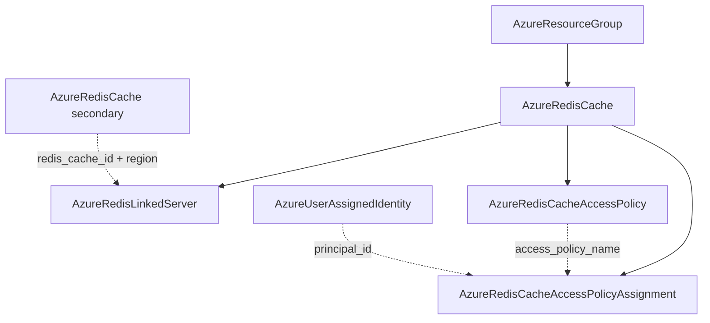

# Azure Redis Family: Cache Depth Rework and Decomposition into Four Kinds

**Date**: July 7, 2026
**Type**: Feature / Breaking Change
**Components**: Azure Provider, API Definitions, IAC Modules, E2E Framework

## Summary

Reworked `AzureRedisCache` (431) from a 15-field spec to the full azurerm v4.80
surface and decomposed the Redis family into three new first-class kinds:
`AzureRedisLinkedServer` (437, geo-replication DR), `AzureRedisCacheAccessPolicy`
(438, custom data-plane permission sets), and
`AzureRedisCacheAccessPolicyAssignment` (439, the Entra grant). The family closes
the modern keyless Redis story — Entra tokens under access-policy grants with the
shared access keys turned off entirely. All four kinds ship with dual-engine
parity on the shared Azure provider builder, 100% parity audits, and live
dual-engine E2E green for the cache, policy, and grant chain (6 runs, all 8
phases each). The live runs also surfaced a product-level Azure finding: classic
Azure Cache for Redis is being retired in favor of Azure Managed Redis, with new
Premium creations already rejected region by region.

## Problem Statement / Motivation

The cache spec was an 80/20-era surface: no Entra authentication, no persistence,
no clustering dials, no identity, no way to express the keyless posture Azure now
recommends — and geo-replication and data-plane RBAC were unrepresentable
entirely. Azure models those as first-class ARM children with independent
lifecycles: deleting a linked server IS the failover operation, and an access
policy assignment is a grant (the class of resource a module must never own).

### Pain Points

- No Entra (token) authentication surface — every consumer was forced onto shared
  access keys
- Premium capabilities (clustering, RDB/AOF persistence, VNet injection dials,
  extra replicas) missing from the spec
- Geo-replication DR was impossible to declare, and folding it into the cache
  would turn the failover runbook into a spec edit on the surviving cache
- No data-plane RBAC nodes for grants to compose against

## Solution / What's New

### AzureRedisCache (431, rework, breaking)

- `name` → globally-unique `cache_name`; `sku_name` → closed enum
  (BASIC/STANDARD/PREMIUM, unspecified deploys STANDARD) with the sku×capacity
  matrix as CEL (C0–C6 vs P1–P5); the size-family letter stays module-derived —
  never spelled twice.
- Full `redis_configuration` block: Entra auth, eviction-policy vocabulary,
  memory dials (non-Basic CEL), keyspace events, the VNet-only auth toggle,
  RDB/AOF persistence (Premium CELs; all three storage connection strings
  `(sensitive)`), SAS vs MANAGED_IDENTITY persistence auth.
- The keyless contract as CEL: `access_keys_authentication_enabled` can only go
  false once Entra auth is on — ARM's own CustomizeDiff, enforced at validation.
- Identity block (SystemAssigned/UserAssigned with UAI FKs), `tenant_settings`,
  zones, `private_static_ip_address` (requires-subnet CEL), `shard_count` XOR
  `replicas_per_primary` (both Premium-gated), user tags.
- Only `replicas_per_primary` is modeled — azurerm's `replicas_per_master` is
  ARM's legacy alias for the same setting; modeling both would be contradictable
  redundant state (recorded skip, with `minimum_tls_version` and `maxclients`).
- Outputs renamed and expanded: `redis_cache_id`, both key faces + both
  connection strings (zero-downtime rotation), `port`, `identity_principal_id`,
  and `region` — the linked-server location seam.
- 13 message-level CELs total; 46 spec tests; firewall rules and patch schedules
  stay folded (pure filters / ARM's singleton child).

### AzureRedisLinkedServer (437, `azredlink`)

One parent reference (`target_redis_cache_id`) with the cache's name and resource
group parsed from the ARM id on both engines; `linked_redis_cache_location`
references the SAME secondary cache's new `region` output, so the location can
never disagree with the cache it describes. Deleting the link is the failover
operation — documented as the resource's lifecycle, not wrapped in ceremony.

### AzureRedisCacheAccessPolicy (438) + Assignment (439)

The Redis data-plane analog of role definition + role assignment: the policy
carries raw Redis ACL syntax (`+@read +@connection ~app:*` — Redis's own
vocabulary, not an invented abstraction) and rejects shadowing the three built-in
policy names; the assignment grants a built-in (by literal) or custom policy (by
FK) to a principal, defaulting `object_id` to an identity's PRINCIPAL id with the
client-id trap called out in the field comment.

## Verification

- Offline gate fully green: spec tests ×4 (46/8/8/10), targeted +
  release-equivalent builds, `make build-go`, secret-coverage (Azure 100%; three
  new sensitive fields), validate-refs, `pkg/outputs` conformance ×4, full
  `planton tofu plan` ×4 rendering every enum seam, 12 presets validated, parity
  audits ×4 at 100% PARITY / COVERAGE.
- Live dual-engine E2E (test subscription, all 8 phases each, zero orphans):
  cache minimal (Standard C0 + Entra + firewall rule + patch window) 1820s/1836s;
  access policy on a scenario-local Entra cache 1889s/1627s; the full three-kind
  grant chain (cache → custom policy → grant to the fixture identity)
  1969s/1851s. Redis is the slowest-provisioning service in the Azure catalog
  (15–40 min per cache), which sized the suite at ~3 hours.
- Live finding (both engines): the linked-server chain is blocked — ARM rejects
  NEW Premium cache creation in westus2 with 400 "Azure Cache for Redis is
  retiring, create Azure Managed Redis instance instead", while the eastus P1
  primary still provisioned. The linked-server kind closes on its green offline
  gate with the exclusion recorded in its E2E profile (`status: deferred` + the
  live evidence); the scenario stays wired.

## Impact

- **Breaking**: `AzureRedisCacheSpec` field renames/renumbering and output
  renames (`redis_id` → `redis_cache_id`); no FK consumers existed (verified),
  so the blast radius is the not-yet-reworked database-stack chart only.
- The retirement finding is recorded timelessly in the family docs: existing
  caches keep running and azurerm fully supports them; Azure Managed Redis
  (`Microsoft.Cache/redisEnterprise`) is the successor for new deployments and
  is now a committed breadth evaluation.
- Shared-builder migration: the cache module retired another inline
  `azure.NewProvider` (keyless-auth compliance); all three new kinds started on
  the shared builder.

## Related Work

- Follows the storage data-services decomposition (share/queue/table/encryption
  scope) and the MSSQL family decomposition — the same honest-decomposition
  doctrine applied to Azure's own resource model.
- The name-hold lesson was refined: unlike SQL logical servers, Redis frees a
  deleted cache's globally-unique name the moment its (slow) delete completes —
  live-verified by same-name recreates across sequential engine runs, and folded
  into the E2E documentation.

---

**Status**: ✅ Production Ready (linked-server live E2E excluded on recorded
Azure-retirement evidence; offline gate green)
