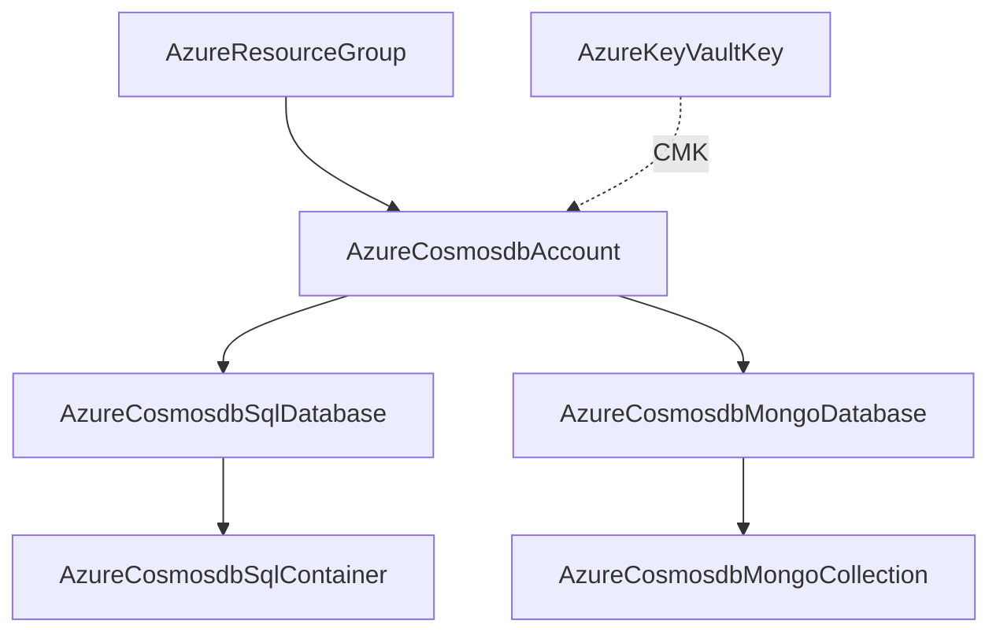

# Azure Cosmos DB Family: Account Depth Rework and Database/Container Decomposition

**Date**: July 7, 2026
**Type**: Feature / Breaking Change
**Components**: Azure Provider, API Definitions, IAC Modules, E2E Framework

## Summary

Reworked `AzureCosmosdbAccount` (432) to the full azurerm v4.80 surface and
dissolved its bundled databases into four first-class kinds:
`AzureCosmosdbSqlDatabase` (500), `AzureCosmosdbSqlContainer` (501),
`AzureCosmosdbMongoDatabase` (502), and `AzureCosmosdbMongoCollection` (503) —
opening the 500–509 sub-band for Cosmos data-plane children. All five kinds ship
with dual-engine parity on the shared Azure provider builder and 100% parity
audits. The live dual-engine suite is wired end to end but was not run: the full
suite runs well past the 30-minute live-E2E boundary, so the family closes on its
fully-green offline gate with the skip recorded honestly in every E2E profile.

## Problem Statement / Motivation

The account spec bundled SQL and Mongo databases as inline lists — black boxes
with no independent lifecycle, no referenceable ids, and no way to model
containers/collections (where partition keys, indexing policies, and throughput
actually live). Azure models each of these as first-class ARM children.

### Pain Points

- Databases could not be referenced, owned, or torn down independently of the
  account
- Containers and collections — the real billing and data-modeling units — were
  unrepresentable
- The account silently auto-added the `EnableMongo` capability, hiding a
  spec-level decision inside module code

## Solution / What's New

### AzureCosmosdbAccount (432, rework, breaking)

`name` → globally-unique `account_name`; closed enums for kind, consistency
policy, backup mode, and 21 capabilities with kind-pairing CELs; identity + CMK
FKs; analytical storage; capacity cap; network ACL bypass; CORS; the restore
block. Bundled `sql_databases`/`mongo_databases` removed; the silent
`EnableMongo` auto-add removed — MONGO_DB accounts declare the capability in the
spec. 18 kind-authentic stack outputs (keys/connection strings documented as
secret-bearing); Pulumi migrated to the shared provider builder. 47 spec tests.

### The four children (500–503)

Every child takes its parent by ARM id (`cosmosdb_account_id` / the database
kinds' ids) with resource-group/account/database names parsed identically on both
engines — Cosmos children have no ARM-id input on either engine, so the parsing
IS the parity contract (no bridge-lag exception needed). Throughput XOR
autoscale CELs throughout; the SQL container carries partition keys
(HASH/MULTI_HASH + version), indexing policy, unique keys, conflict resolution,
and TTLs; the Mongo collection carries shard key, indexes, and TTLs. 61 child
spec tests; 10 presets.

## Verification

- Offline gate fully green: `make build-go`; Bazel ×5; secret-coverage (Azure
  100%); validate-refs; `pkg/outputs` conformance ×5; full `planton tofu plan`
  ×5; presets validated; site catalog regenerated; parity audits ×5 at 100%
  PARITY / COVERAGE.
- **Live dual-engine E2E: SKIPPED under the 30-minute live-E2E boundary** (the
  full 10-run suite takes ~2.5–3 hours; Cosmos accounts provision in ~5–10
  minutes each and every scenario owns a scenario-local account). All five E2E
  profiles record `status: skip` with the reason — no file claims a live
  validation that did not happen. The scenarios, verifiers, and entrypoints are
  wired and run unchanged in an approved window.
- The one live attempt made (account minimal, Pulumi) failed on an eastus
  CAPACITY constraint, not a module defect: `ServiceUnavailable` — "high demand
  in East US region for the zonal redundant (Availability Zones) accounts" —
  with `zone_redundant` defaulting false on both engines. Re-region the account
  scenarios when running live.

## Impact

- **Breaking**: account spec renames/renumbering, bundled databases dissolved,
  outputs renamed kind-authentic. Composition now reaches the container level —
  the unit real Cosmos data models are designed around.
- Deferred with recorded verdicts: the SQL data-plane RBAC pair
  (`SqlRoleDefinition`/`SqlRoleAssignment`, enum 504+), triggers/stored
  procedures (content, not infrastructure), Cassandra/Gremlin/Table children,
  and the managed-Cassandra/PostgreSQL services (separate ARM families).

## Related Work

- The dissolution follows the MSSQL and storage-account precedents: the account
  is the governance boundary, the children are the composable units.
- Ships alongside the Redis family decomposition; the two sessions shared the
  working tree and are committed separately.

---

**Status**: ✅ Production Ready (live E2E awaiting an approved long-run window;
offline gate green)
