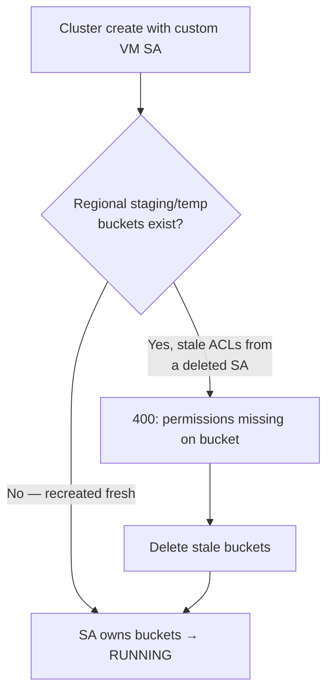

# GCP Analytics Tail — Finish: Dataproc Cluster Live Proof, Policy/Composer Spec Fixes, and Full Cross-Engine Parity

**Date**: July 7, 2026
**Type**: Enhancement
**Components**: GCP Provider, API Definitions, IAC Stack Runner, Testing Framework

## Summary

Completes the GCP analytics tail (Dataproc + Cloud Composer). Closes two
Dataproc-autoscaling-policy validation defects and a Cloud Composer retention
pairing rule, brings the Dataproc cluster to a green dual-engine live E2E proof
(4/4), records the Composer user-workloads Secret/ConfigMap as plan-verified
(each requires a 25-45-minute Composer environment to deploy live), and drives
all five analytics-tail kinds — plus a GcpFirewallRule conformance touch — to
full cross-engine (Pulumi ↔ OpenTofu) parity. The GCP analytics family is now
complete.

## Problem Statement / Motivation

The prior session forged and deep-rebuilt the analytics-tail kinds and proved
the offline gate plus the autoscaling-policy and Composer-environment live
gates, but left the Dataproc cluster live batch failing and three items open:
two spec defects, the cluster live proof, and the parity audits.

### Pain Points

- `GcpDataprocAutoscalingPolicy` marked the YARN `scale_up_factor` /
  `scale_down_factor` as implicit-presence `double` with `required = true`,
  which rejected an explicitly-set `0.0` — a legitimate API value (`0.0`
  scale-down disables shrinking). The secondary-worker coherence rule also
  accepted a floor without a ceiling (`min_instances > 0`, `max_instances == 0`).
- `GcpCloudComposerEnvironment` accepted an Airflow-metadata retention day count
  with no retention mode set, which the API silently ignores.
- The Dataproc cluster live batch failed at create with "Permissions are missing
  … on the staging_bucket / temp_bucket", which looked like a service-account
  gap but was not.

## Solution / What's New

### Spec fixes

- `scale_up_factor` / `scale_down_factor` are now `optional double` with
  `required = true` (explicit presence) so a set `0.0` survives validation while
  the field stays mandatory; the secondary-worker CEL rejects a floor without a
  ceiling.
- `GcpCloudComposerDataRetentionConfig` gained a `retention_days_require_mode`
  message CEL: a metadata retention day count requires a retention mode.

### Dataproc cluster live proof (root cause)

Dataproc auto-creates deterministic regional staging/temp buckets
(`dataproc-staging-<region>-<project#>-<hash>`) and reuses them across runs
without deleting them. An earlier run had created them under a since-deleted
custom VM service account, so their fine-grained ACLs locked out every later
identity regardless of project-level IAM. Deleting the stale buckets (Dataproc
recreates them fresh under the current identity) fixed it. The custom-VM-service-
account design is retained — `roles/dataproc.worker` carries the exact
`storage.buckets.get` + `storage.objects.*` set the identity needs.

Result: `GcpDataprocCluster` live E2E **4/4 green** (minimal-single-node +
autoscaling, Pulumi + OpenTofu) on the ephemeral test project, zero orphans.

### Composer user-workloads pair — plan-verified

Each of `GcpCloudComposerUserWorkloadsSecret` and
`GcpCloudComposerUserWorkloadsConfigMap` installs a full 25-45-minute Composer
environment in its live chain. They are proven by a successful offline
`planton tofu plan` through the real converter (the Secret redacts its
`(sensitive)` `data` map; the ConfigMap plans its plain map), with the composed
Composer environment itself already live-proven.

### Cross-engine parity

All five kinds audited field-by-field (both engine modules against the proto
contract) to full parity: the Dataproc cluster (both the Compute Engine and the
folded GKE arms, every node group, security, metastore/metric/auxiliary), the
autoscaling policy (explicit-presence scale factors flow `0.0` identically), the
Composer environment (all config blocks + Composer-3 flags), and the
user-workloads pair (the Secret's sensitive map handled as `ToSecret` on Pulumi
and a provider-sensitive attribute on OpenTofu, never in outputs). Stack outputs
match on every kind.

## Implementation Details

- **Files**: `apis/dev/planton/provider/gcp/gcpdataprocautoscalingpolicy/v1/spec.proto`
  (+ regenerated stubs), `.../gcpcloudcomposerenvironment/v1/spec.proto` (+ stubs),
  the five kinds' `docs/audit/` reports, `e2e/README.md`, and the regenerated
  `site/public/docs/catalog/gcp/*` pages.
- **E2E authoring guidance added** (`e2e/README.md`): run GCP E2E batches
  sequentially (concurrent `go test` processes cross-contaminate via shared
  module source dirs); an intra-cluster firewall rule is part of a multi-node
  managed cluster's minimum composition on a custom VPC; and Dataproc's
  persistent regional buckets carry per-creator ACLs — delete them when a batch
  fails on bucket permissions after an identity change.

## Benefits

- The analytics tail is provably correct on both engines: Dataproc cluster live,
  policy + Composer environment live, the user-workloads pair plan-verified.
- Two validation defects that would have rejected legitimate manifests
  (`0.0` scale factors) or silently dropped configuration (bare retention days)
  are closed.
- A durable, non-obvious operational lesson (Dataproc bucket ACLs) is captured
  so future runs debug it in minutes, not hours.

## Impact

Adopters get a complete, dual-engine-verified Dataproc + Cloud Composer surface.
The GCP analytics family (BigQuery + Dataproc + Composer) is complete.

## Related Work

Finishes the work opened in
`2026-07-07-131237-gcp-dataproc-fold-autoscaling-policy-and-composer-depth.md`.

---

**Status**: ✅ Production Ready
**Timeline**: One session (continuation)
