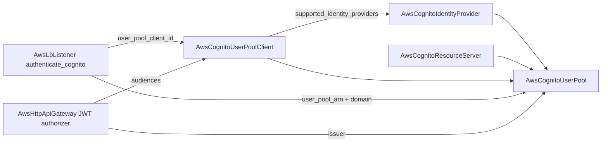

# AWS Cognito Family: User Pool + Identity Provider Depth Pass, App Client + Resource Server Forge

**Date**: July 7, 2026
**Type**: Feature | Breaking Change
**Components**: AWS Provider, API Definitions, Pulumi CLI Integration, IAC Stack Runner, Testing Framework

## Summary

The Cognito family reaches full provider depth: `AwsCognitoUserPool` is rebuilt to the complete `aws_cognito_user_pool` surface with its embedded app clients split out, `AwsCognitoUserPoolClient` (enum 358) and `AwsCognitoResourceServer` (enum 359) are forged as first-class kinds, and `AwsCognitoIdentityProvider` is rebuilt off its legacy `type = any` Terraform contract. The string-typed Cognito seams on ALB listeners, listener rules, and the HTTP API JWT authorizer become real foreign keys, closing the loop on a fully-typed serverless auth graph. All four kinds gained first-ever E2E coverage with all eight live dual-engine lanes green.

## Problem Statement / Motivation

Cognito is the auth front door for the serverless stack this catalog just finished (HTTP API + JWT authorizers), but the surface could not express a production identity setup — and the Terraform path could not deploy one at all.

### Pain Points

- **The user pool's Terraform module was never deployable**: `variables.tf` typed `spec` as an object containing ONLY `region`, so Terraform's object-type conversion silently dropped clients, the domain, password policy — everything. The module validated and planned while configuring almost nothing (the silent-data-loss class).
- **App clients were embedded with `min_items = 1`**: a pool could not exist without a client (dishonest — AWS has no such rule), clients could not be added without touching the pool, and outputs were `client_ids`/`client_secrets` **maps** keyed by client name — violating the singular-semantic outputs convention and burying the FK target every JWT authorizer needs.
- **The `user_pool_endpoint` output lied**: its comment (and TF description) claimed the `https://...` OIDC issuer URL, but both engines export the provider's raw scheme-less `endpoint`. Anything wired from it as a JWT issuer would fail at runtime.
- **The `user_pool_domain` output carried the wrong shape for its only composer**: documented as the full hosted-UI URL, while the ALB `authenticate_cognito` action needs the raw domain string.
- **Missing provider surface**: passwordless sign-in (`sign_in_policy` first-auth factors), email MFA, WebAuthn/passkeys, SMS configuration, device tracking, user-pool tiers, threat protection, invite/verification templates, custom email/SMS sender Lambdas with their KMS coupling, pre-token-generation V2/V3, password history, log delivery.
- **`AwsCognitoIdentityProvider`** carried a legacy `type = any` contract with camelCase reads, an exact `= 5.82.0` pin, and a proto enum where the family convention is provider strings.
- **Every Cognito seam on consumers was a plain string**: ALB listener/listener-rule `user_pool_client_id` and `user_pool_domain`, HTTP API JWT `issuer` and `audiences` — the chart README literally instructed users to wire them manually.

## Solution / What's New

### AwsCognitoUserPool (breaking rebuild)

- **Clients split OUT** (the SNS-subscription precedent): the embedded `clients` list and the `client_ids`/`client_secrets` map outputs are gone.
- **Domain stays folded** (one-per-pool; the domain string is its identity), completed with `managed_login_version` and the custom-domain certificate ref.
- Full surface: `sign_in_policy` (PASSWORD/EMAIL_OTP/SMS_OTP/WEB_AUTHN), `email_mfa` + `web_authn` + `software_token_mfa` + `sms_configuration` (SNS caller role ref + external ID), `device_configuration`, `user_pool_tier` (LITE/ESSENTIALS/PLUS), `user_pool_add_ons` (threat protection modes + additional flows), `admin_create_user_config` with invite templates, `verification_message_template` (modern block only; the legacy top-level conflict fields are deliberately not modeled), `user_attribute_update_settings`, `password_policy.password_history_size`, schema attributes completed (`developer_only_attribute`; append-only semantics documented), lambda config completed (`kms_key_id` → AwsKmsKey ref, custom email/SMS senders with their RequiredWith CELs, `pre_token_generation_config` V1_0/V2_0/V3_0), and folded `log_delivery_configurations` (CloudWatch Logs / Firehose / S3 destination refs — the folded-logging class).
- 63 validation rules total, mirroring the provider's own contracts: alias XOR username attributes, `{####}`/`{username}` template placeholders, sender-Lambda ↔ KMS coupling, numeric ranges (password length 6–99, history 0–24, temporary validity 0–365).
- **Outputs restructured around the three join keys the graph actually needs**: new `issuer` (the `https://...` value JWT authorizers validate), `user_pool_domain` now the RAW domain string (what ALB authenticate-cognito takes), new `hosted_ui_url` (what applications link to), plus `cloudfront_distribution`/`cloudfront_hosted_zone_id` for Route 53 alias composition; `user_pool_endpoint` kept with its comment corrected to the scheme-less value both engines actually export; `user_pool_id`/`user_pool_arn` frozen (FK consumers).
- **Terraform module rewritten from scratch** on the generator-owned contract; both engines converge on `metadata.name` identity and identical tag sets.

### AwsCognitoUserPoolClient (forged, enum 358, `awscogclient`)

The full `aws_cognito_user_pool_client` surface as a first-class node — many-per-pool, independently referenceable, repointable: pool ref, OAuth flows/scopes, callback/logout URLs, explicit auth flows, `supported_identity_providers` as repeated refs → `AwsCognitoIdentityProvider.provider_name` (literal "COGNITO"/"Google" still works through the value arm — and the ref edge orders IdP creation before the client that lists it), token validities with their unit-aware 5m–24h / 60m–10y provider contracts as CELs, `generate_secret` (immutable), `auth_session_validity` (3–15), `prevent_user_existence_errors`, token revocation, propagate-user-context, `refresh_token_rotation` (retry grace 0–60s), `analytics_configuration` (application ARN XOR application ID), read/write attributes. Outputs: `client_id` (the new FK target), `client_secret` (comment-marked sensitive; `sensitive = true` in TF — the IAM-user access-key precedent: AWS mints it, no vault indirection exists, and the output is the only wire), `user_pool_id`.

### AwsCognitoIdentityProvider (rebuild)

Legacy `type = any` contract → generator-owned on the v6 floor; proto enum `provider_type` → provider string with CEL (family convention); OIDC config gains `attributes_url_add_attributes`; `user_pool_id` added to outputs (consumers holding only the IdP get the pool join for free); full Pulumi entrypoint anatomy (`stack-input.yaml`); the SAML preset's missing required `region` fixed.

### AwsCognitoResourceServer (forged, enum 359, `awscogrs`)

OAuth custom scopes as a first-class node: `identifier` (immutable) + display name + up to 100 scopes. Outputs export `scope_identifiers` (`identifier/scope_name`) — exactly the strings machine-to-machine clients grant in `allowed_oauth_scopes`, completing the `client_credentials` story.

### Consumer foreign-key conversions (breaking)

- ALB listener + listener rule `authenticate_cognito`: `user_pool_client_id` → ref (client kind), `user_pool_domain` → ref (the pool's new raw-domain output).
- HTTP API JWT config: `issuer` → ref (the pool's new `issuer` output), `audiences` → repeated refs (client IDs).

## Validation

- **Offline gate all green**: spec tests across all six touched kinds (the four Cognito kinds + listener/listener-rule/HTTP API), `make protos` no-op regen, `make generate-cloud-resource-kind-map` no-op, `tofu init && tofu validate` ×4, Pulumi module builds ×7 (four Cognito + three consumers), `TestVariablesTFDrift` (all four enrolled), `pkg/outputs` conformance, `pkg/crkreflect` tests, `planton validate-refs --check`, `planton secret-coverage --check`, manifest validation across every hack manifest / preset / E2E scenario, `make build-go`.
- **Live dual-engine E2E 8/8 green** (`AWS_PROFILE=planton-aws-e2e`, `-timeout=30m`, short private `TMPDIR`): pool full-surface scenario (prefix domain + passwordless sign-in policy), client OAuth chain on the pool prerequisite (Terraform lane 1m12s; the client itself deploys in ~30s), Google IdP with placeholder credentials, resource-server scopes chain (Pulumi 50s / Terraform 1m38s). Zero-orphan sweep clean (`list-user-pools` → 0).
- Live-lane exclusions recorded in the profiles with reasons: SES-dependent arms (DEVELOPER email, email MFA), SMS arms (SNS caller role), PLUS-tier threat protection, log delivery, custom domains (owned DNS + us-east-1 ACM), Pinpoint analytics.

## Impact

- **Breaking**: `AwsCognitoUserPool` manifests with embedded `clients` no longer validate — clients become `AwsCognitoUserPoolClient` resources; the `client_ids`/`client_secrets` outputs are gone; `user_pool_domain` output changes shape (raw domain, with the URL in `hosted_ui_url`). ALB listener/listener-rule and HTTP API manifests carrying Cognito strings move to refs (value arms still accept literals). `AwsCognitoIdentityProvider.provider_type` becomes a string.
- `charts/aws/serverless-api` breaks on the client split (its auth template embeds `clients:`), and its "wire the JWT authorizer manually" README note is obsolete now that the authorizer takes refs — recorded for the dedicated charts wave.
- A JWT authorizer wired from pool outputs now receives a working issuer URL; before this change the documented wiring produced a scheme-less issuer that failed at runtime.

## Related Work

- Builds directly on the serverless front-door family (HTTP API JWT authorizers are what these refs feed).
- The forge rule's stack-outputs guidance now documents the managed-secret-ARN-first convention and the narrow provider-minted-credential exception (`client_secret`, IAM access keys) so future kinds handle secret-bearing outputs consistently.

---

**Status**: ✅ Production Ready
