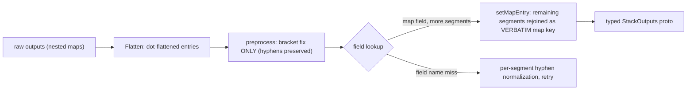

# AWS EFS Family Depth Pass: Full-Surface File System + First-Class Access Points

**Date**: July 7, 2026
**Type**: Breaking Change
**Components**: AWS Provider, API Definitions, Provider Framework, IAC Stack Runner, Testing Framework

## Summary

Rebuilt `AwsElasticFileSystem` to the full Terraform-provider surface and split EFS access points out into the new first-class `AwsEfsAccessPoint` kind (enum 360). The rebuild fixes a deploy-breaking Terraform defect (the resource policy was typed as a string while the tfvars pipeline delivers a nested object), converges the two engines' physical identity and tag sets, adds the previously missing provider surface (dual-stack mount targets, replication, overwrite protection, the policy-lockout bypass), and lands the family's first-ever E2E coverage — all four live dual-engine lanes green. A framework gap fixed along the way: `map<string,string>` stack outputs now actually populate typed StackOutputs protos.

## Problem Statement / Motivation

The EFS kind predated the current catalog standards on every axis:

- **The Terraform module had a deploy-breaking defect**: `spec.policy` is a `google.protobuf.Struct`, which the proto→tfvars converter emits as a nested HCL object — but `variables.tf` typed it `string` and `main.tf` compared it to `""`. Any manifest carrying a resource policy failed at plan time. Only the Pulumi module serialized it correctly.
- **Cross-engine identity divergence**: Terraform pinned `creation_token` to the resource name while Pulumi relied on auto-naming — the same manifest produced different physical identities per engine. Tag sets diverged the same way (Terraform: `Name` + labels only; Pulumi: identity keys without `Name`).
- **Folded access points were the wrong shape**: access points have independent AWS identity (`fsap-…`), are many-per-file-system (up to 1,000), and are exactly what Lambda file-system configs and ECS task EFS volumes reference. Folding them forced consumers through hand-typed map-output paths (`status.outputs.access_point_arns.<name>`), and Lambda's reference had no `default_kind_field_path` at all. ECS task definitions still carried literal string fields with a stale "Planton has no EFS kind yet" comment.
- **Missing provider surface**: no dual-stack/static-IP mount targets, no replication, no overwrite protection, no policy-lockout bypass.
- **Zero E2E**: no verifier, no scenarios, no profile, no outputs-conformance case, no registry prerequisites; the hand-written TF contract was not drift-guarded.

## Solution / What's New

### AwsElasticFileSystem rebuilt (breaking)

- **Mount targets restructured** from a flat `subnet_ids` list to per-target blocks: `subnet_id` ref + optional static `ip_address`, `ipv6_address`, and `ip_address_type` (IPV4_ONLY / IPV6_ONLY / DUAL_STACK) with the address-family couplings as CEL rules.
- **Folded `replication`** (the one-per-file-system, replace-on-change satellite class): destination region and/or AZ (at-least-one-of as CEL, mirroring the provider's own constraint), destination KMS ref, and replicate-into-existing-file-system by reference to another `AwsElasticFileSystem`.
- **`replication_overwrite_protection`** (ENABLED/DISABLED) and **`bypass_policy_lockout_safety_check`** (CEL-gated to require a policy) added.
- **Folded `access_points` removed** — split into the new kind; the `access_point_ids`/`access_point_arns` map outputs are gone (their only consumer repointed in the same change).
- **Both engines converged**: `creation_token` = `metadata.name` in BOTH (EFS's only human-controlled physical identity), one tag convention (identity keys + `Name`, user labels unable to override), the policy Struct handled with `jsonencode()` behind a null guard in Terraform, generator-owned `variables.tf` enrolled in the drift guard, provider floor lifted `= 5.82.0` → `>= 6.12.0` (mount-target dual-stack landed in 6.12.0). Zero PARITY-EXCEPTIONs.
- Outputs: `mount_target_ipv6_addresses` and `replication_destination_file_system_id` added; identity/DNS outputs unchanged (frozen — `file_system_id` has FK consumers).

### AwsEfsAccessPoint forged (enum 360, id_prefix `awsefsap`)

The least-privilege front door to a shared file system: `file_system_id` ref, enforced POSIX identity (uid/gid + up to 16 secondary GIDs, ranges CEL-validated), root-directory restriction with `creation_info` (3–4-digit octal permissions pattern). Total create-time immutability stated honestly — everything except tags replaces the access point. Outputs: `access_point_id` (ECS), `access_point_arn` (Lambda, IAM conditions), plus the file system's ID/ARN so consumers compose from one node. Registry prerequisites: `[AwsElasticFileSystem]`.

### Consumer FK conversions (breaking)

- `AwsLambda.file_system_config.access_point_arn` → `default_kind: AwsEfsAccessPoint` + `default_kind_field_path: status.outputs.access_point_arn` (previously default-kind-only with a hand-typed map path).
- `AwsEcsTaskDefinition` EFS volumes: `file_system_id` and `access_point_id` converted from literal strings to typed refs; the Pulumi module reads the resolved values, the generated TF contract is shape-identical (refs flatten to strings).

### Framework fix: map-typed stack outputs now populate

The generic outputs transformer could not populate `map<string,string>` proto fields from either engine's raw outputs: the flattener dot-flattens map entries (`mount_target_ids.subnet-0abc`), but the populate walker tried to JSON-parse the leaf value as a whole map, and the key preprocessor rewrote hyphens to underscores across the WHOLE key — corrupting map keys, which are data (subnet IDs). Every map output in the catalog (Lambda `alias_arns`, S3 object-set `object_etags`, transit gateway, and now the EFS mount-target maps) silently arrived empty in the platform's typed outputs.

Fixed at the root in `pkg/outputs`:

Map keys pass through verbatim (they may contain hyphens and dots); hyphenated *field names* are normalized per segment at lookup time instead of by whole-key rewrite. Covered by the conformance case and proven live (`7/8 proto fields populated` in the E2E VERIFY-OUT phase, all four mount-target maps landing).

## Validation

- **Offline gate all green**: spec tests ×3 kinds (EFS, access point, ECS task definition), `make protos`, kind-map regen, `make reset-gazelle`, drift guard (both kinds enrolled), outputs conformance (+2 cases incl. the map shapes), `pkg/outputs` full suite, `validate-refs --check`, `secret-coverage --check`, `tofu validate` + offline `tofu plan` from the hack manifests ×2 (proving the Struct policy and mount-target contract render), Pulumi builds ×4, `make build-go`, manifest validation across hack manifests + presets + scenarios + prerequisite, `validate-outputs` dry-runs (EFS 7/8 — the 8th is the legitimately-empty replication output; access point 4/4).
- **Live dual-engine E2E 4/4 green** (`AWS_PROFILE=planton-aws-e2e`, short private TMPDIR, `-timeout=30m`):
  - EFS full-surface (encrypted + elastic + lifecycle trio + backup + protection + two distinct-AZ mount targets + a policy carrying a literal `${aws:ResourceAccount}` variable): Pulumi deploy 1m48s / Terraform 2m07s.
  - Access point chain (FS prerequisite → access point with POSIX identity + auto-created root): Pulumi deploy 17s / Terraform 30s.
  - Zero-orphan sweep clean (no file systems, access points, or tagged fixtures remain in us-west-2).
- Recorded profile exclusions: One Zone (alternate create shape), static/dual-stack addressing (fixture subnets carry no IPv6 CIDR), replication (cross-region destination + 20-minute waiters + overwrite-protection teardown interplay).

## Impact

- **Users**: EFS resource policies deploy (previously a guaranteed Terraform failure); the full modern EFS surface (DR replication, dual-stack, protection) is configurable; Lambda/ECS wire EFS access by clean references instead of hand-typed map paths; both engines produce identical physical resources.
- **Platform**: every kind with map-typed stack outputs now gets real values in typed status outputs — a whole silent-data-loss class closed.
- **Catalog shape**: the access-point split follows the settled decompose test (independent identity + many-per-parent + FK-referenced), consistent with listeners, SNS subscriptions, and Cognito clients.

## Related Work

- Session-023 messaging-family changelog (the Struct-as-JSON-string Terraform class this kind carried).
- Session-028 Cognito-family changelog (the embedded-children split precedent and the E2E prerequisite-chain anatomy mirrored here).

---

**Status**: ✅ Production Ready
