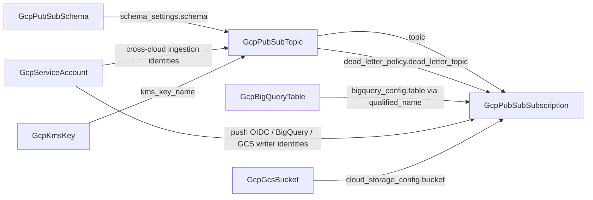

# GCP Pub/Sub: Schema Kind Forged, Topic and Subscription Rebuilt to the Released Floor

**Date**: July 7, 2026
**Type**: Feature
**Components**: GCP Provider, API Definitions, Provider Framework, IAC Stack Runner, Testing Framework

## Summary

The GCP messaging family now models all three of the provider's Pub/Sub resources: a new `GcpPubSubSchema` kind (enum 664) makes the message contract a first-class, shareable node, and the existing `GcpPubSubTopic` / `GcpPubSubSubscription` kinds were rebuilt to the released `google ~> 6.x` floor with full cross-engine parity. The topic's schema reference and the subscription's BigQuery-table and service-account references are now real foreign keys instead of plain strings, and all three kinds are live-proven on both engines with a new Pub/Sub E2E suite.

## Problem Statement / Motivation

### Pain Points

- **The topic referenced its schema by plain string.** `schema_settings.schema` demanded a hand-assembled `projects/{project}/schemas/{schema}` path, and no kind existed to produce one — schema-validated messaging (the pattern that moves contract violations from consumers to publishers) was not composable at all.
- **A live label-parity break on both kinds.** The Terraform modules stamped NO labels while the Pulumi modules stamped the full platform set — identically declared topics and subscriptions differed by engine in cost attribution and fleet queries.
- **The subscription's Pulumi module could not deploy.** It had no `Pulumi.yaml` and no `Makefile` — the deploy-blocking scaffolding class.
- **Stale converter contract.** Both kinds' Terraform variables still used `object({ value = string })` reference typing, required an explicit `project_id` (no ambient-project fallback), and enabled no APIs.
- **Below the released floor.** Neither kind modeled user `labels` or `message_transforms`; `bigquery_config.table` and four `service_account_email`/`gcp_service_account` surfaces were plain strings.
- **Zero E2E.** No scenarios, no verifiers, no test entrypoints for the messaging family.

## Solution / What's New

### The composable messaging graph

### `GcpPubSubSchema` (664, `gcppsch`) — forged

- `type` (`AVRO` XOR `PROTOCOL_BUFFER`, the `TYPE_UNSPECIFIED` sentinel rejected) + required `definition`; the revision lifecycle (in-place commits, 20-revision cap, the `_deleted-schema_` sentinel) taught in the spec.
- Outputs: `schema_id` (the exact string a topic's schema reference consumes) + `schema_name`.
- Full anatomy: both engines with API enablement and ambient project, 22-case spec test, 2 presets (Avro event contract, protobuf binary contract), docs/catalog/READMEs, registry + kind map.

### `GcpPubSubTopic` (660) — rebuilt

- Spec additions at the released floor: user `labels`, `message_transforms[]` (JavaScript UDF arm), and the schema reference converted to `StringValueOrRef` → `GcpPubSubSchema`; the five ingestion `gcp_service_account` fields → `GcpServiceAccount`.
- New pre-deploy validation: reserved-`goog` name prefix rejected; Cloud Storage ingestion requires exactly one input format (previously enforced only by the API at apply time).
- Module fixes: TF labels (user-first merge beneath the `planton-ai_*` set, identical to Pulumi), Pub/Sub API enablement, resolved-string converter typing, ambient project, stale `Pulumi.yaml` `binary:` dropped.
- Registry: `prerequisites: [GcpPubSubSchema]`. 48-case spec test; 5 presets (schema-validated added).

### `GcpPubSubSubscription` (661) — rebuilt

- Spec additions: user `labels`, `message_transforms[]`; `bigquery_config.table` → `GcpBigQueryTable` (via the table's new `qualified_name` output), the three delivery `service_account_email` fields → `GcpServiceAccount`; the `goog` prefix CEL.
- Module fixes: the missing `Pulumi.yaml`/`Makefile` authored, TF labels, API enablement, converter typing, ambient project.
- Registry: `prerequisites: [GcpPubSubTopic]`. 56-case spec test; 4 presets rewritten onto the reference shapes.

### `GcpBigQueryTable` — extend-only output

`qualified_name` (`{project}.{dataset}.{table}`, assembled from resource attributes on both engines) joins the outputs so dotted-form consumers never do string assembly — the `GcpServiceAccount.member` pre-assembled-handle precedent.

## Implementation Details

- **Released-floor verification:** a `tofu providers schema -json` probe against the resolved `google 6.50.0` set the modeling line. Recorded skips (absent from the released line): `tags`, `message_transforms.ai_inference`, topic schema revision pinning, `deletion_policy`, and the schema's `revision_id` attribute (exporting it from Pulumi only would break output parity).
- **E2E:** `pubsub/v1` discovery client added to the GCP harness (no new Go module); three verifiers with posture assertions — the topic and subscription verifiers assert the `planton-ai_resource` attribution label live, making the closed label-parity break a permanently guarded regression; schema → topic → subscription prerequisite chains; six test entrypoints.
- **Conformance:** `pkg/outputs` gained cases for all three kinds (the suite previously had zero Pub/Sub coverage) plus the extended table case.

## Validation

- Offline (all green): spec tests 22 + 48 + 56; both engines' builds ×3 + release-equivalent Pulumi entrypoints; `secret-coverage --check`; `validate-refs --check`; `validate-outputs` on BOTH module dirs ×4 (incl. GcpBigQueryTable); offline `planton tofu plan` through the real converter ×3 (2-to-add, clean); 21 preset/hack/e2e manifests through a freshly built `planton validate`; kind map + gazelle + Java stub gate + `make build-go`.
- Live on the test project (dual-engine, sequential batches): **schema 2/2** (~45s), **topic 4/4** (minimal + schema-validated on the schema prerequisite chain, ~67–88s), **subscription 4/4** (basic-pull + reliable-pull on the schema → topic chain, ~110–121s) — **10/10 scenario-runs green, zero orphans** (post-run sweep of topics/subscriptions/schemas empty).
- Recorded live exclusions (proven offline): the dead-letter arm (needs a second topic instance — the prerequisite system installs one manifest per kind; the reference mechanism is identical to the live-proven `topic` ref), cross-cloud ingestion arms, CMEK, and push/BigQuery/GCS delivery targets.
- Parity audits: all three kinds **Fully Complete, PARITY ✅** (`docs/audit/2026-07-07-234236.md` per kind, plus a GcpBigQueryTable touch audit).

## Impact

Event-driven architectures on GCP are now fully composable from first-class nodes: contract (schema) → channel (topic) → consumer (subscription) → sinks (BigQuery table, GCS bucket) with every edge a resolvable reference. Both engines produce byte-identical label sets and outputs, and the messaging family joins the live E2E harness permanently.

## Related Work

- Follows the analytics family completion (Dataproc/Composer) and consumes the BigQuery table kind for zero-ETL delivery.
- The one-manifest-per-prerequisite-kind constraint and the buf remote-generation retry guidance were folded into `e2e/README.md` and the proto-stub forge flow rule.

---

**Status**: ✅ Production Ready
