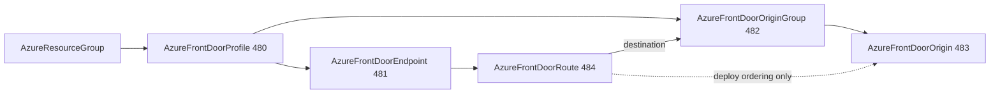

# Azure Front Door Traffic Core: Profile Rework + Endpoint/OriginGroup/Origin/Route Kinds

**Date**: July 8, 2026
**Type**: Breaking Change
**Components**: Azure Provider, API Definitions, Pulumi CLI Integration, IAC Stack Runner, Testing Framework

## Summary

The Azure Front Door (Standard/Premium) surface decomposes from one bundled
component into its honest resource graph: `AzureFrontDoorProfile` (480) is
reworked breaking into the container kind (gaining the managed identity,
access-log scrubbing, and tags surface it was missing), and four new
first-class kinds carry the delivery surface -- `AzureFrontDoorEndpoint`
(481), `AzureFrontDoorOriginGroup` (482), `AzureFrontDoorOrigin` (483), and
`AzureFrontDoorRoute` (484). All five ship both IaC engines at 100%
behavioral parity and passed live dual-engine E2E (10/10 runs, including the
composed five-kind traffic chain).

## Problem Statement / Motivation

The previous `AzureFrontDoorProfile` bundled endpoints, origin groups,
origins, and routes as inline lists inside one spec. That shape fought
Azure's own resource model and real operating patterns:

- **Azure models each as a separate ARM child resource** with its own type,
  API, and lifecycle under `Microsoft.Cdn/profiles/*`.
- **Regional stamps couldn't compose**: adding a region's backend meant
  editing the shared profile manifest instead of adding one origin resource.
- **Blue/green and canary flows were monolith edits**: swapping a backend or
  ramping a canary re-applied the whole profile document.
- **Per-origin Private Link approval workflows** (each origin's pending
  connection is approved independently) had no independent resource to hang
  off.
- The profile spec was also missing real azurerm v4.80 surface: the managed
  identity (needed for bring-your-own Key Vault certificates), access-log
  scrubbing, and tags.
- The Pulumi module still constructed its provider inline, silently breaking
  keyless (OIDC web-identity) auth.

## Solution / What's New

**`AzureFrontDoorProfile` (rework, breaking)** -- the container: explicit
`profile_name` (the provider's exact 2-90 rule), closed sku enum
(unspecified deploys STANDARD; ForceNew, and Azure refuses a
PREMIUM->STANDARD downgrade outright), `response_timeout_seconds`, NEW
`identity` block (system/user-assigned with `AzureUserAssignedIdentity`
references), NEW `log_scrubbing_variables` (repeated enum -- presence
enables scrubbing; the service supports only the match-everything operator
on profiles), NEW user `tags`. Bundled endpoint/origin-group/route lists
are dissolved. Outputs gain `identity_principal_id` (the Key Vault grant
target); the per-endpoint hostname maps move to the endpoint kind.

**`AzureFrontDoorEndpoint` (new, 481, `azfde`)** -- the public entry point.
Parent by profile ARM id; `endpoint_name` becomes the prefix of the
generated globally unique `{name}-{hash}.z01.azurefd.net` hostname,
surfaced as the `host_name` output (the CNAME seam for DNS records).

**`AzureFrontDoorOriginGroup` (new, 482, `azfdog`)** -- the load-balanced
pool: latency-aware selection dials, explicit-optional health probe
(absence IS probing-disabled -- Front Door needs an explicit null),
session affinity, and the traffic-restore ramp.

**`AzureFrontDoorOrigin` (new, 483, `azfdo`)** -- one backend: host name,
certificate-name checking (default on), host-header override, ports,
priority/weight, and the full Private Link block with closed target-type
enum. CELs front-load the statically checkable provider contracts
(private-link-requires-certificate-check; target-type XOR Private Link
Service target); the Premium-SKU gate is cross-resource and stays
apply-time, documented.

**`AzureFrontDoorRoute` (new, 484, `azfdrt`)** -- the traffic rule: endpoint
parent (ForceNew) + origin-group destination (updatable), required patterns
and protocols, the HTTPS-redirect-requires-both-protocols CEL (which also
prevents Azure's silent no-redirect misbehavior), forwarding protocol,
origin path, and the full cache block (query-string keying, compression,
Azure's 41-value content-type allowlist as an items CEL). `origin_ids`
carries deploy-ordering references that are never sent to ARM -- ARM
rejects a route whose origin group has no origins yet. The
`rule_set_ids`/`custom_domain_ids` references land with those kinds.

## Implementation Details

- **Both engines, 100% parity**: single-resource modules per kind; the
  profile's Pulumi module migrated off inline `NewProvider` to the shared
  `pulumiazureprovider.Get` builder (keyless-auth compliant). One
  engine-dialect note documented in both origin modules: azurerm spells
  private-link secondary target types `blob_secondary`/`web_secondary`
  where the pulumi bridge expects `blobSecondary`/`webSecondary` -- same
  ARM group id either way.
- **Registry**: 481-484 fill the CDN sub-band beside the profile;
  `prerequisites` declared per real deploy-order edges (endpoint/origin
  group <- profile; origin <- origin group; route <- endpoint + origin).
- **Validation**: 122 spec test cases across the five kinds; `pkg/outputs`
  conformance cases x5; secret-coverage and validate-refs green (no
  secret-bearing fields in this family); full `tofu plan` renders on all
  five hack manifests; audits x5 at 100% PARITY/COVERAGE including the new
  apply-time validator source-diff section.
- **Audit rule uplift**: the audit now mandates a source-diff of the
  provider's apply-time validators (CustomizeDiff, Create/Update bodies,
  Validate* helpers) -- a schema walk alone misses contracts like the
  route's redirect rule and the origin's Private Link gates, and inventing
  rules the provider doesn't enforce is treated as a defect equal to a
  missing one.

## Live E2E (dual-engine, test subscription)

All 10 runs green; final sweep found zero resource groups and zero
profiles left behind.

| Scenario | Pulumi | Terraform |
| --- | --- | --- |
| Profile minimal (scrubbing + tags) | 1178s | 1281s |
| Endpoint minimal (fixture profile) | 1225s | 1317s |
| Origin group minimal (probe + dials) | 1259s | 1247s |
| Origin minimal (host header, ports, weight) | 1306s | 1371s |
| Route composed chain (RG -> profile -> endpoint + group -> origin -> route, cached + compressed) | 1513s | 1640s |

Timing lesson recorded in `e2e/README.md`: Front Door inverts the usual
profile -- everything CREATES in seconds-to-minutes, but PROFILE DELETION
runs ~18 minutes, dominating every scenario's wall time.

## Breaking Changes

- `AzureFrontDoorProfileSpec` drops `endpoints`, `origin_groups`, and
  `routes` (now first-class kinds), renames `name` -> `profile_name`,
  converts `sku` from string to a closed enum, and renumbers fields.
- `AzureFrontDoorProfileStackOutputs` drops the `endpoint_ids`/
  `endpoint_hostnames` maps (now per-endpoint outputs) and adds
  `identity_principal_id`.
- No FK consumers or charts referenced the old shape; blast radius is the
  kind itself.

## Impact

Front Door compositions now mirror how Azure operators actually work: a
region adds an origin, a canary is a low-weight origin resource, an app
gets its own endpoint + routes on a shared profile -- each an independent
manifest with typed references. The family's remaining resources (rule
sets, custom domains, secrets, and the Front Door WAF policy + security
policy pair, enums 485-489) compose against these outputs next.

---

**Status**: ✅ Production Ready
