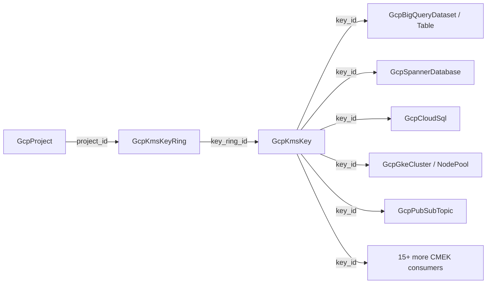

# GCP KMS: Key and Key Ring Rebuilt to the Released Floor with Full Cross-Engine Parity

**Date**: July 8, 2026
**Type**: Feature
**Components**: GCP Provider, API Definitions, Testing Framework

## Summary

The GCP KMS pair — the target of every CMEK reference in the catalog — now stands at the released `google ~> 6.x` floor. `GcpKmsKey` (691) gained user labels, the BYOK `import_only` arm, the EXTERNAL/EXTERNAL_VPC protection levels with a ref-shaped EKM backend, provider-exact rotation validation, and primary-version outputs; `GcpKmsKeyRing` (690) was conformed to the modern module contract (ambient project, converter-contract variables, API enablement). A live Terraform label-parity break was closed, a bridged-provider destroy-semantics hazard was neutralized, and both kinds are live-proven on both engines with the catalog's first KMS E2E — including the honest "destroyed" contract for GCP's undeletable resource class.

## Problem Statement / Motivation

### Pain Points

- **The highest fan-in composition target was below the floor.** Twenty-six CMEK reference fields across twenty kinds point at `GcpKmsKey.status.outputs.key_id`, but the key itself modeled no labels, no import-only/BYOK arm, no external key manager surface, and validated only value formats — not the API's real rules.
- **A live label-parity break.** The Terraform crypto-key module stamped ZERO labels while the Pulumi module stamped the full `planton-ai_*` set — identically declared keys differed by engine in cost attribution and fleet queries.
- **A bridged-provider destroy hazard.** The pinned Pulumi provider line carries a client-side `deletion_policy` knob the released Terraform GA resource does not have; left unpinned, a future bridged-default change could silently alter destroy behavior on one engine only.
- **Stale converter contract on both kinds**: `object({ value = string })` reference typing, a `~> 5.0` provider float, required `project_id` with no ambient fallback (ring), stale `Pulumi.yaml runtime.options.binary`, no Cloud KMS API enablement, no registry prerequisite from key to ring.
- **Staleness traps in validation.** The spec allowlisted five key purposes while the provider models purpose as a free string — GCP's newer purposes (post-quantum key encapsulation) would have been wrongly rejected pre-deploy.
- **Zero E2E, zero outputs conformance.** No verifiers, no scenarios, no test entrypoints, no `pkg/outputs` cases for either kind.
- **Doc defects**: a dead `examples.md` link, references to a nonexistent `GcpKmsCryptoKey` kind, legacy `planton-resource*` label names, and a credential-variable mismatch between the TF README and the module.

## Solution / What's New

### The CMEK composition graph

### `GcpKmsKey` (691) — deep rebuilt

- **New spec surfaces at the released floor**: user `labels` (merged beneath platform attribution labels, identical order both engines), `import_only` (the BYOK container guarantee), `crypto_key_backend` as an un-defaulted `StringValueOrRef` (the future EKM-connection kind attaches with a one-line `default_kind`), and the full four-level `protection_level` vocabulary (`SOFTWARE`/`HSM`/`EXTERNAL`/`EXTERNAL_VPC`).
- **Provider-exact validation**: the rotation CEL now enforces the provider's own validator (≥ 86400s, ≤ 9 fractional digits) instead of format-only; three new message-level rules move API create-time rejections to pre-deploy (rotation only on `ENCRYPT_DECRYPT` keys; `import_only` requires `skip_initial_version_creation`; `crypto_key_backend` pairs only with `EXTERNAL_VPC`).
- **Staleness traps removed**: `purpose` and `version_template.algorithm` are now free strings mirroring the provider contract, with the known values taught densely in comments — new API values are never wrongly rejected.
- **Outputs extend-only**: `key_id` and `key_name` preserved byte-for-byte (all 26 inbound CMEK references and the OpenBao bare-name consumer verified safe); `primary_version_name` + `primary_state` added from resolved resource attributes (populated by GCP only for `ENCRYPT_DECRYPT` keys — taught in the output comments and guarded identically on both engines).
- **Registry**: `prerequisites: [GcpKmsKeyRing]`. 43-case spec test; 4 presets (symmetric CMEK with a `valueFrom` ring reference, HSM compliance, asymmetric signing, import-only BYOK) — all valid as written.

### `GcpKmsKeyRing` (690) — conformed

- Ambient `project_id` (optional ref → `GcpProject`, provider-default fallback both engines), converter-contract variables, `location` output added (bare-name consumers compose from `key_ring_name` + `location`). The spec models 100% of the released three-field resource. 20-case spec test; presets rewritten valid-as-written with ring-design guidance (one ring per environment/data domain — IAM flows down).

### Module defect closure (both engines, both kinds)

- **The TF label-parity break is closed** — the crypto-key TF module now merges user labels beneath the identical `planton-ai_*` set; the ring correctly stamps no labels on either engine (the API has no labels surface; Pulumi's dead label computation removed).
- **The bridged `deletion_policy` is pinned to `DELETE`** in the Pulumi module with an explanatory parity comment — exactly the released Terraform destroy behavior (destroy versions, disable rotation, keep the key object), so destroy semantics can never diverge.
- Provider float `~> 5.0` → `~> 6.0`; flat-string reference typing; canonical `Pulumi.yaml` (no `binary:`); Cloud KMS API enablement on both engines (`disable_on_destroy=false`; the key extracts the project from the ring path identically on both engines); rich lifecycle comments teaching the undeletable-resource model.

### E2E: the undeletable resource class, done honestly

Cloud KMS rings and keys have **no delete API** — destroy removes a ring from state only, and destroys a key's *versions* while the key object persists forever. The new E2E layer models that honestly:

- Two verifiers on the Cloud KMS API. The key's exists-check asserts the `planton-ai_resource` label (the closed parity break is a permanently guarded live regression) and an `ENABLED` primary version; its absent-check asserts the honest destroyed posture — every version `DESTROYED`/`DESTROY_SCHEDULED` and rotation disabled — rather than absence.
- Run-scoped `${E2E_RUN_ID}` names everywhere (permanent resources make fixed names unusable), ring leaf scenario + published ring prerequisite + one composed key scenario folding rotation and the HSM version-template arm together.
- **One live scenario per undeletable-prerequisite component by design**: prerequisites redeploy per scenario under the same engine-scoped run id, so a second scenario would 409 on the just-"destroyed" (state-only) ring. Documented in `e2e/README.md` alongside the redefined zero-orphan contract for this class ("no ACTIVE material", not "no objects").

## Validation

- Offline (all green): spec tests 43 + 20; per-kind Go builds + release-equivalent Pulumi builds; `tofu init/validate` ×2; offline `planton tofu plan` through the real converter ×2 (labels, rotation, outputs inspected); `secret-coverage --check`; `validate-refs --check`; `validate-outputs` on both module dirs ×2; two new `pkg/outputs` conformance cases; 13 preset/hack/e2e manifests through a freshly built `planton validate`; gazelle + `make build-go`.
- **Live dual-engine E2E green on `planton-e2e`**: ring minimal 2/2 (~25s/engine, state-only destroy verified), key symmetric-rotation 2/2 (~50s/engine on the ring prerequisite chain, label + ENABLED-primary posture verified live, destroyed posture verified after destroy). Post-run sweep: zero active key material (all versions `DESTROY_SCHEDULED`, rotation off) — the inert run-scoped ring/key objects are permanent by GCP design.
- Both kinds audited **Fully Complete — PARITY ✅** (`docs/audit/2026-07-08-055500.md` per kind); site catalog regenerated (KMS Key Ring title added; key/ring pages + preset pages refreshed).

## Deliberately Not Modeled (recorded reasons)

- `deletion_policy` (absent from released 6.50.0 GA; bridged flag pinned for parity) and `key_access_justifications_policy` (beta-only).
- Sibling resources: `crypto_key_version` (the rotation product, service-managed), `ekm_connection` (Tier-2; the ref-shaped backend field is ready for it), the Autokey pair (folder-scoped singletons), `key_ring_import_job` (interactive BYOK ceremony), `secret_ciphertext` (a transform, not a resource), and the per-resource IAM trios (catalog-wide deferral).

## Impact

Every CMEK edge in the catalog now terminates at a floor-complete, parity-proven key with live verification — and the undeletable-resource E2E contract this session established covers the entire GCP resource class (key handles share it) for every future component.
