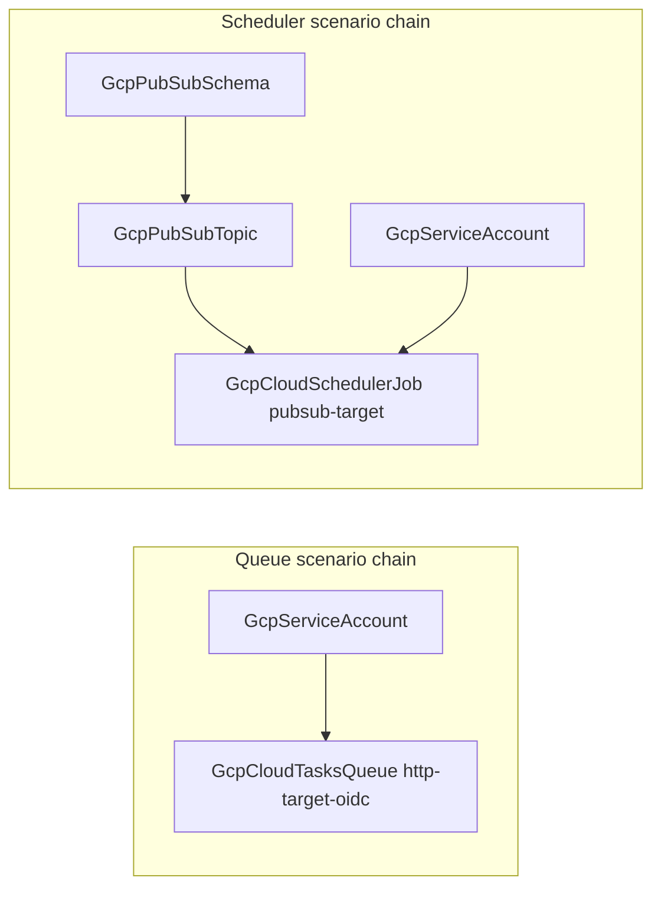

# GCP Cloud Tasks Queue and Cloud Scheduler Job Depth Rebuild with Full Parity

**Date**: July 8, 2026
**Type**: Enhancement
**Components**: GCP Provider, API Definitions, IAC Stack Runner, Testing Framework

## Summary

`GcpCloudTasksQueue` and `GcpCloudSchedulerJob` now stand at the released
Terraform google provider 6.x floor with 100% cross-engine behavioral parity,
registry-declared compositions, and their first live dual-engine E2E
coverage. The queue sheds a pause/resume surface only one engine could honor
and gains the App Engine routing override plus the GCP-computed
`max_burst_size` output; the scheduler's job-name fallback now behaves
identically on both engines. This completes the GCP messaging/scheduling
band: contract → channel → consumer → cron trigger → task dispatch, every
edge a resolvable reference.

## Problem Statement / Motivation

Both kinds predated the current catalog bar and carried defect classes in
every layer:

### Pain Points

- **A spec surface one engine silently ignored**: the queue spec offered
  `desired_state` (pause/resume) and a `state` output, but those attributes
  shipped in provider 7.0.0 — the released 6.x line the Terraform modules
  build against has neither. Pulumi (bridged from the newer line) honored
  the field; Terraform dropped it silently. Worse, the Terraform module's
  `variables.tf` declared the field and its README documented it as an
  implemented "virtual field" while `main.tf` never used it.
- **A name-parity break**: the scheduler spec promises "empty `job_name`
  defaults to `metadata.name`"; Pulumi implemented the fallback, Terraform
  used the raw spec value — the same manifest produced differently named
  jobs per engine.
- **Missing floor surface**: `app_engine_routing_override` (on released 6.x)
  was unmodeled, and the spec comment promising `max_burst_size` "reported
  in stack outputs" pointed at an output that did not exist.
- **Stale-shape classes**: `object({value})` Terraform ref typing, stale
  `Pulumi.yaml binary:` options, no API enablement, required `project_id`
  instead of the catalog-wide ambient contract, presets carrying `${...}`
  placeholders that fail validation.
- **Zero validation infrastructure**: no E2E clients, verifiers, scenarios,
  or output-conformance cases for either kind; no registry prerequisites.

## Solution / What's New

### GcpCloudTasksQueue (662)

- **Pause/resume removed from the declarative surface** (fields renumbered
  contiguously): released 6.x has no `desired_state`/`state` (verified
  against the provider's v6.50.0 tag), so modeling it made one engine drop
  user intent. Pause/resume is a runtime operation
  (`gcloud tasks queues pause|resume`); the surface returns when the catalog
  moves to the 7.x major. The false Terraform README claim and the dead
  variable declaration are gone.
- **`app_engine_routing_override` added** (service/version/instance) —
  queue-pinned routing for App Engine tasks, completing the released floor.
- **`max_burst_size` output added on BOTH engines** — the GCP-computed burst
  ceiling (Terraform reads `rate_limits[0].max_burst_size`, Pulumi
  `RateLimits.MaxBurstSize()`); the E2E verifier cross-checks the exported
  value against the live API.
- **`queue_name` stays deliberately required**: a deleted queue's ID is
  reserved by the Cloud Tasks API for up to 7 days, so the name deserves an
  explicit, stable choice — never a derived default (the same reasoning as
  permanent-identifier kinds).

### GcpCloudSchedulerJob (663)

- **Job-name fallback parity closed**: the Terraform module now resolves
  `job_name` → `metadata.name` in locals with an explicit conditional,
  matching Pulumi — proven live by a scenario that omits the name on both
  engines.
- Spec surface confirmed at 100% of the released 6.x resource (the provider
  marks `schedule` Optional but the API requires it — the spec keeps honest
  pre-deploy enforcement).

### Both kinds

- Ambient `project_id` (empty → provider default project), API enablement
  (`cloudtasks.googleapis.com` / `cloudscheduler.googleapis.com`,
  `disable_on_destroy=false`), flattened converter-contract Terraform
  variables, canonical `Pulumi.yaml`, and the bridged provider's client-side
  `deletion_policy` pinned to `DELETE` with PARITY comments (absent from
  released 6.x — destroy semantics can never diverge).
- Registry compositions declared: queue → `[GcpServiceAccount]`; scheduler →
  `[GcpPubSubTopic, GcpServiceAccount]`.
- 6 presets rewritten valid-as-written with reference-shaped compositions;
  docs rewritten to the final surface.

### E2E (first coverage for the family)

- `cloudtasks/v2` + `cloudscheduler/v1` harness clients; two verifiers with
  posture assertions (queue RUNNING + live `max_burst_size` cross-check; job
  ENABLED + schedule + exactly-one-target).
- Four scenarios: queue minimal + http-target-oidc (SA chain, full
  `uri_override` incl. path/query overrides); scheduler pubsub-target (topic
  chain + name-fallback proof) + http-target-oidc (SA chain).
- `pkg/outputs` conformance cases for both kinds.

## Validation

- Offline (all green): spec tests 46 + 52; per-kind Go and release-equivalent
  Pulumi builds; `tofu init/validate` ×2; offline `planton tofu plan` through
  the real converter ×2; `secret-coverage --check`; `validate-refs --check`;
  `validate-outputs` on both module dirs ×2; 12 manifests validated (presets,
  hack, token-substituted e2e); kind map + gazelle + `make build-go`.
- **Live dual-engine E2E green on `planton-e2e`**: queue 4/4, scheduler 4/4
  (create → verify → destroy, sequential batches); post-run sweeps show zero
  queues, jobs, topics, or E2E service accounts.
- **Live perpetual-diff check**: a real-converter apply of the queue with
  both `path_override`/`query_override` set, followed by a plan — "No
  changes" (the provider's known `query_override` perma-diff class does not
  reproduce with the module's send-only-when-set shape on the 6.x line).
- Parity audits: both kinds **Fully Complete — PARITY ✅**
  (`docs/audit/2026-07-08-075300.md` per kind). Site catalog regenerated.

### Live-found constraint (fixed in-session)

Cloud Scheduler job deletion finalizes asynchronously: the destroy returns
and a GET already 404s, yet recreating the same name minutes later (as the
dual-engine runner does) can 409 `already exists`. The name-fallback proof
scenario now carries `${E2E_RUN_ID}` in `metadata.name` itself — the
fallback then makes it the cloud-side name, proving the contract without a
fixed identifier. The class is documented in `e2e/README.md` alongside the
Cloud Tasks queue-ID reservation window.

## Recorded Skips (with reasons)

- Queue `desired_state`/`state` — 7.0.0-only; returns with the provider
  major upgrade.
- `deletion_policy` (both kinds) — client-side, absent from released 6.x;
  bridged flag pinned to DELETE.
- `max_burst_size` as input — Computed-only; exported as an output instead.
- Queue IAM member/binding/policy trio — resource-scoped IAM glue is not
  modeled as kinds; scheduler `deadline` — deprecated alias of
  `attempt_deadline`.

## Impact

Scheduled and queued work on GCP is now fully composable from first-class
nodes: a Scheduler job publishes to a referenced Pub/Sub topic or invokes a
Cloud Run service as a referenced service account; a Tasks queue dispatches
OIDC-authenticated tasks with queue-owned routing. Both kinds deploy
identically on either engine, and the messaging/scheduling band
(schema/topic/subscription/queue/job) is complete at the released floor.

---

**Status**: ✅ Production Ready
