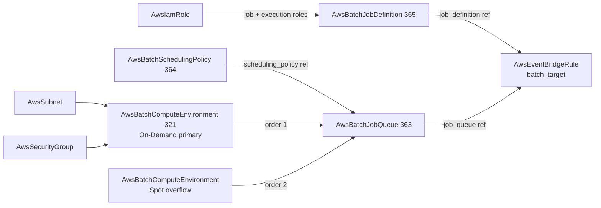

# AWS Batch Family Decomposition

**Date**: July 8, 2026
**Type**: Breaking Change
**Components**: API Definitions, AWS Provider, IAC Stack Runner, CLI Commands, Testing Framework

## Summary

The AWS Batch surface is decomposed and rebuilt to its full provider depth.
`AwsBatchComputeEnvironment` — which previously bundled job queues and a
scheduling policy inside one spec — is now a pure MANAGED compute environment,
and the pieces AWS itself models as independent resources are first-class
kinds: `AwsBatchJobQueue` (363), `AwsBatchSchedulingPolicy` (364), and
`AwsBatchJobDefinition` (365). The EventBridge Batch target now references the
job definition kind through a typed foreign key. Two CLI defects found by this
work were fixed at the root: every `planton tofu` command crashed reading an
unregistered `--stack-input` flag, and `planton tofu load-tfvars` wrote its
output to stderr.

## Problem Statement / Motivation

The old `AwsBatchComputeEnvironment` inverted AWS's own resource model:

- **Job queues were embedded** in the compute environment spec, but the whole
  point of a queue's `computeEnvironmentOrder` is mapping ONE queue onto
  MULTIPLE environments in preference order (an On-Demand primary with a Spot
  overflow). An embedded queue can never express that, and replacing an
  environment behind a queue with zero downtime is impossible when the queue
  dies with its parent.
- **The scheduling policy was embedded** even though AWS shares one fair-share
  policy across many queues.
- **Job definitions were not modeled at all**, yet EventBridge Batch targets
  reference them by ARN — the reference dangled as a literal string.
- The compute environment's spec covered a fraction of the provider surface
  (no launch templates by ref, no EC2 AMI configuration, no placement groups,
  no Batch-on-EKS, no update policy), and its Terraform contract was a legacy
  hand-written `variables.tf` outside the drift guard.

## Solution / What's New

### The decomposed resource graph

### `AwsBatchComputeEnvironment` (rebuilt, breaking)

- `job_queues`, `scheduling_policy`, and their outputs are gone.
- Full MANAGED surface: all four compute types (`EC2`/`SPOT`/`FARGATE`/
  `FARGATE_SPOT`), the complete allocation-strategy set, launch-template
  composition by ref, `ec2_configurations` (AMI image types incl. GPU and
  Kubernetes variants), placement groups, `eks_configuration` (Batch-on-EKS
  attachment), and the update policy.
- Fargate/EC2 honesty as CEL: EC2-only knobs are rejected on Fargate
  environments at validate time (and vice versa), not mid-deploy.
- The in-place-update envelope is documented on the spec: AWS can only update
  infrastructure in place under the service-linked role plus a
  capacity-optimized allocation strategy.
- Generator-owned `variables.tf` (drift-guard enrolled), the missing
  `outputs.tf` created, registry `prerequisites: [AwsSubnet]`.

### `AwsBatchJobQueue` (forged, enum 363, `awsbatjq`)

Ordered compute-environment refs, an optional scheduling-policy ref,
`job_state_time_limit_actions` (stuck-job automation with AWS's closed
reason-matcher set validated), and priority-0 honesty (priority is optional —
0 is a valid AWS priority). Registry prerequisites:
`[AwsBatchComputeEnvironment]`.

### `AwsBatchSchedulingPolicy` (forged, enum 364, `awsbatsp`)

The full fair-share surface: `compute_reservation`, `share_decay_seconds`,
and weighted `share_distributions` including wildcard-prefix identifiers.

### `AwsBatchJobDefinition` (forged, enum 365, `awsbatjd`)

The ECS-task-definition precedent applied to Batch: a structured
single-container model (image, command with `Ref::` placeholders,
vCPU/memory/GPU requirements, split job/execution IAM roles by ref,
environment plus secrets-by-ARN, log configuration, EFS and host-path
volumes, ulimits, Linux parameters, runtime platform) serialized to the
`containerProperties` JSON payload identically in BOTH engines, with
serializer unit tests. Retry strategy with `evaluate_on_exit` discrimination
(RETRY on Spot-reclaim status reasons, EXIT on real failures), timeout,
fair-share scheduling priority, and honest revision semantics:
`job_definition_arn` carries the revision, `arn_without_revision` serves
latest-ACTIVE consumers, and `deregister_on_new_revision` (default true)
controls whether superseded revisions are deactivated. The deferred arms
(multinode `node_properties`, multi-container `ecs_properties`, Batch-on-EKS
`eks_properties` pod jobs, `enable_execute_command`, S3-files volumes) are
recorded with reasons in the component docs.

### EventBridge seam (breaking)

`AwsEventBridgeRule.batch_target.job_definition` is now a
`StringValueOrRef` with `default_kind AwsBatchJobDefinition`
(`status.outputs.job_definition_arn`) — a new revision of the definition
rolls the rule through the graph.

## CLI Fixes (found by this work's offline gate)

1. **`planton tofu` commands crashed on manifest resolution** with
   `flag accessed but not defined: stack-input`. The shared manifest resolver
   (`internal/cli/manifest/resolve_from_stack_input.go`) read the
   `--stack-input` flag unconditionally, but only the pulumi command tree
   registers it. The resolver now treats an unregistered flag as "source
   absent", restoring `planton tofu init/plan/apply/destroy/refresh
   --manifest ...`.
2. **`planton tofu load-tfvars` wrote to stderr** via Go's builtin `println`,
   so `planton tofu load-tfvars manifest.yaml > vars.tfvars` captured an empty
   file. Now `fmt.Println` (stdout) — the command's whole purpose is piping.

## Validation

- Offline gate green: spec tests for all four kinds + EventBridge (Bazel
  `go_test` targets, incl. the container-properties serializer tests),
  `tofu init && validate` ×4 (aws v6.53.0), offline `tofu plan` from the hack
  manifests ×4 through the fixed CLI path, Pulumi module builds ×4, TF
  drift guard (all four enrolled), outputs conformance (+4 cases),
  `validate-refs --check`, `secret-coverage --check`, `validate-outputs`
  dry-runs 12/12 fields, every manifest CLI-validated, `make build-go`,
  Bazel build + test of all touched targets, `go vet -tags=e2e`.
- **Live dual-engine E2E 8/8 green** (2026-07-08): scheduling policy + job
  definition combined four-lane run 2m01s; compute environment 3m38s (Pulumi)
  / 3m26s (Terraform) including the VPC → subnet → security-group fixture
  chain; job queue 5m11s / 5m51s including the compute-environment
  prerequisite chain (destroy carries the disable-then-delete drain).
  Zero-orphan sweep clean: no compute environments, queues, policies, ACTIVE
  job definitions, or e2e VPCs/security groups left in the account.
- New E2E machinery: four state-aware verifiers on one batch SDK client
  (compute environments and queues are disable-then-delete — DELETING/DELETED
  lifecycle states count as absent; job definitions are never hard-deleted —
  only an ACTIVE revision counts as existing), a compute-environment
  prerequisite install profile, four scenarios, and eight test entrypoints.

## Breaking Changes

- `AwsBatchComputeEnvironmentSpec` loses `job_queues` and `scheduling_policy`
  (and their outputs); the compute-resources block is renamed/expanded to the
  full provider shape. No users are on the old shape.
- `AwsEventBridgeRule.batch_target.job_definition` changes from `string` to
  `StringValueOrRef`.

## Impact

Batch is now a real composition surface: one queue can span an On-Demand
primary and a Spot overflow environment, an environment can be replaced
behind a queue with zero queue downtime, one fair-share policy can govern
many queues, and "new job definition revision in, EventBridge rule rolls" is
expressed in the resource graph. Every `planton tofu` user regains the
manifest-driven command path the `--stack-input` crash had broken.

## Related Work

- The load-balancing decomposition (target group / listener / listener rule)
  and the ECS restructuring (`AwsEcsTaskDefinition`) — the same
  split-by-provider-model discipline this change applies to Batch.
- The EFS and WAF family passes — the preceding sessions in the same AWS
  catalog depth series.

---

**Status**: ✅ Production Ready
