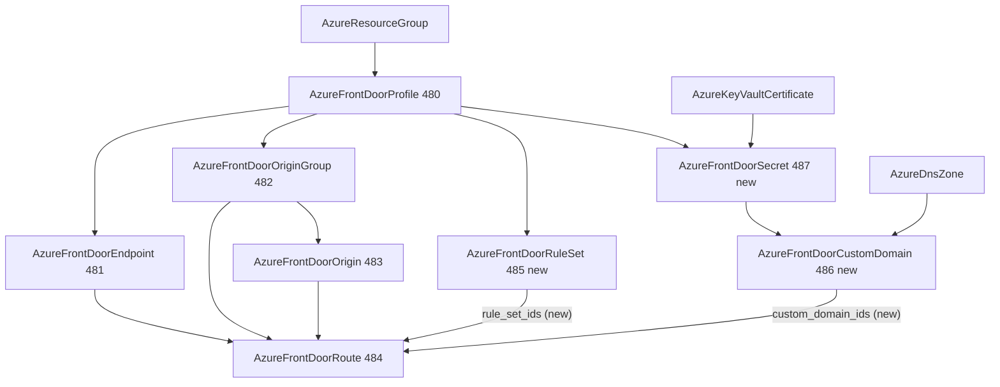

# Azure Front Door Delivery Policy: Rule Set, Custom Domain, and Secret Kinds + Route Reference Retrofit

**Date**: July 8, 2026
**Type**: Feature
**Components**: Azure Provider, API Definitions, Pulumi CLI Integration, IAC Stack Runner, Testing Framework

## Summary

The Azure Front Door family gains its delivery-policy layer: three new
kinds -- `AzureFrontDoorRuleSet` (485), `AzureFrontDoorCustomDomain`
(486), and `AzureFrontDoorSecret` (487) -- and the
`AzureFrontDoorRoute` spec gains the two reference seams that were
recorded as deferred when the traffic core shipped (`rule_set_ids`,
`custom_domain_ids`). A Front Door deployment can now answer on its own
hostnames with managed or bring-your-own TLS and apply edge delivery
policies (redirects, security headers, per-request cache and origin
overrides) shared across routes.

## Problem Statement / Motivation

The Front Door traffic core (profile, endpoint, origin group, origin,
route) serves traffic only on generated `*.azurefd.net` hostnames with
per-route static configuration. Production deployments need three
things the family lacked:

- **Custom hostnames with TLS** -- every real site serves its own
  domain; wildcards and EV/OV certificates need a bring-your-own
  certificate node with a sane rotation story.
- **Edge delivery policy** -- HTTPS upgrades, security-header
  baselines, cache overrides for `/api/*` vs fingerprinted assets, and
  canary origin steering, written once and attached to many routes.
- **The route's deferred seams** -- `rule_set_ids` and
  `custom_domain_ids` were recorded skips pending these kinds.

## Solution / What's New

### AzureFrontDoorRuleSet (485, `azfdrs`)

The ordered edge delivery policy. The RULES fold inside the set (they
form one ordered document; nothing references an individual rule;
routes attach the whole set), modeling the full azurerm surface of
`cdn_frontdoor_rule_set` + `cdn_frontdoor_rule`:

- All **19 condition types** through one shared 13-value operator enum
  with per-condition vocabulary subsets (WILDCARD is url-path-only,
  GEO_MATCH/IP_MATCH are address-only); Equal-only conditions carry no
  operator field (a one-value knob is a constant); closed wire
  vocabularies (methods, HTTP/TLS versions, ports, device classes)
  stay strings with `in`-list validations.
- All **5 action types**, with redirect/rewrite/override as SINGULAR
  fields so the provider's only-once contracts are structural, and the
  provider's ~20 expand-time validators front-loaded as CELs
  (condition/action caps, redirect XOR rewrite, operator↔match-values,
  header-action value pairing, the override's full cache/forwarding
  matrix, the `d.HH:MM:SS` duration grammar, fold-derived unique rule
  names).
- One deliberately-shared protocol enum maps to TWO ARM dialects
  (redirect `Http`/`Https` vs override `HttpOnly`/`HttpsOnly`) --
  documented at both module map sites.

### AzureFrontDoorCustomDomain (486, `azfdcd`)

The ownership-proven hostname node with the two-step lifecycle: deploy
(pending validation, `validation_token` exported), then publish the
token as a `_dnsauth.<host_name>` TXT record. Models the provider's
FQDN contract, the optional `AzureDnsZone` reference, managed vs
customer certificates (secret reference CEL-paired both directions),
the managed-cert 64-char/no-wildcard CustomizeDiff contracts, and the
full cipher-suite block (predefined TLS12_2022/TLS12_2023 sets or
CUSTOMIZED with the provider's ECDHE-RSA allowlist and the
both-TLS 1.3-suites rule). The minimum TLS version is a recorded skip:
after Azure's TLS 1.0/1.1 retirement the provider accepts exactly one
value, so both modules send the constant `TLS12`.

### AzureFrontDoorSecret (487, `azfdsec`)

The bring-your-own certificate node wrapping an
`AzureKeyVaultCertificate` -- by its `versionless_id` output by default
(Front Door follows the latest version; Key Vault rotation propagates
with zero redeploys) or the versioned id to pin. Fully immutable
(azurerm exposes no update), which is safe because rotation lives in
Key Vault. The provider's nested one-choice `secret{customer_certificate}`
wrapper is flattened to a single field. Two apply-time contracts are
documented on the spec and taught by docs/presets: the one-time
`Microsoft.AzureFrontDoor-Cdn` service-principal Key Vault grant, and
Azure's live-verified rejection of self-signed certificates (the chain
must carry at least two certificates -- CA-issued only).

### AzureFrontDoorRoute retrofit

`rule_set_ids` and `custom_domain_ids` land at their semantic positions
with the spec renumbered contiguously; the previously-deferred
`link_to_default_domain` contract is now a real CEL (disabling the
default domain requires at least one custom domain); both modules
normalize empty collections to absent (Front Door's
empty-means-disassociate quirk); the
`cdn_frontdoor_custom_domain_association` verdict is fully realized --
no cycle exists across decomposed kinds, so the route's own field IS
the attachment and no association construct exists anywhere.

## Implementation Details

- Both engines per kind: Terraform on `azurerm ~> 4.0` with the
  canonical empty provider block; Pulumi classic v6 on the shared
  `pulumiazureprovider.Get` builder. The rule set's TF module fans
  rules out via `for_each` keyed on spec-unique names; Pulumi creates
  one `cdn.FrontdoorRule` per rule (evaluation position is the rule's
  own `order`, so creation order carries no meaning).
- E2E: three new ARM verifiers; the harness Setup gains a second
  idempotent tenant bootstrap (instantiate the Front Door service
  principal + grant "Key Vault Secrets User" at the subscription
  scope); a new route scenario (`rule-set-attach`) proves the
  delivery-policy seam through a scenario-declared rule-set fixture;
  the secret's scenario composes the vault -> certificate chain as an
  extra fixture.
- 107 new spec tests (65/30/12) plus the route's extended cases;
  `pkg/outputs` conformance ×3 new kinds; site catalog regenerated.
- The secret's live deferral exposed an enforcement gap: E2E profile
  status was advisory inside a full-provider suite run (a documented
  deferral still FAILED the suite). Every provider test runner
  (azure/aws/auth0/kubernetes) now loads the component's E2E profile
  and skips non-green components with the profile's `deferred_reason`
  in the skip message -- the profile is now binding at both the CI
  matrix layer and the test-runner layer.

## Validation

- **Offline gate fully green**: spec tests ×4 kinds, chunked
  `buf generate` (remote-plugin degradation workaround), kind-map +
  gazelle regen, targeted + release-equivalent builds ×4,
  `make build-go`, Bazel trees ×4, `secret-coverage --check` (no new
  secret-bearing fields -- certificate REFERENCES are not material),
  `validate-refs --check` (5 new FK edges), `pkg/outputs`, full
  `planton tofu plan` ×4 hack manifests rendering every enum seam
  (both protocol dialects verified in plan output), 8 presets + all
  E2E manifests validate, audits ×3 at 100% Fully Complete PARITY ✅
  COVERAGE ✅ (incl. the apply-time validator source-diff section) +
  the route audit addendum.
- **Live dual-engine E2E: 8/10 green, ~4.5 h suite** (test
  subscription, all 8 phases each, zero orphans -- final sweep: no
  resource groups, no vaults, empty recycle bin, no profiles):
  - Route minimal 28m04s (pulumi) / 26m20s (terraform) -- the
    retrofitted modules re-proven on the composed five-kind chain.
  - Route rule-set-attach 25m55s / 26m12s -- the `rule_set_ids` seam
    live through a six-fixture chain.
  - Rule set minimal 21m10s / 23m40s -- the three-rule policy
    (redirect, security headers, caching override).
  - Custom domain minimal 22m29s / 23m46s -- pending-validation proof;
    all four outputs incl. `validation_token` populated.
  - **Secret ×2 DEFERRED on live evidence**: both engines hit ARM's
    identical content validator -- `BadRequest: "The certificate chain
    includes an invalid number of certificates. The number of
    certificates should be at least 2."` Azure rejects SELF-SIGNED
    certificates for Front Door BYO TLS, and the test tenant cannot
    mint a CA-issued one. The runs still proved the fixture chain, the
    service-principal bootstrap (the request passed authorization and
    reached content validation), the module's request shape, and clean
    teardown. Recorded in the E2E profile with the unblock path
    (import a CA-issued chain into the fixture vault; the scenario
    runs unchanged).

## Impact

An Azure org can now compose the complete production Front Door story
declaratively: custom hostnames with hands-off TLS rotation, edge
delivery policies shared across routes, and canary/cache/security
behaviors applied at the edge -- with both IaC engines behaviorally
identical and every reference seam a typed, validated foreign key. The
CDN sub-band stands at 480-487; the Front Door WAF pair (488-489)
completes the family.

## Related Work

- Front Door traffic core decomposition (2026-07-08) -- the profile
  rework and the four kinds these policies attach to.
- Key Vault trio (2026-07-04) -- `AzureKeyVaultCertificate`, whose
  versionless id is the secret kind's rotation seam.

---

**Status**: ✅ Production Ready
