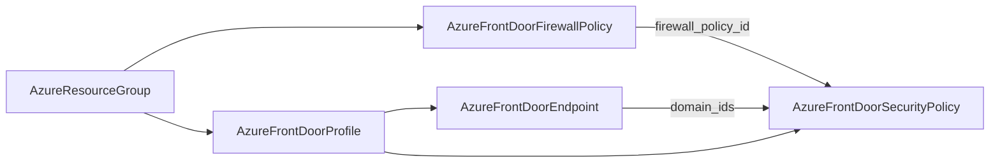

# Azure Front Door Edge Security: Firewall Policy and Security Policy Kinds

**Date**: July 8, 2026
**Type**: Feature
**Components**: Azure Provider, API Definitions, Provider Framework, Testing Framework

## Summary

Front Door's edge-security pair ships, completing the Front Door family: `AzureFrontDoorFirewallPolicy` (488) models the Front Door WAF -- custom match/rate-limit rules, Microsoft's managed rule sets on Premium, and log scrubbing -- and `AzureFrontDoorSecurityPolicy` (489) is the association that attaches that WAF to the endpoint and custom-domain hostnames a profile serves. A WAF policy enforces nothing until a security policy associates it; together the two kinds close the enforcement loop for every Front Door deployment. Both engines run at 100% behavioral parity through the shared Azure provider builder, and both kinds are live-proven end to end on Pulumi and OpenTofu.

## Problem Statement / Motivation

The Front Door family (profile, endpoint, origin group, origin, route, rule set, custom domain, secret) could serve and shape traffic but not protect it. Azure's edge WAF is a DIFFERENT ARM type than the regional Application Gateway WAF already in the catalog (`Microsoft.Network/frontDoorWebApplicationFirewallPolicies` -- global, resource-group-scoped, its own sku and rule vocabulary), so kind 427 could not be reused, and without the security-policy association there was no way to turn any WAF on for Front Door traffic.

### Pain Points

- No OWASP-class protection, rate limiting, or bot management for Front Door deployments
- The two-resource enforcement model (policy + association) is a real Azure adoption gotcha -- a policy alone silently protects nothing
- The sku pairing rules (WAF sku must match profile sku; Premium-only managed rules and challenges) live in scattered Azure validators

## Solution / What's New

### `AzureFrontDoorFirewallPolicy` (enum 488, `azfdwaf`)

The full azurerm v4.80 surface of `azurerm_cdn_frontdoor_firewall_policy`:

- **Policy settings**: Detection/Prevention mode (required -- the provider has no default here), enabled, request-body inspection, redirect URL, block-response customization (closed 15-value status-code set, base64 body), user tags. No `region` field -- the resource is global.
- **Premium challenge lifetimes**: the JS-challenge and CAPTCHA solved-cookie lifetimes (5-1440 min). Azure always enables both policies on Premium, so both engines send the value-or-30 there and never on Standard.
- **Custom rules** (<= 100): match and rate-limit types, 6 actions (incl. the Premium-only JSChallenge/CAPTCHA), match conditions over 9 request variables with 12 operators, up to 5 transforms, negation, and the keyed-variable selector.
- **Managed rules** (<= 100, Premium only): type/version as documented open strings (Azure ships new sets server-side), the 3-value set action, exclusions at all three scopes (set/group/rule), group overrides with per-rule overrides (<= 1000) carrying the 7-value action vocabulary.
- **Log scrubbing**: 7 match variables (a superset of the profile's access-log trio), Equals/EqualsAny with the selector pairing contracts.

Around 10 CELs front-load the provider's CustomizeDiff and expand-time validators: the three Standard-sku gates, the DefaultRuleSet/Microsoft_DefaultRuleSet version pairing, the anomaly-scoring action gates on 2.0+ sets, the JSChallenge-only-on-bot-manager rule, and the scrubbing operator/selector contracts. Recorded skips: ARM's `groupBy` rate-limit grouping (absent from the azurerm schema -- neither engine can express it) and the classic-Front-Door `frontend_endpoint_ids` read-back.

### `AzureFrontDoorSecurityPolicy` (enum 489, `azfdsecpol`)

The enforcement seam, modeled flat: `profile_id` FK, provider-exact name, `firewall_policy_id` FK to the new kind, and `domain_ids` (1-500 mixed endpoint/custom-domain references -- Azure accepts both interchangeably). The provider's triple-nested one-item blocks are TF ergonomics for a one-choice ARM union and are deliberately not mirrored. `patterns_to_match` is a constant (`/*` is the only value the service accepts); the pulumi bridge flattens that one-item list to a singular string -- same ARM payload, dialect documented in both modules. The Standard-100/Premium-500 domain cap and the WAF-sku-must-match-profile-sku pairing are cross-resource and stay apply-time, documented in both kinds.

### Composition

## Implementation Details

- Registry: 488 `prerequisites: [AzureResourceGroup]` (the policy is RG-scoped, not a profile child); 489 `prerequisites: [AzureFrontDoorEndpoint, AzureFrontDoorFirewallPolicy]` -- direct parents only, the profile transits through the endpoint (the route kind's precedent).
- Both Pulumi modules build their provider through the shared `pulumiazureprovider` builder (static secret, keyless web identity, or ambient chain) -- migration now 35 of ~58 Azure modules.
- E2E: verifiers ×2 (generic ARM GetByID -- the firewall policy pins its own `Microsoft.Network` frontdoor API version `2025-03-01`, since the CDN family's `2024-02-01` does not serve that RP; the security policy reuses the family pin), 4 runner entrypoints, a firewall-policy install fixture (STANDARD, matching the fixture profile's sku), and three scenarios.
- 51 spec tests across the pair (happy paths on both tiers + an error path per CEL).

## Validation (what ran and passed)

- **Offline**: spec tests 40+11 ALL PASS; chunked `buf generate` (the remote-plugin degradation persisted; documented workaround) + full-tree Java compile gate + gazelle; kind-map regen; targeted + release-equivalent builds ×2; `make build-go`; Bazel trees ×2; `secret-coverage --check` (no secret-bearing fields); `validate-refs --check` (3 new FK edges); `pkg/outputs` conformance ×2; full `planton tofu plan` ×2 hack manifests (the Premium depth and the mixed domain shapes rendered); 5 presets + all E2E manifests validate; audits ×2 at **100% Fully Complete, PARITY ✅ COVERAGE ✅** with the apply-time validator source-diff sections; site catalog regen (2 new slugs).
- **Live** (test subscription `8158df85-…`): **6/6 scenario runs green** -- firewall policy minimal 168s/161s and premium-managed-rules 124s/149s (both engines; no profile fixture, so no 18-minute tax), security policy composed chain RG → profile → endpoint + WAF policy → association 1361s/1463s (all 8 phases; the profile fixture's ~18-minute delete dominates). Zero-orphan sweep: zero resource groups, zero Front Door profiles, zero WAF policies.
- **Live finding fixed in-session**: Azure rejected the bot-manager override fixture with `"The following managed rule IDs are not supported: 300700"` -- bot-manager rule IDs carry a `Bot` prefix (`Bot300700`) while default-rule-set IDs are bare numerics. Fixed across scenario/preset/hack/test, re-run green on both engines; the ID-shape lesson now lives in the spec comment, the kind docs, and `e2e/README.md` (vendor-catalog IDs: look them up via the live catalog API, never infer).

## Impact

- The Front Door family (480-489) is COMPLETE: traffic serving, delivery policy, TLS, and now edge security -- a Front Door deployment composes end to end from first-class Planton kinds.
- One WAF policy is shareable across many profiles' security policies; per-hostname protection tiers compose by pairing different policies with different domain lists.

## Related Work

- Front Door traffic core (2026-07-08): profile rework + endpoint/origin-group/origin/route forges
- Front Door delivery policy (2026-07-08): rule set + custom domain + secret forges, route retrofit
- Regional WAF policy (2026-07-04): the Application Gateway WAF -- a different ARM type, deliberately not shared

---

**Status**: ✅ Production Ready
