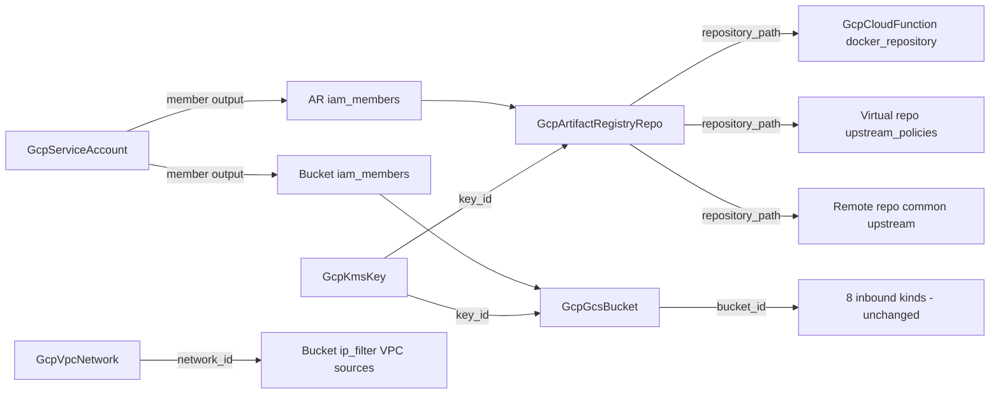

# GCP Artifact Registry Repository and GCS Bucket Depth Rebuild with Full Parity

**Date**: July 8, 2026
**Type**: Enhancement
**Components**: GCP Provider, API Definitions, IAC Stack Runner, Testing Framework

## Summary

`GcpArtifactRegistryRepo` and `GcpGcsBucket` now stand at the released
Terraform google provider 6.x floor with 100% cross-engine behavioral
parity, additive-only IAM, and their first live dual-engine E2E coverage.
The Artifact Registry kind sheds its bundled reader/writer service
accounts and exported key material (the catalog's last
secret-material-in-state module) and gains the full three-mode surface —
standard, remote pull-through cache, and virtual aggregation — with
cleanup policies, CMEK, and self-composing repository references. The
bucket sheds the catalog's last authoritative IAM surface, gains the full
released storage floor (autoclass, soft delete, dual-region placement,
turbo replication, hierarchical namespace, network-layer IP filtering),
and its `force_destroy` is now an honest, default-false spec decision
instead of a hardcoded true.

## Problem Statement / Motivation

Both kinds predated the current catalog bar. The Artifact Registry
repository was the shallowest spec in the GCP catalog — 4 fields against
a ~3,100-line provider resource — and the bucket, though richer, carried
parity and philosophy defects in every layer.

### Pain Points

- **Secret material in state**: the AR module silently created reader and
  writer service accounts and exported their JSON keys base64-encoded in
  stack outputs — hidden resources, key material in both engines' state,
  and a design that contradicts the keyless-first catalog.
- **A Docker-only naming assumption**: both engines hardcoded a
  `-docker` repository suffix and `-docker.pkg.dev` hostnames regardless
  of format, so NPM/Maven/Python repositories got wrong registry URLs.
- **Missing 90% of the floor**: no repository modes (remote/virtual), no
  cleanup policies, no CMEK, no immutable tags, no Maven policy, no
  vulnerability-scanning control, no user labels.
- **Authoritative IAM on the bucket**: `iam_bindings` clobber grants they
  do not list — two charts touching the same role fight each other. The
  catalog's doctrine is additive-only grants.
- **A destroy-safety inversion**: the bucket hardcoded
  `force_destroy = true` in both engines — destroying any bucket silently
  erased its data. The safe posture (fail on non-empty) was inexpressible.
- **Cross-engine label drift**: the bucket's Terraform module stamped
  legacy unprefixed label keys while Pulumi stamped `planton-ai_*` — the
  same manifest produced differently labeled buckets per engine.
- **Stale-shape classes**: hardcoded `6.19.0` provider pins,
  `object({value})` Terraform ref typing, placeholder `Pulumi.yaml`
  names, no API enablement, no ambient-project fallback (AR), stale
  AWS-copy README content, and outputs that matched neither the proto
  contract nor the sibling engine.
- **Zero validation infrastructure**: no E2E verifier/scenarios/test
  entrypoints for either kind (the bucket existed only as another kind's
  prerequisite), no `pkg/outputs` conformance cases.

## Solution / What's New

### GcpArtifactRegistryRepo (600)

- **Spec rebuilt to the released floor**: `repository_id`
  (metadata.name fallback — the format-derived suffix is gone),
  provider-authentic `location`, ambient `project_id`, free-string
  `format` (the enum was a staleness trap: missing APT, saying KUBEFLOW
  where the API takes KFP), `mode` with four mode↔config coherence CEL
  rules, `description`, user `labels`, `kms_key_name` → GcpKmsKey,
  `docker_config.immutable_tags`, `maven_config`, `cleanup_policies`
  (DELETE/KEEP + most_recent_versions + dry-run, KEEP-coherence CEL),
  `remote_repository_config` (all seven upstream arms under an
  exactly-one CEL; upstream credentials as a Secret Manager
  secret-version REFERENCE — no material in spec or state),
  `virtual_repository_config` (self-kind FKs), and
  `vulnerability_scanning_enablement`.
- **Outputs contract reworked** (zero inbound FKs existed — verified):
  `name`, `repository_path` (the composition key other resources
  consume), `registry_uri` (constructed identically on both engines —
  released 6.x exports no URI attribute), `location`.
- **Additive IAM members** with the GcpServiceAccount `member`-output
  FK shape and optional IAM conditions; public access is
  `allUsers` + reader role, never a flag.
- **FK ripple**: `GcpCloudFunction.docker_repository` now defaults to
  this kind's `repository_path`.

### GcpGcsBucket (606)

- **Spec completed to the released floor** (fields renamed to the
  catalog grain: `project_id`, `labels`; outputs untouched so all 8
  inbound consumer kinds are safe): explicit default-false
  `force_destroy`, `autoclass` (+ terminal class + CEL guard against
  SetStorageClass rules), complete `lifecycle_rules` (all three actions,
  all conditions, optional-presence ints so an explicit 0 is
  expressible), `soft_delete_policy` (0-to-disable), WORM retention with
  irreversible-lock semantics taught in comments,
  `custom_placement_config` (dual-region), `rpo` (turbo replication),
  `hierarchical_namespace_enabled`, `enable_object_retention`,
  `default_event_based_hold`, and `ip_filter` — the network-layer
  allowlist (public CIDR ranges + VPC networks as GcpVpcNetwork FKs)
  evaluated before IAM, schema-probe-verified present on the released
  6.50.0 line.
- **Authoritative `iam_bindings` → additive `iam_members`** (same
  role + member-ref + condition shape as the AR kind and
  GcpProjectIamMember).
- **Outputs extended** (extend-only): `bucket_name`, `url`,
  `self_link`, `location`, `project_number` alongside the preserved
  `bucket_id`.

### Both kinds, both engines

`google ~> 6.0` float, API enablement with `disable_on_destroy=false`,
ambient project, identical user-beneath-platform `planton-ai_*` label
merges, flattened converter-contract Terraform variables, canonical
`Pulumi.yaml`, bridged `deletion_policy` pinned DELETE with a PARITY
comment (AR), rich authoring comments, canonical `iac/hack/` manifests,
rewritten timeless docs (the AR Pulumi README's phantom multi-repo
design and the bucket TF README's AWS DynamoDB copy-paste are gone),
three presets each (AR: standard docker + cleanup, remote Docker Hub
cache, virtual aggregation; bucket: private standard, static website,
data-lake autoclass), registry `prerequisites: [GcpServiceAccount]`.

## Implementation Details

- The AR `registry_uri` is constructed as
  `{location}-{format}.pkg.dev/{project}/{repo}` on both engines because
  the released 6.x provider exports no URI attribute; the E2E verifier
  cross-checks the live value.
- Bucket lifecycle explicit-zero semantics ride the provider's
  `send_*_if_zero` virtual fields, driven identically from the spec's
  optional-presence ints on both engines.
- The E2E harness gained a typed `artifactregistry/v1` client (present
  in the pinned google-api line — no REST probe needed) and an AR
  verifier asserting format/mode posture, label parity, and the
  name↔path relationship; the bucket verifier graduated from
  existence-only to posture assertions (labels + live location), making
  the closed Terraform label drift a permanently guarded live regression.

## Validation

- Offline (all green): 55 + 61 spec tests; per-kind Go +
  release-equivalent Pulumi builds; `tofu init/validate`; offline
  `planton tofu plan` through the real converter ×3 (both hack
  manifests + a dedicated ip_filter manifest, output inspected);
  `secret-coverage --check`; `validate-refs --check`;
  `validate-outputs` on all four module dirs; first `pkg/outputs`
  conformance cases for both kinds; every preset, hack manifest, and
  (token-substituted) E2E manifest through a freshly built
  `planton validate`.
- **Live dual-engine E2E on `planton-e2e`: 8/8 green, zero orphans**
  (AR docker-standard with cleanup policies + live SA-member FK chain
  ~79-94s, AR remote-docker-hub pull-through ~53-80s; bucket minimal +
  features with versioning/lifecycle/autoclass ~51-93s — re-proven both
  engines after the ip_filter addition). Virtual aggregation proven
  offline (needs a second AR instance — the one-manifest-per-
  prerequisite-kind limitation).
- Audits: both kinds **Fully Complete — PARITY ✅**
  (`docs/audit/2026-07-08-143000.md` per kind). Site catalog
  regenerated (slugs moved to `artifact-registry-repository` and
  `cloud-storage-bucket`; cross-links swept, one stale source link
  fixed).

## Impact

- **Anyone composing GCP CI/CD or storage**: repositories and buckets
  are now honest composable nodes — a Cloud Function references its
  build repository, a virtual repository aggregates per-team repos, a
  bucket's access is additive grants that never clobber, and destroy
  semantics fail safe by default.
- **The catalog's security posture**: the last module exporting service
  account key material is gone; the GCP secret-coverage baseline stays
  empty.
- **Chart authors (end-of-phase wave)**: the AR spec renames
  (`region` → `location`, `repoFormat` → `format`) and the bucket's
  `gcpProjectId`/`gcpLabels` → `projectId`/`labels` renames leave
  `charts/gcp/cloud-run-environment` and bucket-composing charts
  temporarily stale — accepted and expected; the chart wave sweeps them
  against the final catalog.

## Related Work

- Follows the KMS pair, Cloud Tasks/Scheduler, and Vertex AI depth
  rebuilds (July 2026) — same released-floor + parity + live-E2E bar.
- The additive-IAM shape follows `GcpProjectIamMember`; the free-string
  enum-staleness fix follows `GcpKmsKey.purpose` and
  `GcpCloudFunction.runtime`.

---

**Status**: ✅ Production Ready
