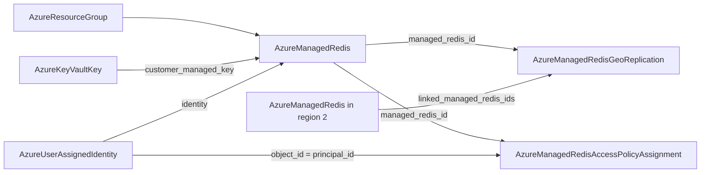

# Azure Managed Redis Family: Cluster, Geo-Replication, and Access Grant Kinds

**Date**: July 8, 2026
**Type**: Feature
**Components**: Azure Provider, API Definitions, Provider Framework, Testing Framework

## Summary

The Azure Managed Redis family ships as three kinds, opening the 510-519 sub-band: `AzureManagedRedis` (510) models the Redis Enterprise successor to the retiring classic Azure Cache for Redis -- the cluster plus its 1-to-1 default database, with the capabilities the classic service never had (Redis modules, customer-managed-key encryption, a keyless-by-default posture); `AzureManagedRedisGeoReplication` (511) links instances into ACTIVE (multi-primary) geo-replication groups; and `AzureManagedRedisAccessPolicyAssignment` (512) is the Entra data-plane grant that, with keys off by default, is how clients connect at all. Both engines run at 100% behavioral parity through the shared Azure provider builder.

## Problem Statement / Motivation

Azure is retiring classic Azure Cache for Redis, and ARM already rejects new Premium classic-cache creations region by region with "Azure Cache for Redis is retiring, create Azure Managed Redis instance instead" (verified live during the classic Redis family's geo-replication testing). The catalog's classic kinds (431, 437-439) remain the right surface for existing fleets, but the catalog had no answer for a NEW production Redis deployment on Azure.

### Pain Points

- No deployable kind for the service Azure itself directs new Redis workloads to
- The classic kinds cannot express Managed Redis capabilities: Redis modules (search, JSON, bloom, time series), CMK encryption, active multi-primary geo-replication, or the keyless-by-default authentication posture
- Managed Redis inverts classic Redis's security default (keys OFF unless enabled), so without the grant kind a default deployment would be unreachable

## Solution / What's New

### `AzureManagedRedis` (enum 510, `azmredis`)

The full azurerm v4.80 surface of `azurerm_managed_redis` -- the cluster and its default database folded 1-to-1, exactly as Azure maps them:

- **Sizing**: the closed 44-value SKU vocabulary (BALANCED B0-B1000, COMPUTE_OPTIMIZED X3-X700, MEMORY_OPTIMIZED M10-M2000, FLASH_OPTIMIZED A250-A4500), mapped row-by-row to ARM's `Balanced_B0`-style wire values in both engines (mechanically diffed: identical). Azure validates in-place SKU changes against the live instance; disallowed changes replace it.
- **Cluster posture**: high availability (default true, the zone-redundant SLA), public network access (Private Link is the only isolation mechanism -- no VNet injection, no IP firewall), CMK encryption (VERSIONED `AzureKeyVaultKey.key_id` + the wrapping user-assigned identity, which must also ride the identity block -- an ARM pairing enforced at apply), user tags.
- **The Redis process** (`default_database`, required -- Azure rejects a database-less cluster): keyless-first access keys (default OFF), TLS posture, clustering policy (OSS/Enterprise/None), the 8-value eviction vocabulary, up to 4 modules with args, geo-replication group membership, and AOF ("1s") XOR RDB (1h/6h/12h) persistence.

Ten CELs mirror the provider's CustomizeDiff validators: the geo-replication B3+ SKU floor, the geo module allowlist (RediSearch/RedisJSON only), the RediSearch pairing rules (NoEviction + EnterpriseCluster, checked against the EFFECTIVE defaulted policies), the persistence exclusivity and geo conflicts, module-name validity and uniqueness, and the identity ids-match-type contract.

Recorded skips with re-enable triggers: `minimum_tls_version` (the provider accepts exactly one value and hardcodes it -- a one-value knob is a constant), ARM's `deferUpgrade`/writable `port`/`redisVersion`/`redundancyMode` (in the ARM API but expressible by neither engine), the flush-databases action (imperative), and the module `version` read-back.

### `AzureManagedRedisGeoReplication` (enum 511, `azmredisgeo`)

Active geo-replication group membership: the managing member plus 1-4 linked members (groups of five), every member accepting writes with conflict-free merge semantics. Modeled as its own kind for the provider's own reason -- linking mutates EVERY member's replication state out of band, so membership cannot honestly be a property of any single instance. ONE resource manages the whole group; deleting it unlinks (nothing is deleted), and removing a single ID evacuates just that region. The self-link and distinct-member contracts are documented rather than CEL'd (the members are `StringValueOrRef`s, and message-level CEL cannot dereference a ref's sub-fields).

### `AzureManagedRedisAccessPolicyAssignment` (enum 512, `azmredisgrant`)

The Entra data-plane grant closing the keyless posture: the instance FK plus the principal `object_id` (defaulting to `AzureUserAssignedIdentity.principal_id`, with the principal-vs-client-id trap called out). Managed Redis exposes exactly one built-in policy ("default") which the provider hardcodes, and Azure names the assignment after the object ID -- so the kind carries exactly the two fields that are genuinely configuration, with the constants recorded.

### Composition

## Implementation Details

- Registry: the new Managed Redis sub-band 510-519; the cluster declares `prerequisites: [AzureResourceGroup]`; the two children deliberately declare none (clusters are expensive scenario-local E2E fixtures; deploy ordering flows from the references) -- documented in the registry comment.
- Both Pulumi modules build their provider through the shared `pulumiazureprovider` builder -- migration now 38 of ~61 Azure modules. The bridge (pulumi-azure v6.38) covers all three resources field-for-field: zero PARITY-EXCEPTIONs beyond the family-wide tag-shape note.
- E2E: verifiers ×3 -- the cluster and grant on the generic ARM GetByID at the family's `2025-07-01` API pin, and the geo-replication verifier STATE-AWARE in a new way: the group has NO ARM object at all (create links, destroy unlinks), so the verifier reads the managing database's `properties.geoReplication.linkedDatabases` and requires the association genuinely established on verify-exists and collapsed on verify-absent. Scenarios ×3 (cluster minimal with keys enabled to prove the key outputs; the grant chain through a scenario-local KEYLESS cluster + the fixture identity; the two-region B3 geo pair); 6 runner entrypoints; `pkg/outputs` conformance ×3.
- The classic Redis family's docs now point at the successor by kind name.
- 52 spec tests across the family (every SKU family, both persistence methods, geo floor and allowlist paths, CMK, identity models; an error path per CEL).

## Validation (what ran and passed)

- **Offline**: spec tests 40/7/5 ALL PASS; chunked `buf generate` (the remote-plugin degradation persisted; the documented `--path` workaround) + full-tree Java compile gate + gazelle; kind-map regen; targeted + release-equivalent builds ×3; `make build-go`; `secret-coverage --check` (the CMK field is a key reference, not key material; the access keys are prose-documented secret-bearing OUTPUTS); `validate-refs --check` (7 new FK edges resolve); `pkg/outputs` ×3; full `planton tofu plan` ×3 hack manifests (the M10 SKU mapping, Disabled public access, CMK block, EnterpriseCluster/NoEviction, three modules with args, RDB persistence, a three-member geo group, and the grant all rendered); 7 presets + 9 E2E/hack manifests validate; audits ×3 at **100% Fully Complete, PARITY ✅ COVERAGE ✅** with apply-time validator source-diff sections; site catalog regen (3 new slugs).
- **Live E2E: deferred by owner decision, recorded in all three E2E profiles.** Managed Redis clusters provision and delete in tens of minutes (the provider budgets 45/30 minutes), so the dual-engine suite exceeds the pre-approved live-E2E window; the components stand on their green offline gates, and the scenarios run unchanged once a live window is approved. The geo-replication scenario additionally needs the suite's most expensive fixture pair (two B3 clusters in different regions).

## Benefits

- The catalog now has an answer for every new Redis deployment on Azure -- the service Azure itself directs users to, with the retirement guidance wired across both Redis families' docs
- The keyless posture is the DEFAULT: a preset-following user deploys a cache with no secret anywhere, granted per identity
- Capabilities beyond classic Redis become composable nodes: CMK against the existing Key Vault key kind, write-anywhere geo-replication as a first-class linkable group

## Impact

Three new Azure kinds (510-512); no changes to existing kind contracts (the classic Redis family's docs gained successor cross-references only). No release is cut; the kinds accumulate on the Azure rework branch.

## Related Work

- The classic Redis family (431, 437-439) -- remains the surface for existing fleets; its geo-replication testing surfaced the retirement that motivated this family
- The Key Vault key kind (425) -- the CMK seam this family consumes
- The shared Azure Pulumi provider builders -- adopted by all three modules

---

**Status**: ✅ Production Ready (offline gate; live E2E deferred by owner decision, scenarios ship ready-to-run)
