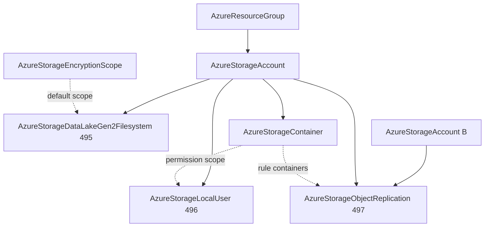

# Azure Storage Data Services Remainder: ADLS Gen2 Filesystem, SFTP Local User, and Object Replication

**Date**: July 8, 2026
**Type**: Feature
**Components**: Azure Provider, API Definitions, Provider Framework, Testing Framework

## Summary

Three new Azure kinds close out the storage family's data services:
`AzureStorageDataLakeGen2Filesystem` (495) — the analytics data-lake
namespace unit with root-path POSIX ACLs, `AzureStorageLocalUser` (496)
— the SFTP credential identity with per-container permission scopes and
secret-bearing sid/password outputs, and `AzureStorageObjectReplication`
(497) — the two-account asynchronous blob replication policy. All three
ship dual-engine (OpenTofu + Pulumi on the shared provider builder) at
100% behavioral parity, with live dual-engine E2E green across all six
runs.

## Problem Statement / Motivation

The reworked `AzureStorageAccount` deliberately dissolved its bundled
children into first-class kinds, and the storage family had three
recorded gaps left:

- **Data lakes**: analytics estates (Spark, Databricks, Synapse) address
  data as `abfss://{filesystem}@{account}` and separate zones (raw,
  curated, gold) as filesystems with distinct access postures — no kind
  modeled the filesystem, its root POSIX ACL, or its RBAC grant scope.
- **SFTP exchange**: partners and legacy pipelines that only speak SFTP
  reach blob storage through local users — each partner an isolated
  credential identity with its own container grant. No kind modeled the
  user, so the SFTP surface the account spec already exposes
  (`sftp_enabled`) had no credential story.
- **Blob DR/distribution**: cross-region disaster recovery and
  read-local fan-out need rule-driven replication between two accounts —
  previously deferred because it spans a resource pair.

## Solution / What's New

### AzureStorageDataLakeGen2Filesystem (enum 495, `azadlsfs`)

- Parent by ARM id; azurerm's exact name contract (`$root` or lowercase
  alnum/hyphen 3-63, no leading hyphen) as CEL
- Root-path POSIX access control: `owner`/`group` (Entra object ID or
  `$superuser`), `aces` with closed scope (ACCESS/DEFAULT) and type
  (USER/GROUP/MASK/OTHER) enums, `[r-][w-][x-]` permissions, and the
  mask/other-take-no-qualifier contract — all mirroring the provider's
  data-plane validators
- `default_encryption_scope` as a reference to
  `AzureStorageEncryptionScope.encryption_scope_name`
- The `filesystem_id` output carries the CONSTRUCTED ARM container-proxy
  id (`{account}/blobServices/default/containers/{name}`) — ADLS
  filesystems surface in ARM as blob containers, and that proxy id is
  what data-plane role assignments scope to; the provider's own resource
  id is a dfs URL nothing management-grain can consume

### AzureStorageLocalUser (enum 496, `azslu`)

- At-least-one auth method and the keys-iff-key-auth create contract as
  CELs; OpenSSH public-key format validation up front
- Permission scopes flatten the provider's one-item `permissions`
  wrapper to five booleans; `resource_name` references
  `AzureStorageContainer.container_name` (file shares via explicit
  valueFrom to `AzureStorageShare.share_name`)
- Outputs include the composed `sftp_username` (`{account}.{user}`) and
  the secret-bearing `sid` + Azure-generated `password` (returned
  exactly once; regenerates when password auth flips off and on —
  documented on the field)

### AzureStorageObjectReplication (enum 497, `azsor`)

- Both accounts and both sides of every rule as references; rules
  bounded 1-1000 with azurerm's exact `copy_blobs_created_after`
  vocabulary (OnlyNewObjects / Everything / RFC 3339) as CEL
- The prefix filter is named `prefix_match` after ARM's own INCLUDE
  semantics (the provider attribute's "filter_out" name reads as the
  opposite; both modules document the mapping)
- One kind IS the two-sided pair Azure materializes on both accounts;
  outputs carry both per-account ARM ids plus the shared `policy_id`
  GUID parsed identically on both engines
- Recorded skip: azurerm's `metrics_enabled` is not bridged by
  pulumi-azure v6.38 — a one-engine-only input would ship silent-drop
  divergence, so the field waits on the bridge (trigger recorded)

## Implementation Details

- Full four-proto anatomy per kind, registry entries in the storage-data
  sub-band, kind-map regen, gazelle regen
- Both engines from day one: TF on `azurerm ~> 4.0` with the canonical
  empty provider block; Pulumi classic v6 via the shared
  `pulumiazureprovider.Get` builder (keyless-auth safe)
- Known deploy-time failure classes applied at authoring time: Computed
  optionals presence-guarded (filesystem owner/group/scope, local-user
  home directory), proto defaults presence-guarded
  (`copy_blobs_created_after`), no one-way flags or irregular
  vendor-constant casing in these vocabularies
- E2E: three verifiers on the generic ARM GetByID (the filesystem rides
  the blob-container proxy — no data-plane client, no new SDK deps; the
  replication verifier keys on the destination-side id, the
  authoritative copy); scenario-local account fixtures throughout (the
  globally-unique-name convention), incl. the replication scenario's
  two-account + two-container chain proving name-aware multi-instance
  resolution

## Validation

- Offline (all green): spec tests 21/17/15 covering every CEL error
  path; targeted + release-equivalent builds ×3; `make build-go`; Bazel
  component trees ×3; `secret-coverage --check` (Azure stays 100%);
  `validate-refs --check` (9 new FK edges); `pkg/outputs` conformance
  ×3; full `planton tofu plan` ×3 hack manifests rendering every enum
  and CEL seam; 7 presets + 10 E2E/hack manifests validate; parity
  audits ×3 at 100% Fully Complete, PARITY ✅ COVERAGE ✅, each with the
  apply-time validator source-diff section; site catalog regen (3 new
  slugs)
- Live dual-engine E2E (test subscription): **all six runs green** —
  filesystem 234s Pulumi / 260s TF (root ACL + properties through the
  dfs data plane, ARM-proxy verify), local user 235s/285s (both auth
  methods, 6/6 outputs incl. the generated password, container-grant FK
  live), object replication 410s/415s (the composed two-account
  four-fixture chain, Everything backfill + prefix filter). The
  filesystem's first TF attempt failed on a local Pulumi FILE-BACKEND
  state loss (several fixture stacks of that one scenario reported "no
  stack named" at once — including one already deployed and verified);
  an identical re-run passed end to end, and the failure class is now
  documented in `e2e/README.md`. Zero-orphan sweep after the suite:
  no resource groups, no storage accounts.

## Impact

- The Azure storage family is complete: account + container + share +
  queue + table + encryption scope + filesystem + local user + object
  replication — every recorded follow-up from the account's
  decomposition is closed (the blob inventory policy's fold-class
  verdict stays with the account spec's next touch, as recorded)
- Data-lake, SFTP-exchange, and blob-DR architectures compose entirely
  from first-class referenceable nodes

## Related Work

- The `AzureStorageAccount` depth rework and container forge
- The storage data services wave (share/queue/table/encryption scope)
- The shared Azure Pulumi provider builders (keyless auth)

---

**Status**: ✅ Production Ready
