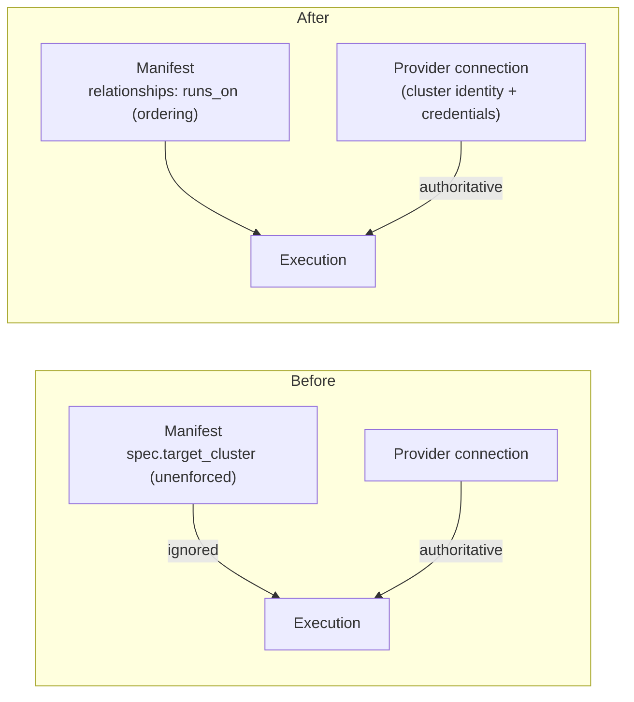

# Remove the target_cluster Selector from Every Kubernetes Kind

**Date**: July 9, 2026
**Type**: Breaking Change
**Components**: API Definitions, Kubernetes Provider, Manifest Processing, IAC Stack Runner, InfraCharts, Documentation

## Summary

The `KubernetesClusterSelector target_cluster` field is gone from all 69 Kubernetes kind specs, along with every trace of it across the repository: the shared `target_cluster.proto` type, the tofu generator skip rule that existed only to drop it, the dead Terraform variable blocks, the chart template stanzas, and ~150 documentation pages. Cluster targeting is the Kubernetes provider connection's job — the manifest never had an enforceable say, so the field was a second voice that could silently disagree with the connection actually used. Specs, charts, and docs now read as if the field never existed. The obsolete per-kind `docs/audit/` snapshots (134 files across every provider) were removed in the same pass.

## Problem Statement / Motivation

Every Kubernetes kind spec carried `KubernetesClusterSelector target_cluster = 1` — a declaration of which cluster the resource should land on. It had three structural defects:

- **Unenforced and divergent.** The credential a deployment actually uses comes from the Kubernetes provider connection resolved at execution time (explicit slug → annotation → environment/org default). Nothing validated the manifest's `target_cluster` against that connection, so the two could disagree and the connection silently won — the manifest lied.
- **Closed-world coupling.** The selector's `cluster_kind` enum whitelisted Planton-created cluster kinds, structurally excluding bring-your-own clusters, and it was a provider-only divergence: no other provider's kinds name their host in spec.
- **Redundant for ordering.** Its one real job — a DAG edge from addon to cluster — is already served by `metadata.relationships` (`runs_on`), which every environment chart declares.

The proto half of the removal (spec edits, deleted `target_cluster.proto`, regenerated stubs) had already landed, leaving `go vet`, `go test`, and `buf generate` broken against dozens of files that still referenced the deleted type. This change completes the removal end to end and returns the repository to green.

## Solution / What's New

- **Protos**: all 69 kind specs plus the permanent `_test` kind carry no `target_cluster` field, no `reserved` placeholder, and no prose references. This system has no external consumers yet, so no compatibility ceremony is carried — field 1 is simply absent. Stubs regenerated for every language.
- **Spec tests**: 61 test files stripped of the deleted type; test contexts that existed only to exercise the selector were removed whole.
- **Tofu generators** (`pkg/iac/tofu/generators/`): the `KubernetesClusterSelector` skip rule is deleted; the skip mechanism itself remains (still used by `ValueFromRef`) and its test now exercises the mechanism via an injected rule instead of the dead type. The manifest-module generator also now emits a version-pinned `required_providers` block, converging the generator with the shape every committed module already had.
- **Terraform modules**: dead `target_cluster = optional(object({...}))` blocks removed from 12 hand-written `variables.tf`; the 14 generated CRD-projection modules regenerated (comment-only diffs).
- **Charts**: all 54 addon templates across the 6 Kubernetes environment charts (`aws`, `azure`, `gcp`, `digital-ocean`, `civo`, `scaleway`) drop the `targetCluster` stanza. Addons in the five non-AWS charts that relied on it as their only (or namespace-less) spec content now declare explicit `namespace` / `createNamespace` values matching the AWS chart's proven shapes — fixing two validation-failure classes (`field spec is nil`, `spec.namespace: value is required`) across 45 templates.
- **Dev fixtures**: 8 `iac/hack/manifest.yaml` smoke-test manifests cleaned.
- **Docs**: ~110 apis-tree docs (READMEs, catalog pages, iac READMEs), 41 site catalog docs, the deployment-components concept page, and the protodefaults README rewritten timelessly. All 134 dated `docs/audit/` snapshots deleted repo-wide (obsolete point-in-time QA artifacts).

## Implementation Details

- `apis/dev/planton/provider/kubernetes/*/v1/spec.proto` — field and placeholder removal; doc comments rewritten (the Istio/Gateway "flattened after the Planton namespaced envelope" comments now name only `namespace`).
- `pkg/iac/tofu/generators/typerules.go` — skip-rule entry deleted; `flatten_test.go` reshaped to `TestFlatten_SkipRule_RemovesField` (injects a `ContainerEnv` skip rule, proving the mechanism without the dead type); selector-specific cases dropped from `tfvars_test.go`, `variablestf_test.go`, `manifest_tfvars_test.go`, `typerules_test.go`.
- `pkg/iac/tofu/generators/manifestmodule.go` — generated `locals.tf` comment text no longer narrates the dropped field; `manifestProviderTF` emits pinned `required_providers` (hashicorp/kubernetes `~> 2.35`).
- `pkg/iac/pulumi/pulumimodule/labels/labelkeys/label_keys_test.go` — stale expectations updated in passing (`planton_org_*` → `planton_dev_*`, tracking the `planton.dev` label domain).

## Validation

- `go test ./apis/...` — 407 packages, all green.
- `go test ./pkg/iac/tofu/...`, `./pkg/iac/pulumi/pulumimodule/labels/...` — green.
- `make build` — full gate green (buf lint + stub regen + Java stub compile + gazelle + `go vet` + CLI build + e2e matrices).
- `planton validate-refs --check`, `planton secret-coverage --check`, `planton e2e discover --provider aws` — green.
- `planton chart validate --all charts/aws` — 12/12 pass (the CI gate). `digital-ocean` 2/2 and `civo` 1/1 now pass; `azure/aks-environment`, `gcp/gke-environment`, and `scaleway/kapsule-environment` have zero addon-manifest failures remaining.
- Residue grep for `target_cluster|targetCluster|KubernetesClusterSelector` — matches only in `_changelog/` history and the unrelated upstream Strimzi CRD field.

### Known pre-existing failures (documented, not introduced here)

- `TestAwsProviderTfConvergence` (`pkg/iac/stackinput/providerenvvars`) fails at HEAD: the guard expects 71 AWS `provider.tf` files but the rebuilt AWS catalog has 89, and `awsec2instance`/`awsecscluster` wire `region` into their provider blocks. This belongs to the AWS catalog effort's in-flight work.
- Chart validation failures in `azure`, `gcp`, `scaleway`, `alicloud`, `hetznercloud`, `oci`, and `openstack` charts stem from chart-vs-proto drift in non-addon manifests (e.g. `AzureAksNodePool` enum default mismatch, `GcpGkeCluster` required fields) that predates this change; none reference the removed field.

## Impact

Manifest authors stop writing a field that never did what it claimed; the Kubernetes provider connection is now the single voice for cluster targeting, and bring-your-own clusters are no longer structurally excluded by a kind whitelist. DAG ordering is unchanged — every environment chart already declared `runs_on` relationships. This is a breaking change for any manifest still carrying `spec.targetCluster`: the field is rejected as unknown. Charts in this repository are already updated; external manifests simply delete the stanza.

## Related Work

- `2026-07-09-181500-import-id-recipes-and-roundtrip-proof.md` — the commit that carried the proto half of this removal into history.
- `2026-07-09-120000-platform-keys-move-from-labels-to-annotations.md` — the unreleased breaking `pkg/iac` change that ships in the same next tag.

---

**Status**: ✅ Production Ready
