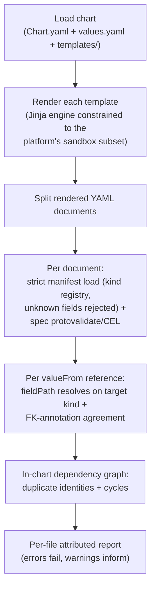

# GCP Chart Catalog Rebuild Opener + Offline Chart Validation in the CLI

**Date**: July 9, 2026
**Type**: Feature
**Components**: CLI Commands, Manifest Processing, Provider Framework, GCP Provider, Infra Charts, Build System

## Summary

The GCP infra-chart catalog is being rebuilt from scratch: the nine legacy
`charts/gcp/*` charts are deleted and replaced by a redesigned catalog of
real-world architecture charts, starting with the two state-backend charts
(`terraform-state-backend`, `pulumi-state-backend`). To make chart quality
enforceable offline, the CLI gained a new `planton chart validate` command
that renders a chart with its default values and validates every manifest and
every `valueFrom` reference against the protos compiled into the binary — no
control plane needed. A chart authoring standard
(`_rules/charts/author-planton-infra-chart.mdc`) encodes the design method,
per-file quality bar, and the platform's sandboxed template contract for
every provider's charts.

## Problem Statement / Motivation

### Pain Points

- The GCP charts were authored against long-gone component schemas: every one
  of them failed validation against the current specs (renamed fields,
  restructured messages, retired kinds). Reworking them file-by-file would
  have preserved compositions that no longer represent how the rebuilt
  components are meant to compose.
- Chart validation previously required the platform's server-side
  `chart build` — which validates against the control plane's compiled
  protos, not the working tree's. During a schema-rebuild cycle the two
  diverge, leaving chart authors with no gate at all until a release ships.
- The most dangerous chart defect class was invisible offline: a `valueFrom`
  whose `fieldPath` names a real output in the wrong format (self-link vs
  name vs id). Component modules encode the proven composition key in their
  foreign-key annotations, but nothing checked chart references against them.
- There was no written standard for what makes a chart worth shipping or what
  its files must contain — each chart re-invented its own bar.

## Solution / What's New

### `planton chart validate <chart-dir>`

```bash
# Validate a chart with its defaults
planton chart validate charts/gcp/terraform-state-backend

# Exercise a feature toggle's non-default arm
planton chart validate charts/gcp/terraform-state-backend \
  --set kmsEnabled=true --set gcp_project_number=123456789012

# Every chart in the tree (builds the CLI from the working tree)
cd charts && make validate
```



The checks, in order:

1. **Template subset**: source scan rejects the tags and filters the
   platform's sandboxed Jinjava renderer disables (`set`, `include`,
   `import`, `macro`, `call`, `do`; `attr`, `map`, `sort`, `shuffle`), so a
   chart that renders offline cannot fail server-side on a banned construct.
   Rendering binds every param top-level and under `values`, always binds
   `org`/`env`, and registers `bool` and `b64decode` filters with the
   platform's semantics.
2. **Strict schema**: every rendered document goes through the CLI's
   canonical manifest loader (kind registry lookup, protojson with unknown
   fields rejected, proto field defaults) plus the spec's full
   protovalidate/CEL rule set; `metadata.name` is required as the resource's
   dependency-graph identity.
3. **Reference integrity**: every `valueFrom` must name a kind (explicitly or
   via the field's `default_kind` annotation) and a field path that resolves
   against that kind's actual proto surface (via the reference-integrity
   analyzer's newly exported `refcheck.ResolveRefPath`). **Overriding an
   annotated composition key is an error**: when a field's annotation says
   the contract is `status.outputs.key_id` and a chart references
   `status.outputs.key_name` on the same kind, that is the id/name/self-link
   format-mismatch class that otherwise only surfaces at deploy time.
   References to resources the chart does not define are warnings (they
   resolve from the environment at deploy time).
4. **Graph honesty**: duplicate (kind, name) identities and dependency cycles
   among chart-internal references are errors.

The command lives in the standalone binary's command set (like `e2e`),
deliberately outside the engine-embedding seam: the Planton Platform CLI
mounts its own `chart` command tree (`build`, `publish` against the control
plane), and server-side `chart build` remains the authoritative pre-publish
gate — this command is the fast offline equivalent for authoring loops and CI.

### The chart authoring standard

`_rules/charts/author-planton-infra-chart.mdc` now encodes, timelessly and
for every provider: the catalog design method (a chart must be a recognizable
real-world architecture, remove genuinely hard wiring, deploy from its
defaults, and teach — and each provider's catalog is designed from that
provider's own architecture space, never from another provider's chart
list), the per-file quality bar, the template-language contract above, and
the `valueFrom` discipline. `charts/README.md` carries the summary;
`_rules/charts/build-and-fix-planton-infra-charts.mdc` gained a "Phase 0:
validate offline first" section; `charts/Makefile` gained `make validate`.

### The GCP catalog rebuild — first wave

All nine legacy GCP charts are deleted (their compositions predate the
rebuilt component schemas). The redesigned catalog lands wave by wave; this
change ships the state backends — the charts platform adopters use to
bootstrap the bucket their IaC state lives in:

| Chart | What it deploys |
|-------|-----------------|
| `gcp/terraform-state-backend` | Hardened GCS backend for Terraform/OpenTofu state: versioning with bounded noncurrent history, uniform bucket-level access, enforced public-access prevention, explicit 7-day soft delete; optional CMEK arm (key ring + 90-day-rotating key + the Cloud Storage service-agent grant); optional dedicated state-access service account (keyless by default, optional key export) with additive bucket IAM |
| `gcp/pulumi-state-backend` | The same hardened storage posture for Pulumi's DIY GCS backend, plus the Pulumi-specific teaching: `pulumi login gs://…`, and the secrets passphrase contract (what it encrypts, why it must never change out of band, how it relates to CMEK) |

The slugs are renamed from `terraform-backend`/`pulumi-backend` to say what
the charts actually provision — a state backend, matching the platform's
`StateBackend` resource their READMEs teach users to register.

Both charts carry inline template comments to the same bar as spec-proto
field comments (why each posture, its trade-offs, what to change), fully
documented typed params, and READMEs that close the after-deploy loop.
Validation is green on every toggle arm of both charts.

## Implementation Details

- **`pkg/infrachart`** — chart loading (`Chart.yaml`, typed `values.yaml`
  params mirroring the platform's param contract, recursive template
  discovery), rendering (gonja v2 constrained to the documented subset;
  custom `bool` filter with Java `Boolean.parseBoolean` semantics;
  `b64decode`), document splitting, per-document strict validation reusing
  `internal/manifest`, reference walking over populated
  `StringValueOrRef.value_from` fields with FK-annotation reads, in-chart
  dependency graph with cycle detection, and a per-file attributed report.
  22 unit tests cover the renderer subset, param typing/overrides, and every
  error/warning class end to end.
- **`pkg/refcheck/resolve.go`** — exports `ResolveRefPath(kind, path)` so
  chart validation resolves reference paths through the same single source of
  truth the annotation analyzer uses.
- **`cmd/planton/root/chart/validate.go` + `cmd/planton/root/chart.go`** —
  the cobra wiring, `--set`/`--org`/`--env` flags, colored per-file report,
  non-zero exit on errors.
- **`apis/dev/planton/provider/_test/testcloudresourcegeneric/v1/spec.proto`**
  — the permanent generic test kind gained `annotated_ref` carrying the full
  foreign-key annotation pair (self-referential, resolving against its own
  stack outputs), giving FK-reading machinery a hermetic fixture that never
  moves with production resource shapes.
- **Two AWS chart READMEs** lost one sentence each: they hyperlinked deleted
  GCP charts (dead links after the deletion; the sentences were also
  cross-provider design references the chart standard now rules out).
- **Site stats** regenerated from the tree (42 charts, 444 components).

## Benefits

- Chart schema drift is now caught at authoring time, offline, against the
  exact working-tree protos — previously impossible before a release.
- The id/name/self-link reference class — repeatedly found only in live runs
  during component work — is now a static, offline error for charts.
- Every future chart, on every provider, inherits one written standard and
  one gate; community chart authors get the same `chart validate` command.
- The state-backend bootstrap path for adopters is a first-class, taught
  experience instead of a bare bucket.

## Impact

- **Chart authors** (internal and community): new command, new Makefile
  target, new authoring rule.
- **GCP chart users**: the legacy GCP charts are gone; the redesigned catalog
  lands wave by wave on this branch line and ships with the next release.
  Platform catalogs seeded from earlier releases keep their existing rows
  until then.
- **Other providers' charts**: unchanged (a tree-wide `make validate` census
  shows most legacy charts failing offline against current schemas — the same
  drift class the GCP charts had; each provider's catalog rebuild addresses
  its own).

## Related Work

- The GCP component catalog rebuild (this branch line) — the frozen component
  schemas these charts compose.
- The reference-integrity analyzer (`pkg/refcheck`) and `validate-refs` — the
  annotation contract the new FK-agreement check enforces on charts.

---

**Status**: ✅ Production Ready
