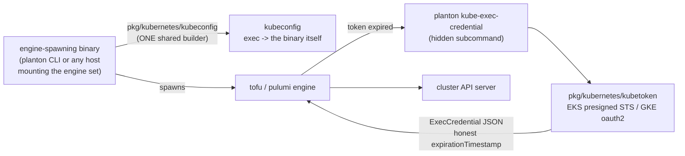

# EKS Credentials via the Standard ExecCredential Protocol

**Date**: July 9, 2026
**Type**: Feature
**Components**: Kubernetes Provider, API Definitions, IAC Stack Runner, Pulumi CLI Integration, CLI Commands

## Summary

EKS Kubernetes connections now work end to end: the previously empty
`KubernetesProviderConfigAwsEks` carries real cluster identity and AWS
credentials, and both deploy engines (OpenTofu/Terraform and Pulumi) reach the
cluster through the Kubernetes-standard ExecCredential protocol served by the
Planton binary itself. The three 2022-era hand-rolled kubeconfig exec-plugin
templates — which referenced helper binaries built nowhere in the repo and
passed secrets as process arguments — are deleted; GKE migrates onto the same
seam, and DigitalOcean DOKS connections (previously failing at env-var
loading) now pass through their static kubeconfig.

## Problem Statement / Motivation

EKS API-server tokens are presigned STS `GetCallerIdentity` URLs that expire
within ~15 minutes and are validated per request. A static token embedded in a
kubeconfig dies mid-way through any long Helm install. The Kubernetes-standard
answer is the ExecCredential protocol: the kubeconfig names a command the
kubernetes/helm providers re-invoke whenever the current token expires, with
an honest `expirationTimestamp` driving the refresh.

### Pain Points

- `KubernetesProviderConfigAwsEks` and the EKS arms in both engines were
  stubs: the tofu path returned an empty kubeconfig, the pulumi path returned
  the literal string `"coming-soon"`.
- The GKE kubeconfig template exec'd a phantom binary
  (`/usr/local/bin/kube-client-go-gcp-exec-plugin`) that no build produces,
  and passed the base64-encoded service-account key in **argv** — visible to
  every process on the host via `ps`.
- Three copies of hand-rolled kubeconfig templates (EKS, GKE, AKS) drifted
  independently under `pkg/iac/pulumi/pulumimodule/provider/`.
- A DOKS connection failed at provider env-var loading despite carrying a
  complete, valid kubeconfig.

## Solution / What's New

Three new packages under `pkg/kubernetes/`, one concept each:

- **`kubetoken`** — in-process token sources. EKS: presigned STS
  `GetCallerIdentity` with the `x-k8s-aws-id` signed header, `k8s-aws-v1.` +
  base64url encoding, expiry reported as now+14m (aws-iam-authenticator
  semantics). GKE: OAuth2 access token minted from a service-account key
  (token endpoint overridable, so the exchange is fully offline-testable).
  No cloud CLI is ever shelled out to.
- **`execcredential`** — the protocol: the
  `client.authentication.k8s.io/v1` JSON emitter, the hidden
  `kube-exec-credential` cobra command, and the environment-variable contract
  constants shared with the kubeconfig builder so the two ends cannot drift.
  All inputs arrive via environment — never argv.
- **`kubeconfig`** — the ONE shared builder both engines use: exec arms for
  `aws_eks` and `gcp_gke`, static passthrough for `digital_ocean_doks`, an
  explicit "not supported" error for `azure_aks` (previously a silent empty
  kubeconfig). Kubeconfigs are rendered from typed structs, never string
  templates, so field values cannot inject YAML structure.

### The credential command is the binary itself

No new artifact ships. The `kube-exec-credential` subcommand is mounted in the
engine command set (`cmd/planton/root.RegisterCommands`), so the standalone
CLI and every host binary that embeds the engine serve their own kubeconfig
exec entries:

- **Tofu path** (`providerenvvars`): the kubeconfig is rendered in the
  spawning binary, so the exec command is `os.Executable()` directly.
- **Pulumi path**: the kubeconfig is rendered inside the module process, which
  cannot know the host binary's path — the host advertises it via
  `PLANTON_KUBE_CREDENTIAL_COMMAND` (set in `pulumistack.Run` beside the
  stack-input env var). If the contract is absent, the builder fails with an
  error naming the variable — never a silently wrong binary.

### Credential handling

Credential material rides the kubeconfig's exec `env:` entries (the standard
client-go mechanism). Static AWS keys use the SDK's standard names
(`AWS_ACCESS_KEY_ID`, ...) so the ambient credential chain inside the minter
picks them up with zero plumbing; when the connection carries no static keys,
no credential entries are emitted at all and the process's own ambient chain
(profile, environment, instance role) signs the token — the local-desktop
mode. The kubeconfig file is written at 0600, matching the stack-input
discipline.

## Implementation Details

- `apis/dev/planton/provider/kubernetes/provider.proto`:
  `KubernetesProviderConfigAwsEks` gains `cluster_name`, `cluster_endpoint`,
  `cluster_ca_data`, `region` (required) and optional
  `access_key_id`/`secret_access_key`/`session_token` with the same CEL
  format rules as `AwsProviderConfig` (skipped when empty, so ambient-chain
  configs validate).
- `pkg/iac/stackinput/providerenvvars/kubernetes.go`: rewritten on the shared
  builder; still exports the kubeconfig under both `KUBECONFIG` (Pulumi) and
  `KUBE_CONFIG_PATH` (tofu). The DOKS arm now works on this path.
- `pkg/iac/pulumi/pulumimodule/provider/kubernetes/pulumikubernetesprovider/provider.go`:
  rewritten on the shared builder; the getter's signature is unchanged, so the
  ~70 kubernetes kind pulumi modules calling it need zero edits. The
  kubernetes kinds' Terraform modules already ship empty
  `provider "kubernetes" {}` blocks resolved from env vars, so they are
  untouched too.
- Deleted outright: `pulumiekskubernetesprovider`,
  `pulumigkekubernetesprovider`, `pulumiakskubernetesprovider` (the 2022
  templates; their only consumer was the getter above).
- `golang.org/x/oauth2` becomes a direct dependency (GKE token minting).

## Testing

New offline suites prove the seam without any live cloud:

- EKS token shape: prefix, base64url payload, region-scoped STS host,
  `Action=GetCallerIdentity`, `x-k8s-aws-id` in the signed headers, honest
  now+14m expiry, secret key never present in the URL, session token carried
  as `X-Amz-Security-Token`. Presigning is pure local signing, so the whole
  suite runs offline.
- GKE token: full JWT-exchange loop against a local fake token endpoint with
  a generated RSA key.
- ExecCredential JSON conformance (apiVersion, kind, RFC3339 timestamp, UTC
  normalization).
- Kubeconfig builder: per-arm shape assertions, the **no-secrets-in-argv**
  invariant, ambient mode emitting no credential entries, exec arms rejecting
  an empty credential command, DOKS byte-for-byte passthrough, AKS loud
  failure.
- `providerenvvars`: EKS arm (0600 file, exec command = the test binary
  itself) and DOKS arm on the tofu path.
- End-to-end through the real binary:
  `planton kube-exec-credential` with static env credentials emits a valid
  `client.authentication.k8s.io/v1` document.

Gates run and green: `go test ./pkg/kubernetes/...`, the touched
`providerenvvars` tests, `make build` (protos, gazelle, vet, CLI build, e2e
matrices), `planton validate-refs --check`, `planton secret-coverage --check`.
(The pre-existing `TestAwsProviderTfConvergence` failure in `providerenvvars`
belongs to the in-flight AWS-catalog convergence work and is unrelated.)

## Impact

- EKS Kubernetes connections become deployable by both engines, with tokens
  that refresh mid-operation instead of 401-ing during long Helm installs.
- GKE deployments stop depending on a phantom helper binary and stop exposing
  the service-account key in process arguments.
- DOKS connections work on the tofu path for the first time.
- Hosts that embed the engine command set inherit the credential seam with
  zero additional work.

## Related Work

- `2026-07-09-204031-remove-target-cluster-selector-from-kubernetes-kinds.md`
  — the connection track is now the sole authority for cluster targeting;
  this change makes that track actually able to reach EKS.
- `2026-07-06-152816-gcp-keyless-external-credentials-array-wire-shape.md` —
  the same no-secrets-in-argv discipline applied to GCP keyless auth.

---

**Status**: ✅ Production Ready
