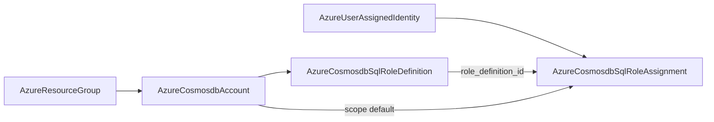

# Cosmos SQL Data-Plane RBAC Pair: Role Definition + Role Assignment

**Date**: July 9, 2026
**Type**: Feature
**Components**: Azure Provider, API Definitions, IaC Modules, E2E Framework

## Summary

Forged the Cosmos DB SQL (NoSQL) API data-plane RBAC pair —
`AzureCosmosdbSqlRoleDefinition` (504) and `AzureCosmosdbSqlRoleAssignment`
(505) — filling enum slots beside the existing Cosmos children (500–503).
Both kinds ship with dual-engine parity on the shared Azure provider builder,
100% parity audits, and live dual-engine E2E green on all four entrypoints.

## Problem Statement / Motivation

Cosmos DB keyless auth requires Entra principals to hold Cosmos **data-plane**
roles — a separate RBAC system from ARM. ARM role assignments (kind 461) cannot
grant SQL API data access. Azure ships built-in Data Reader/Contributor roles
plus custom role definitions scoped at account/database/container granularity.

### Pain Points

- No Planton surface for defining custom Cosmos SQL roles or binding them to
  managed identities / principals
- Composed environments could not express least-privilege container-scoped
  grants as first-class, referenceable resources

## Solution / What's New

### AzureCosmosdbSqlRoleDefinition (504)

- Parent FK: `cosmosdb_account_id` (ARM id); RG/account parsed on both engines
- Required `assignable_scopes` (repeated StringValueOrRef, default → account id)
- Required `permissions[].data_actions` (Cosmos allow-only RBAC)
- Optional pinned `role_definition_id` GUID; closed role type enum
- Output `role_definition_id`: fully-scoped ARM id for zero-translation assignment FK

### AzureCosmosdbSqlRoleAssignment (505)

- FK defaults: `principal_id` → UAI `principal_id`; `scope` → account id;
  `role_definition_id` → definition output (or built-in literal id)
- Pulumi apply-time guard on resolved role-definition-id format
- Built-in Data Contributor/Reader assignable by well-known GUID literals

### E2E + Framework

- Verifiers reuse `cosmosdbAPIVersion = "2024-08-15"` rbacs paths
- Scenario-local SQL accounts (`westus3`, distinct names per scenario)
- Assignment composed chain proves all three FK seams on both engines
- `e2e/README.md`: pulumi-azure SqlRoleAssignment UUID + 24-char logical
  name constraint documented for future forges

## Impact

- **Product / UX**: Operators can define custom Cosmos SQL roles and grant them
  to identities through the catalog — the missing piece for keyless Cosmos workloads.
- **Maintainability**: Matches azurerm v4.80 field-for-field; explicit Pulumi UUID
  generation prevents a class of silent autonaming failures.
- **Architecture**: Fills 504–505 in the Cosmos 500–509 sub-band; Mongo RBAC
  deferred to its own plan time.

## Validation

- Offline: spec tests, `make build-go`, secret-coverage, validate-refs,
  outputs conformance, tofu plans, audits ×2 at 100%
- Live E2E: 4/4 green (definition Pulumi/Terraform, assignment Pulumi/Terraform)
- Zero orphan sweep clean
