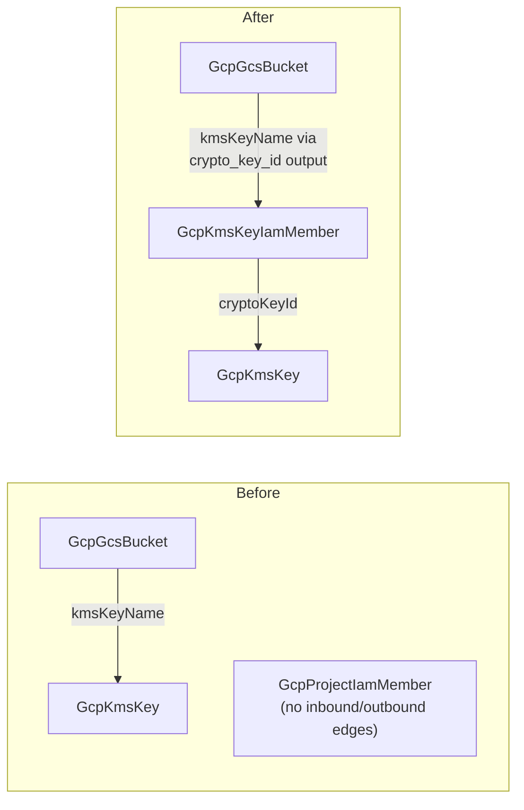

# GCP Charts Adopt Resource-Scoped IAM Grants: Key-Scoped CMEK Ordering + Optional Deployer Impersonation

**Date**: July 10, 2026
**Type**: Enhancement
**Components**: GCP Provider, Infra Charts, Chart Authoring Rule

## Summary

The three shipped GCP infra-charts now compose the resource-scoped IAM grant
kinds. Both state-backend charts replace their project-scoped CMEK grant with
a key-scoped `GcpKmsKeyIamMember` and chain the bucket's `kmsKeyName` through
the grant's `crypto_key_id` output — the permission is now a real dependency
edge, so a first CMEK-enabled deploy can no longer race IAM propagation. The
GitHub Actions keyless deployer gains an optional impersonation arm: a
dedicated deployer `GcpServiceAccount` plus an account-scoped
`GcpServiceAccountIamMember` (`roles/iam.workloadIdentityUser`) for the GitHub
principal, for workflows that need a real service-account identity.

## Problem Statement / Motivation

Two gaps were documented when the state-backend and foundation charts shipped:

- **CMEK grants were project-scoped with no ordering edge.** The Cloud
  Storage service agent's `cryptoKeyEncrypterDecrypter` grant rode a
  `GcpProjectIamMember` (key-scoped IAM was not yet a first-class node), so
  the agent could use every key in the project, and nothing ordered the
  bucket after the grant — first CMEK deploys could fail on IAM propagation
  and carried a documented "re-run it" caveat in both charts.
- **The impersonation hop was inexpressible.** No kind modeled SA-level IAM,
  so the keyless deployer could only bind roles directly to the federated
  principal. Direct federation is the right default, but some workflows need
  a real service-account identity (signed URLs / signBlob, domain-wide
  delegation, tools that only accept a service-account email, org policies
  that forbid granting roles to federated principals).

`GcpServiceAccountIamMember` and `GcpKmsKeyIamMember` closed both gaps as
components; this change makes the charts consume them.

## Solution / What's New

### State backends: the permission becomes a dependency

In `terraform-state-backend` and `pulumi-state-backend` (`encryption.yaml` +
`state-bucket.yaml`):

- The storage-agent grant is now `GcpKmsKeyIamMember` — `cryptoKeyId`
  references the in-chart key by its annotated composition key; the member
  stays the literal GCP-created service agent
  (`service-<project_number>@gs-project-accounts.iam.gserviceaccount.com`).
  Least privilege: the agent can use exactly this key and nothing else in
  the project.
- The bucket's `kmsKeyName` references the grant (`kind:
  GcpKmsKeyIamMember`, `fieldPath: status.outputs.crypto_key_id` — the
  grant's outputs echo the resolved key path precisely for this). Deployment
  now orders ring → key → grant → bucket, and the "if the first deploy loses
  the race to IAM propagation, re-run" caveat is deleted from both templates
  and both READMEs (tables, mermaids, and deployment-order narratives
  updated).

### Keyless deployer: the optional impersonation arm

New `impersonationEnabled` (default `false`) and
`deployer_service_account_id` (default `gha-deployer`) params, and a new
`deployer-identity.yaml` template:

- A `GcpServiceAccount` that exists to BE impersonated — it holds nothing by
  itself; the deploy roles bind to it.
- A `GcpServiceAccountIamMember` granting `roles/iam.workloadIdentityUser`
  on that account to the same GitHub `principalSet://` the direct posture
  uses (account-scoped, never project-wide — a project-level grant would
  allow impersonating every account in the project).
- With the arm on, the per-role `GcpProjectIamMember` grants and the
  Artifact Registry writer grant bind to the account's `member` output (a
  bare `valueFrom` on the annotated composition key, which also orders the
  grants after the account); with it off, everything binds directly to the
  federated principal exactly as before.
- README gains a "Direct federation vs impersonation" section (direct stays
  the recommended default), the impersonation variant of the
  `google-github-actions/auth` step (`service_account:` line), and a day-2
  note that flipping the toggle rebinds the grants and requires the matching
  workflow change. `Chart.yaml`'s catalog description mentions the arm.

### Chart authoring rule uplift

The provider-agnostic `_rules/charts/author-planton-infra-chart.mdc` gains a
`valueFrom`-discipline bullet: **turn required permissions into ordering
edges** — when a resource only works if an IAM grant is already effective,
reference the grant (whose outputs echo its resolved inputs) instead of the
granted-on resource, so the dependency graph deploys the consumer after the
permission exists instead of documenting "re-run if the first deploy fails."

## Validation

- `planton chart validate` (CLI built from the working tree) green on **19
  runs**: both state backends × 5 arms each (defaults; CMEK; CMEK without
  the SA; SA off; everything-on with key export), the deployer × 8 arms
  (defaults; impersonation; impersonation + org-wide; registry off;
  impersonation + registry off; single- and triple-role lists; org-wide
  direct), and untouched `project-foundation`.
- Tree-wide `charts/ make validate` census: 12/44 pass with **all four GCP
  charts passing** (the 32 failures remain other providers' pre-existing
  schema drift, owned by their own catalog rebuilds).
- One validation catch during authoring: the deployer account's description
  exceeded the spec's 256-character cap — caught offline by the chart gate,
  trimmed.
- Both consumed kinds were live dual-engine E2E-proven when they were
  forged; this change adds composition only, no module or proto changes.

## Impact

- **CMEK state backends deploy deterministically**: the first deploy
  succeeds because the bucket cannot be created before its service agent
  can use the key — an operational caveat class removed structurally, and
  the grant no longer hands the agent every key in the project.
- **The deployer chart now covers the identity-required CI cases** without
  weakening its default: direct federation remains the recommended posture,
  and the arm's single account-scoped grant keeps the impersonation blast
  radius to exactly one account.
- **Every provider's chart wave inherits the ordering-edge idiom** through
  the authoring rule.

## Related Work

- `2026-07-10-003303-gcp-resource-scoped-iam-grant-pair.md` — the two kinds
  these charts now compose.
- `2026-07-09-231753-gcp-project-foundation-and-github-keyless-deployer-charts.md`
  — the deployer chart this extends.
- `2026-07-09-220939-gcp-chart-catalog-rebuild-opener-and-offline-chart-validation.md`
  — the state-backend charts and the offline gate used here.

---

**Status**: ✅ Production Ready
