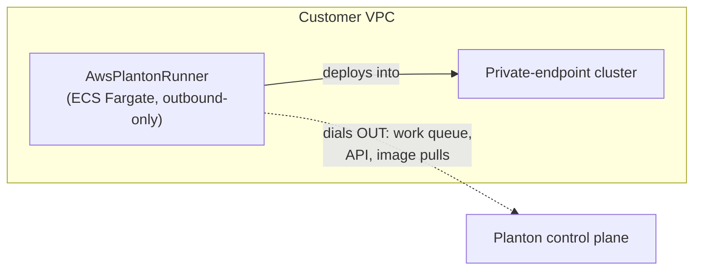

# AwsPlantonRunner: A Standing Runner Appliance on ECS Fargate

**Date**: July 10, 2026
**Type**: Feature
**Components**: API Definitions, AWS Provider, Pulumi CLI Integration, IAC Stack Runner, Testing Framework

## Summary

A new AWS deployment component, `AwsPlantonRunner`, deploys a standing
Planton runner appliance inside a customer's VPC on ECS Fargate: an
always-on, outbound-only worker that executes deploy operations and cloud
operations from within the network. This is the piece that makes
private-endpoint targets — most notably Kubernetes clusters whose API
endpoints are unreachable from the internet — deployable and operable with
zero inbound network exposure. The component ships the full anatomy (four
protos, both IaC engines at behavioral parity, docs, presets, its own live
E2E lane) and was proven live on both engines with clean create → verify →
destroy runs.

## Problem Statement / Motivation

Some infrastructure is reachable only from inside the network. The
canonical case is a Kubernetes cluster with a private API endpoint — the
production security posture, and simultaneously the reason no hosted
runner fleet can deploy into it. Teams solve this today with hand-run
agents on pet VMs or bespoke per-team IaC, both of which rot: unpatched
hosts, plaintext credentials on disk, and no day-2 story.

### Pain Points

- Private-endpoint clusters cannot be deployed to or operated by anything
  outside the VPC — no initial installs, no upgrades, no destroys.
- Hand-rolled in-network agents carry credentials in plaintext, add
  inbound attack surface, and die with the host.
- An in-cluster runner cannot manage its own cluster's lifecycle: it kills
  itself uninstalling its own deployment and dies with the cluster it
  would be needed to rebuild.

## Solution / What's New

A first-class, declaratively-managed appliance. The spec models intent —
where the runner lives (subnet references), how big it is (Fargate
cpu/memory, validated pairings), which build it runs (`runner_version`),
how it executes work (`execution_mode`: `temporal`/`dual`/`grpc`), and who
it is (`credentials`, a sensitive managed-secret reference) — while the
compute substrate stays an implementation detail of the IaC modules.

Both engines provision the same eight resources in the same dependency
order:

1. Secrets Manager secret (zero recovery window) holding the credentials
   document — injected into the container by the ECS agent at task start,
   never present in the task definition.
2. Execution role: `AmazonECSTaskExecutionRolePolicy` plus an inline
   `secretsmanager:GetSecretValue` scoped to exactly the one secret.
3. Runtime (task) role: the runner's own AWS identity — created
   permissionless, or a referenced `AwsIamRole` passed through.
4. CloudWatch log group with explicit retention (the runner's operation
   audit trail).
5. Outbound-only security group (no inbound rules) in the VPC derived
   from the first referenced subnet.
6. A dedicated ECS cluster (free scheduling boundary; self-contained
   teardown).
7. The task definition: awsvpc, FARGATE, the runner container with its
   env contract (`EXECUTION_MODE`, `TUNNEL_ENABLED=false` for
   temporal-only workers) and awslogs wiring.
8. A Fargate service holding exactly one runner.

## Implementation Details

- **Component**: `apis/dev/planton/provider/aws/awsplantonrunner/v1/` —
  four protos with dense intent-explaining comments, spec test (21
  cases covering every CEL rule, including the Fargate cpu/memory
  pairing matrix), README, catalog page, research doc
  (`docs/README.md`), three presets, and a hack manifest.
- **Registry**: `AwsPlantonRunner = 354` with
  `prerequisites: [AwsSubnet]`; reflection map regenerated.
- **IaC engines**: `iac/pulumi/` (module split by resource concern:
  secret, iam, security_group, runner) and `iac/tf/` at full behavioral
  parity — same naming basis (`metadata.name`), identical tags, same
  resources, same container contract, same 10 stack outputs. No
  steady-state gating and no deployment circuit breaker on either
  engine, deliberately: ECS reports a service ACTIVE independently of
  task health, and a runner whose control plane is momentarily
  unreachable must still deploy and destroy cleanly — the runner's
  readiness contract is its work queue, not ECS task liveness.
- **E2E**: a service-ARN-keyed verifier
  (`aa_e2e/verify/planton_runner.go`), test entrypoints for both
  engines, and a `minimal.yaml` scenario using an obviously-fake
  credentials document (service-level verification makes that the right
  lane shape; no live control plane needed).
- **Outputs guard**: an `AwsPlantonRunner` case in
  `pkg/outputs/conformance_test.go`; `planton validate-outputs` reports
  10/10 proto fields populated, zero unmapped.
- **Provider quirk captured in both modules**: security-group
  descriptions reject quote characters (AWS allows only
  `a-zA-Z0-9. _-:/()#,@[]+=&;{}!$*`), discovered live and fixed with
  matching comments in both engines.

### Design Decisions

- **No Temporal endpoints on the spec.** A manifest author cannot know an
  instance's Temporal address; connectivity belongs in the runner's
  credentials document (which already carries the API and tunnel
  endpoints). Modeling it would be setup ceremony with a failure mode
  attached.
- **No desired count.** One registration = one runner; the registration's
  work queue serializes operations. Scaling execution capacity means more
  runners, never more copies of one.
- **No substrate knobs.** The appliance is the product; ECS Fargate is
  the implementation, stated in the README and module comments, not the
  API.
- **Zero-day secret recovery window.** The credentials document is
  re-mintable material; Secrets Manager's default 30-day soft-delete
  would block re-creating a same-named runner after a destroy.

## Benefits

- Private-endpoint Kubernetes clusters become deployable and operable
  with one declarative resource — no pet VMs, no inbound rules, no
  plaintext credentials.
- The security-group output gives private targets a stable trust handle
  that survives task IP churn.
- The runtime-role seam makes keyless cloud access through the runner a
  first-class, auditable composition (`AwsIamRole` reference).

## Validation

- Spec tests: 21/21 green. Outputs conformance: green.
- Both release-contract builds green; `make build` full gate green;
  `planton validate-refs --check` and `planton secret-coverage --check`
  green.
- **Live E2E, both engines**: create → DescribeServices ACTIVE →
  destroy → verify-absent, all phases PASS (Pulumi 2m47s, Terraform
  3m02s), zero orphaned resources confirmed by account sweep.

## Related Work

- Builds on the EKS credential seam (ExecCredential protocol) and the
  `target_cluster` removal — together these make private-cluster
  deployment through an in-VPC runner possible end to end.
- The forge workflow's registration rule now documents the
  kind-reflection-map regeneration step this component's forge surfaced.

---

**Status**: ✅ Production Ready
