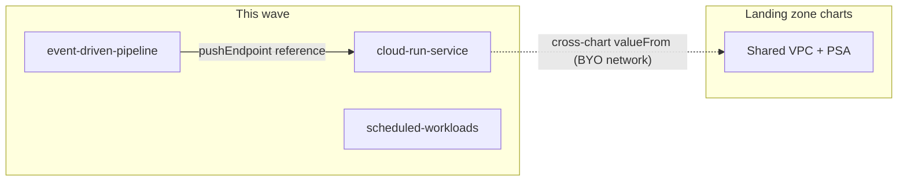

# GCP Serverless Chart Wave: cloud-run-service, event-driven-pipeline, scheduled-workloads

**Date**: July 10, 2026
**Type**: Feature
**Components**: Infra Charts, GCP Provider, API Definitions, Manifest Processing

## Summary

Three new GCP infra charts ship the serverless tier of the catalog: a
production `cloud-run-service` (the flagship — 22 resources everything-on,
with passwordless IAM database authentication and a global HTTPS front
door), an `event-driven-pipeline` (schema-validated Pub/Sub with a real
dead-letter design, a zero-code BigQuery sink, and an OIDC push consumer),
and `scheduled-workloads` (cron on Cloud Run Jobs through an
OAuth-authenticated Scheduler trigger). Enabling the pipeline's push
consumer required one narrow API change:
`GcpPubSubSubscription.push_config.push_endpoint` is now a
`StringValueOrRef` that references a `GcpCloudRun` service's URL.

## Problem Statement / Motivation

The GCP chart catalog covered bootstrap (state backends), foundations
(landing zone, keyless CI/CD) — but nothing a team runs day to day. The
serverless tier is where most GCP applications actually live, and its
hand-wiring is genuinely hard:

- A production Cloud Run service spans a dozen-plus resources whose
  reference formats differ per consumer (network id vs name vs self-link)
  and whose IAM handshakes are easy to get subtly wrong.
- Event-driven architectures lose messages silently when the dead-letter
  topic has no subscription, and hot-loop consumers when it has no
  dead-letter policy at all.
- Scheduling a Cloud Run Job requires knowing that job execution is a
  Cloud Run Admin API call taking an OAUTH token (not the OIDC token used
  for services) signed by an identity holding `run.invoker`.

One composition was outright inexpressible: pushing a subscription's
messages to a Cloud Run service in the same environment. The push
endpoint was a plain string, and a Cloud Run URL embeds a generated
suffix that exists only after the service deploys — it could be neither
referenced nor assembled.

## Solution / What's New

### The push-endpoint reference (API change)

`push_config.push_endpoint` became a `StringValueOrRef` with
`default_kind = GcpCloudRun` → `status.outputs.url`. Literal HTTPS URLs
work exactly as before; a reference now resolves the service's real URL
and doubles as the ordering edge (the subscription deploys after the
service). Blast radius: the Terraform module needed zero changes (the
tfvars converter flattens refs to plain strings), the Pulumi module
changed one line (`GetValue()`), and the `02-push-with-oidc` preset now
teaches the reference form.

### charts/gcp/cloud-run-service

The default deploy is registry + runtime identity + a public hello
service. Four toggle arms grow it into the full production shape:

- **Private Cloud SQL Postgres, passwordless**: IAM database
  authentication — the runtime service account IS the database user
  (IAM-type `GcpCloudSqlUser` + `cloudsql.client`/`instanceUser` grants +
  the `cloudsql.iam_authentication` flag). No password exists anywhere.
- **Memorystore for Valkey** over PSC, including its
  `GcpServiceConnectionPolicy` under a sub-toggle (one policy per
  network/class/region — the sub-toggle is how a second deployment
  shares the first one's policy).
- **Serverless VPC Access connector** for private egress.
- **Global HTTPS front door**: serverless NEG → backend service →
  serving URL map + redirect URL map → managed certificate → HTTPS/HTTP
  proxies → one global address → 443 + 80 forwarding rules, with an
  optional Cloud Armor attachment point. The service's ingress flips to
  internal+LB automatically so the run.app URL cannot bypass the edge.

The private arms reference the environment's EXISTING network by Planton
resource name (cross-chart `valueFrom`) — an application chart consumes
the landing zone, it never rebuilds it, because PSA and connection
policies are one-per-network resources that collide when duplicated.

### charts/gcp/event-driven-pipeline

Schema-validated topic (example AVRO contract, publish-time enforcement),
a pull worker path (identity + subscriber grant + subscription with
backoff), and a dead-letter design that parks poison messages instead of
discarding them (DL topic + parking subscription + the two service-agent
grants dead-lettering actually requires). Optional arms: a BigQuery sink
(dataset + day-partitioned raw-events table + `dataEditor` grant + sink
subscription — deliberately schema-agnostic so schema evolution never
breaks history) and the OIDC push consumer the API change unlocked
(consumer service + push identity + invoker grant + push subscription
whose endpoint is a reference to the service's URL).

### charts/gcp/scheduled-workloads

A Cloud Run Job with separate runtime and trigger identities, the
`run.invoker` grant, and a Cloud Scheduler job invoking the Admin API's
`:run` method with an OAuth token — the full handshake wired, with retry
posture at both layers explained in place (the scheduler retries the
trigger call; the job retries tasks). Optional Cloud Tasks queue for the
asynchronous half of the batch layer.

### Ordering edges without data flow

Where a resource must deploy after another but no spec field consumes an
output — the cache after its connection policy, the sink subscription
after the BigQuery grant, the push subscription after the invoker grant,
the scheduler after the job — the charts declare explicit
`metadata.relationships` `depends_on` edges, which the platform's
dependency graph consumes alongside `valueFrom` references. The chart
authoring rule now teaches both this and the cross-chart
(bring-your-own-resource) reference pattern.

## Validation

- Offline chart gate (`planton chart validate`, CLI built from the
  working tree) green on **20 toggle-arm runs**: cloud-run-service ×9
  (defaults; SQL; SQL+connector; cache; cache without policy; front door;
  front door+armor; registry off; everything-on at 22 resources),
  event-driven-pipeline ×7 (defaults; schema off; DL off; sink; push;
  sink+push; all-off+both-arms), scheduled-workloads ×4 (defaults; queue;
  retries; quoted cron).
- Tree census `charts/ make validate`: **all 7 GCP charts pass** (15/47;
  the 32 failures are other providers' pre-existing drift).
- The API change: spec tests green (new ref-form case + four updated push
  cases), per-kind Go + Pulumi builds, `validate-refs`,
  `secret-coverage`, `validate-outputs` on both module dirs, all presets +
  hack manifest validated, and a real-converter `planton tofu plan` on a
  push manifest inspected field-by-field (the rendered `push_config`
  block is byte-identical to the pre-change shape). Touch audit recorded
  in the kind's `docs/audit/`.
- Icon URLs verified resolving; site catalog + stats regenerated
  (47 charts).

## Impact

Teams get the serverless tier as three one-shot deploys: a production
service that grows arms instead of being rebuilt, an eventing fabric
whose failure paths are designed rather than discovered, and a batch
layer with the IAM handshake already right. For component consumers, push
subscriptions can finally target Cloud Run services by reference — with
full backward compatibility for literal URLs.

## Related Work

Builds on the GCP state-backend charts, the project-foundation +
keyless-deployer wave, and the resource-scoped IAM grant kinds. The
chart authoring rule gained the cross-chart reference and
explicit-relationship teachings this wave surfaced.

---

**Status**: ✅ Production Ready
