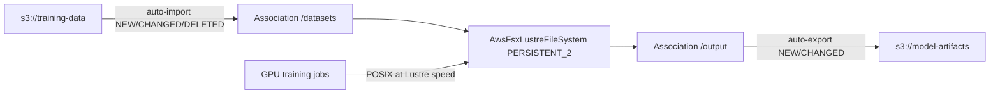

# AWS FSx Standalone Trio at the Full Provider Surface + the Data Repository Association Kind

**Date**: July 10, 2026
**Type**: Feature (with breaking spec changes on Lustre and OpenZFS)
**Components**: AWS Provider, API Definitions, Pulumi CLI Integration, IAC Stack Runner, Testing Framework

## Summary

The three standalone FSx file-system kinds — `AwsFsxLustreFileSystem`, `AwsFsxOpenzfsFileSystem`, and `AwsFsxWindowsFileSystem` — now model the complete provider surface, and a new kind, `AwsFsxDataRepositoryAssociation`, makes the modern S3↔Lustre link a first-class composable resource. Three cross-engine behavioral defects were fixed (unwanted final backups on every Pulumi destroy; the Windows Secrets Manager AD-join arm silently dropped), all four Terraform contracts moved to the generator under the drift guard, and the family shipped its first E2E artifacts with live lanes recorded as deferred.

## Problem Statement / Motivation

The three FSx kinds predated the current component anatomy: hand-written Terraform contracts (`type = any` on two of them), pinned `= 5.82.0` providers, no E2E artifacts, and no drift or outputs-conformance enrollment.

### Pain Points

- **Whole storage classes were unreachable.** Lustre and OpenZFS could not express `INTELLIGENT_TIERING` — the elastic, pay-for-what-you-store class — nor its companions (`throughput_capacity`, read cache configuration). OpenZFS also forbade the two `SINGLE_AZ_HA` deployment types the FSx API accepts.
- **S3-linked Lustre was unrepresentable on PERSISTENT_2.** The flagship production generation supports S3 data only through data repository associations, which had no kind; the legacy in-spec link was additionally mis-gated as "scratch only" when the provider allows it on PERSISTENT_1 as well.
- **Pulumi destroys took unwanted final backups.** `skip_final_backup` (spec default: skip) was never sent by the Lustre and OpenZFS Pulumi modules, so the provider default (take a backup) applied — every Pulumi-deployed file system left a billed backup behind on destroy while Terraform behaved as specified. The Windows module had the inverse defect: it only ever sent `true`, so an explicit "take a final backup" never reached AWS.
- **The recommended Windows AD-join path was Terraform-only.** The Pulumi module dropped `domain_join_service_account_secret_arn` behind a stale "not in this SDK version" comment; the pinned pulumi-aws v7.35.0 has carried the argument (with optional username/password) since the provider's 6.29.0 line.
- No restore-from-backup arm, no `final_backup_tags`, no root squash (Lustre), no `delete_options` (OpenZFS), and validation far looser than the provider (missing value sets, ranges, formats).

## Solution / What's New

### AwsFsxLustreFileSystem (breaking)

- `INTELLIGENT_TIERING` storage class: absolute `throughput_capacity` (multiples of 4000 MB/s) + `data_read_cache_configuration` (proportional / user-provisioned / no-cache), with the companion-set contract enforced at validation.
- `efa_enabled` (EFA + GPUDirect Storage; PERSISTENT_2 with metadata configuration), HDD `drive_cache_type` (required for HDD — AWS's contract), `root_squash_configuration` (UID:GID squash + exempt NIDs), `backup_id` restore, `final_backup_tags`.
- The legacy S3 link arm completed (`auto_import_policy`, `imported_file_chunk_size`) and its deployment gate corrected: valid on SCRATCH_1/SCRATCH_2/PERSISTENT_1, forbidden only on PERSISTENT_2 (where associations are the S3 path).
- Provider-honest value sets promoted to validation: per-unit throughput {12,40,50,100,125,200,250,500,1000}, metadata IOPS tiers, time-window formats.

### AwsFsxOpenzfsFileSystem (breaking)

- Deployment types now cover the API's full set: `SINGLE_AZ_1`, `SINGLE_AZ_2`, `SINGLE_AZ_HA_1`, `SINGLE_AZ_HA_2`, `MULTI_AZ_1` — with per-generation throughput value sets enforced for the generations the provider itself gates (the HA variants stay AWS-validated, mirroring the provider's own posture).
- `INTELLIGENT_TIERING` + `read_cache_configuration` (MULTI_AZ_1 only; forbids provisioned capacity), `backup_id`, `delete_options` (the cascading-delete opt-in), `final_backup_tags`.
- The MULTI_AZ_1 networking contract enforced at validation: `preferred_subnet_id` required (and invalid elsewhere), exactly two subnets for MULTI_AZ_1 and exactly one for the single-AZ types; `route_table_ids` gained its foreign-key annotation.

### AwsFsxWindowsFileSystem (additive)

- `backup_id` restore + `final_backup_tags`; storage capacity presence-honest (32–65536, required unless restoring).
- `preferred_subnet_id` upgraded to required-for-MULTI_AZ_1; DNS server IPs validated as IP addresses; per-alias length, credential length bounds, IOPS range.

### AwsFsxDataRepositoryAssociation (new kind)

The modern, many-per-filesystem S3 link with its own lifecycle:

```yaml
apiVersion: aws.planton.dev/v1
kind: AwsFsxDataRepositoryAssociation
metadata:
  name: training-data-link
spec:
  region: us-west-2
  fileSystemId:
    valueFrom:
      kind: AwsFsxLustreFileSystem
      name: ml-training-fsx
      fieldPath: status.outputs.file_system_id
  fileSystemPath: /datasets/2026
  dataRepositoryPath: s3://training-data/2026/
  autoImportEvents: [NEW, CHANGED, DELETED]
  batchImportMetaDataOnCreate: true
```

The (file system, path, bucket) triple is the association's identity; the sync policies update in place. The provider's single-purpose `s3 { auto_import_policy { events } }` wrapper is flattened to two event lists — the wrapper carries no information of its own.



## Implementation Details

- **Cross-engine parity**: `skip_final_backup` is now presence-honest in both engines on all three kinds (the resolved value is always sent — only-send-true silently reverts an explicit `false` to the provider default). The Windows Pulumi module wires the Secrets Manager join arm; the spec's exclusivity rules guarantee exactly one credential arm reaches the provider.
- **Tag convention converged**: all six modules emit the identity set (`Name` + `planton.ai/resource|organization|environment|resource-kind|resource-id`) with user labels merged in, in both engines. Two kinds previously emitted only a `Name` tag from Terraform; one emitted bare un-namespaced keys.
- **Generator-owned contracts**: all four `variables.tf` files are generated from the proto contract and enrolled in the drift guard; provider floors verified against the provider changelog (Lustre `>= 6.8.0` — the intelligent-tiering read-cache validation fix; OpenZFS `>= 6.22.1` — INTELLIGENT_TIERING; Windows `>= 6.29.0` — the Secrets Manager join arm with optional credentials; association `>= 6.0.0`).
- **E2E**: one lifecycle-state-aware verifier serves all three file-system kinds (`DescribeFileSystems` is type-agnostic; `DELETING` counts as absent) plus an association verifier; five scenarios including a composed lane that links the new Lustre prerequisite fixture to the shared S3 bucket fixture; eight dual-engine test entrypoints; outputs-conformance cases for all four kinds. Registry prerequisites: `[AwsSubnet]` for the three file systems, `[AwsFsxLustreFileSystem]` for the association.
- **Offline verification** (live lanes deferred — FSx file systems provision in tens of minutes and bill accordingly): `tofu init` + `plan` green for all four kinds (each planning exactly its resource), `pulumi preview` green for all four (this catch: the Lustre and OpenZFS `Pulumi.yaml` carried `runtime.options.binary` residue with project-named values — a class that passes every build and fails only at deploy/preview; both fixed and the authoring rules sharpened to flag any `options.binary` value), spec tests, drift guard, outputs conformance, reference-integrity and secret-coverage gates, manifest validation across every FSx preset/scenario/fixture, and the repo-wide build.

## Benefits

- Production Lustre (PERSISTENT_2) finally reaches its S3 story — the primary reason the file system exists for ML/HPC workloads — through a composable association kind instead of an unreachable arm.
- Elastic INTELLIGENT_TIERING capacity is expressible on both Lustre and OpenZFS; OpenZFS HA topologies are no longer blocked at validation.
- A silent money leak is closed: Pulumi destroys no longer leave billed final backups behind by default.
- The recommended credentials-out-of-state Windows AD join works identically in both engines.
- Misconfigurations that previously failed at the AWS API now fail at manifest validation (throughput/IOPS value sets, deployment-type couplings, restore-shape exclusivity, formats).

## Impact

Breaking for existing `AwsFsxLustreFileSystem` and `AwsFsxOpenzfsFileSystem` manifests only where fields changed presence semantics (`storage_capacity_gib` and per-unit throughput are now `optional`; HDD Lustre manifests must state `drive_cache_type`; MULTI_AZ_1 OpenZFS manifests must carry `preferred_subnet_id` and exactly two subnets). `AwsFsxWindowsFileSystem` is additive. No chart composes any FSx kind, so no chart updates ride this change.

## Related Work

- Follows the per-kind depth-pass series that brought the AWS catalog to the full provider surface (most recently the Global Accelerator, MemoryDB/Client VPN, and CI/CD rebuilds).
- The FSx ONTAP trio (`AwsFsxOntapFileSystem`, `AwsFsxOntapStorageVirtualMachine`, `AwsFsxOntapVolume`) is the family's remaining surface and follows the same offline-verification posture.

---

**Status**: ✅ Production Ready (live E2E lanes recorded as deferred in the component profiles; re-runnable at any time)
