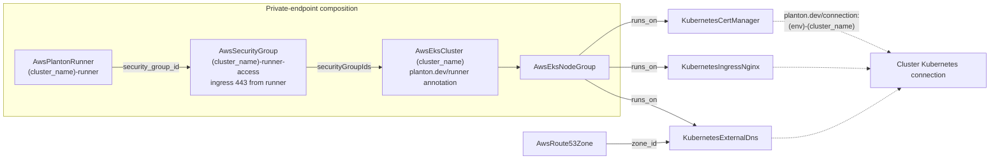

# EKS Environment Chart: One-Run Composition with Connection Binding, Private-Endpoint Runner, and a Focused Add-on Set

**Date**: July 10, 2026
**Type**: Enhancement
**Components**: InfraCharts, AWS Provider, Kubernetes Provider, Manifest Processing

## Summary

The `aws/eks-environment` chart now composes a complete, self-wiring Kubernetes environment in a single run. Every in-cluster add-on binds to the cluster's Kubernetes connection via the `planton.dev/connection` annotation; a private API endpoint (the chart's default) includes a standing `AwsPlantonRunner` inside the VPC — with the security-group seam that actually admits it to the API server — bound to the cluster via the `planton.dev/runner` annotation. The add-on set is focused down to the networking trio every cluster needs (ingress-nginx, cert-manager, external-dns), and external-dns is now genuinely wired to the Route 53 zone it manages instead of installing unconfigured.

## Problem Statement / Motivation

The chart provisioned a cluster and rendered add-ons, but the composition was not self-sufficient:

### Pain Points

- **Add-ons carried no connection binding.** Kubernetes-provider nodes relied on environment/organization default connections — nothing tied an add-on to the cluster deployed in the same run.
- **A private endpoint made the add-ons undeployable.** With `disable_public_endpoint` on (the default), nothing outside the VPC can reach the API server — there was no in-network runner in the composition, and even one placed in the VPC would be rejected: a private EKS endpoint only admits traffic its ENI security groups allow.
- **external-dns installed but managed nothing.** The template rendered no provider configuration, while `KubernetesExternalDns` has a first-class EKS arm (`spec.eks.route53ZoneId`) built for exactly this composition. Two disconnected knobs (`create_hosted_zone`, `externalDnsEnabled`) let users enable either half without the other.
- **Seven of nine add-ons were niche.** Solr, Zalando Postgres, Strimzi Kafka, Elastic, Istio, and external-secrets operators shipped default-on in a general-purpose environment chart.

## Solution / What's New



### Connection binding on every add-on

cert-manager, ingress-nginx, and external-dns carry
`planton.dev/connection: "{{ values.env }}-{{ values.cluster_name }}"` — the
env-qualified slug at which the platform publishes the cluster's Kubernetes
connection. The cluster resource is deliberately named without an env prefix
(`{{ values.cluster_name }}` plain) so the qualification lives on the
org-scoped connection, not the env-scoped resource; the template comment
records the reasoning and the multi-environment naming implication.

### The private-endpoint runner pair (`templates/runner.yaml`)

Rendered when `disable_public_endpoint` and the new `enable_planton_runner`
toggle (default on) are both true:

- **`AwsPlantonRunner <cluster_name>-runner`** — in the chart's two private
  subnets, `executionMode: temporal` (pull-based, no inbound path),
  credentials declared as `$secret/<cluster_name>-runner-credentials` (the
  platform provisions the referenced secret; the manifest needs no
  hand-provisioned material).
- **`AwsSecurityGroup <cluster_name>-runner-access`** — the one inbound rule
  the composition needs: API server port 443 from the runner's exported
  `security_group_id`, attached to the cluster via `spec.security_group_ids`.
  Without it the runner's outbound-only posture would be rejected at the
  private endpoint. The reference chain (runner → access group → cluster)
  also makes ordering structural: the runner comes up before the cluster and
  is torn down after it — add-ons drain through the runner, then the
  cluster, the runner last.
- The cluster carries `planton.dev/runner: "<cluster_name>-runner"` under
  the same condition, naming its sibling runner resource.

### DNS on one honest toggle

`create_hosted_zone` + `externalDnsEnabled` collapse into `dnsEnabled`
(default off — a zone needs a real domain and registrar delegation). Flipping
it renders the `AwsRoute53Zone` for `domain_name` AND external-dns wired to
it through the EKS arm:

```yaml
spec:
  eks:
    route53ZoneId:
      valueFrom:
        kind: AwsRoute53Zone
        name: "{{ values.domain_name }}"
        fieldPath: status.outputs.zone_id
```

### Focused add-on set

Deleted (each with its toggle): solr-operator, zalando-postgres-operator,
strimzi-kafka-operator, elastic-operator, istio, external-secrets. What
remains is the networking story every cluster needs; workload operators
belong in workload-specific charts.

## Implementation Details

- `templates/runner.yaml` (new): the conditional runner + access-group pair.
- `templates/kubernetes/cluster.yaml`: env-prefix dropped from the resource
  name; conditional `planton.dev/runner` annotation and `securityGroupIds`
  attachment.
- `templates/kubernetes/node-group.yaml`, `managed-addons.yaml`: cluster
  references and managed add-on names follow the rename.
- `templates/kubernetes/addons/{cert-manager,ingress-nginx,external-dns}.yaml`:
  `planton.dev/connection` annotation with a why-comment; external-dns gains
  the `eks` provider arm and moves onto `dnsEnabled`.
- `templates/dns.yaml`: moves onto `dnsEnabled`; a stray mis-indented
  template tag fixed in the rewrite.
- `values.yaml`: 6 add-on toggles removed; `dnsEnabled` and
  `enable_planton_runner` added; `cluster_name` description now states
  environment-uniqueness and physical-name semantics.
- `Chart.yaml` / `README.md`: rewritten for the current composition,
  including how add-ons reach the cluster and the private-endpoint posture
  (NAT required — `nat_mode: none` starves the runner).
- `_rules/charts/build-and-fix-planton-infra-charts.mdc`: the
  platform-behavior annotation conventions are now part of the chart
  conventions, with this chart named as the reference composition.

## Validation

- Offline gate: `planton chart validate --all charts/aws` — **12/12 charts,
  0 failures** (the CI gate), with the eks-environment chart exercising 9
  render variants (defaults + every bool flipped).
- Per-variant document counts verified: the runner pair present by default
  (21 docs), absent when either gate flips (19); `dnsEnabled=true` adds the
  zone + wired external-dns (23).
- Rendered-output review of the runner pair, cluster, and external-dns
  confirmed every field against the live spec protos; typed load,
  protovalidate, and `valueFrom` resolution pass for all variants.
- Fleet check: digital-ocean 2/2 and civo 1/1 stay green; chart-structure
  CI guard passes. Failures in azure/gcp/scaleway/alicloud/hetznercloud/
  oci/openstack predate this change (chart-vs-proto drift in non-addon
  manifests; none reference anything touched here).

## Impact

- **One chart, one run**: cluster plus working in-cluster networking with
  zero manual connection or runner setup, for public AND private endpoints.
- **Private endpoints are actually operable**: the runner is admitted at the
  API server by construction, and teardown order is a property of the graph.
- **Leaner surface**: 6 fewer default-on operators; every remaining toggle
  earns its place.

## Related Work

- The standing runner appliance kind this chart composes:
  `2026-07-10-014530-awsplantonrunner-standing-runner-appliance-on-ecs-fargate.md`
- The EKS credential seam add-on deploys ride on:
  `2026-07-09-232137-eks-credentials-via-standard-execcredential-protocol.md`
- The cluster-selector removal that made connections authoritative:
  `2026-07-09-204031-remove-target-cluster-selector-from-kubernetes-kinds.md`

---

**Status**: ✅ Production Ready
